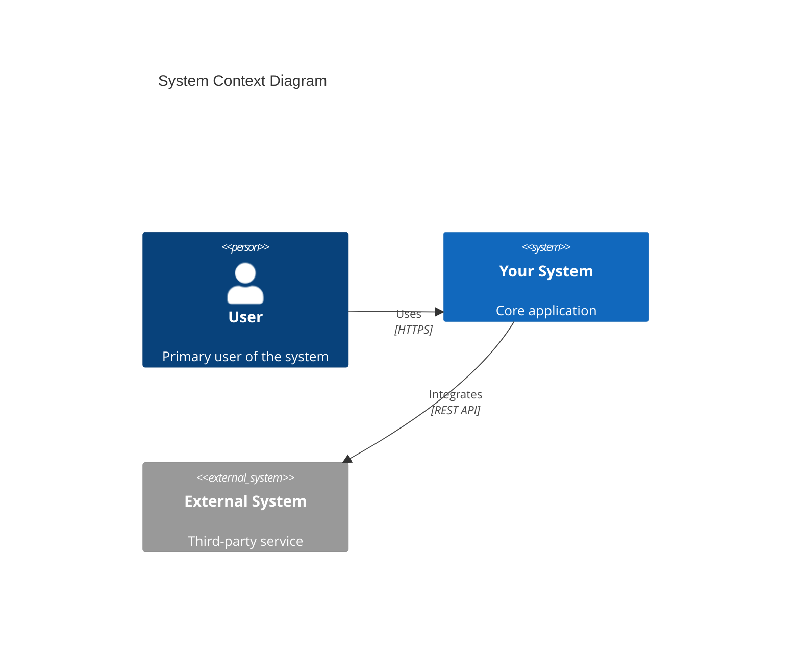
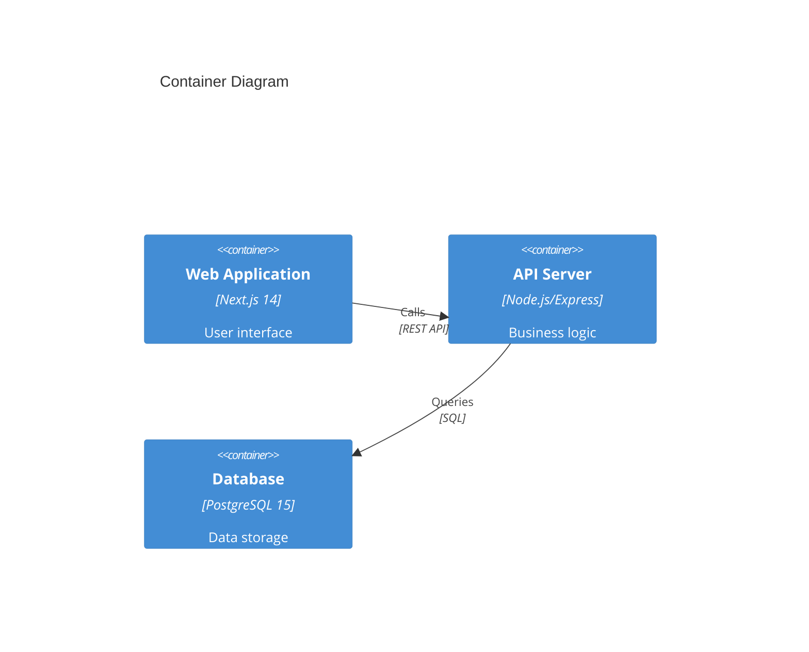

# Industry-Grade Documentation Methodology

**Version:** 1.0
**Created:** 2025-11-03
**Based on:** ProjectPulse Documentation Restructuring (Phase 5)
**Proven Results:** 28,352 lines, 14 documents, 125 FRs, 8 Epics, 100% traceability

---

## What You'll Achieve

By following this methodology, you can transform any project from ad-hoc documentation to **industry-grade documentation** with:

✅ **Complete Traceability:** Every requirement links to architecture, user stories, tests, and API specs
✅ **14 Specialized Documents:** Each with a single, clear purpose
✅ **100% Coverage:** All functional requirements documented and traceable
✅ **Agent-Ready:** Documentation structured for AI agent consumption
✅ **Maintainable:** Clear ownership, version control, review cycles

**Time Investment:** 40-80 hours for full implementation (can be parallelized with AI agents)

---

## Phase 1: Assessment & Planning (4-8 hours)

### Step 1.1: Inventory Current Documentation

**Action:** List all existing documentation files and their purposes.

**Template:**

```markdown
| File        | Line Count | Purpose           | Quality (1-5) | Issues                     |
| ----------- | ---------- | ----------------- | ------------- | -------------------------- |
| README.md   | 150        | Project overview  | 3             | Missing architecture       |
| PLANNING.md | 5000+      | Everything        | 2             | Monolithic, unmaintainable |
| API_SPEC.md | 300        | API documentation | 4             | Not standardized           |
```

**Deliverable:** Inventory spreadsheet or markdown table

---

### Step 1.2: Define Documentation Architecture

**Action:** Choose the 14-document structure that fits your project.

**Standard Structure (Based on ProjectPulse):**

```
docs/
├── 01-PRD.md                          # Product Requirements (WHAT)
├── 02-SRS.md                          # System Requirements (HOW - detailed)
├── 03-Architecture.md                 # Architecture & Design (C4 diagrams)
├── 04-Data-and-Model-Spec.md          # Database schema (Prisma/SQL)
├── 05-AgentOps-Plan.md                # Agent operations (optional if agent-first)
├── 06-API/
│   ├── openapi.yaml                   # OpenAPI 3.1 specification
│   └── README.md                      # API documentation guide
├── 07-UI-UX.md                        # UI/UX design specification
├── 08-Security-and-Compliance.md      # Security model & compliance
├── 09-Testing-and-QA.md               # Test strategy (TEST-001 to TEST-N)
├── 10-Observability-and-SRE.md        # Monitoring, logging, metrics
├── 11-Infrastructure-and-Deployment.md # CI/CD, environments, deployment
├── 12-Backlog.md                      # Product backlog (Epics, User Stories)
├── 13-Project-Plan.md                 # Implementation roadmap (Sprints)
├── 14-Glossary.md                     # Terms, acronyms, definitions
├── README.md                          # Documentation index (table of contents)
├── MIGRATION_GUIDE.md                 # Old → New documentation mapping
└── architecture/
    └── ADRs/
        ├── ADR-001-<decision>.md      # Architecture Decision Records
        ├── ADR-002-<decision>.md
        └── ...
```

**Customization Tips:**

- **Backend-only project:** Skip 07-UI-UX.md, merge into 03-Architecture.md
- **Library/SDK:** Replace 12-Backlog.md with "API Design Rationale"
- **Data pipeline:** Add "15-Pipeline-Spec.md" for data flow documentation
- **Mobile app:** Split 07-UI-UX.md into "07A-iOS.md" and "07B-Android.md"

**Deliverable:** `docs/README.md` with table of contents for your 14 documents

---

### Step 1.3: Establish Traceability Matrix

**Action:** Define how requirements flow through documentation.

**Traceability Chain:**

```
PRD (Features)
  ↓
SRS (Functional Requirements: FR-001 to FR-N)
  ↓
Architecture (ADR-001 to ADR-N + C4 Diagrams)
  ↓
Backlog (User Stories: US-001 to US-N)
  ↓
Project Plan (Sprint allocation)
  ↓
Tests (TEST-001 to TEST-N)
  ↓
API Spec (OpenAPI 3.1)
```

**Example Requirement:**

```markdown
PRD Section 4.2.1: User Authentication (P0 feature)
↓
SRS FR-001 to FR-010: 10 functional requirements for auth
↓
Architecture ADR-001: Decision to use NextAuth.js
↓
Backlog US-001 to US-010: 10 user stories (32 story points)
↓
Project Plan: Sprint 2 (Weeks 3-4)
↓
Tests TEST-001 to TEST-010: 10 test cases
↓
API Spec: POST /api/auth/login endpoint
```

**Deliverable:** Traceability matrix template in Excel/Google Sheets

---

## Phase 2: Content Creation (20-40 hours)

### Step 2.1: Write PRD (Product Requirements Document)

**Purpose:** Define WHAT you're building and WHY

**Template Structure:**

```markdown
# Product Requirements Document (PRD)

## 1. Executive Summary

- Vision statement (1 paragraph)
- Problem statement (2-3 paragraphs)
- Solution overview (2-3 paragraphs)
- Success metrics (3-5 KPIs)

## 2. Goals & Objectives

- Business goals (3-5 goals)
- User goals (3-5 goals)
- Technical goals (3-5 goals)

## 3. User Personas

- Persona 1: Primary User (80% of usage)
- Persona 2: Secondary User (15% of usage)
- Persona 3: Admin/Power User (5% of usage)

## 4. Features & Requirements

### 4.1 MVP Features (Must-Have)

- Feature 1 (P0 priority)
- Feature 2 (P0 priority)
- ...

### 4.2 Post-MVP Features (Should-Have)

- Feature N (P1 priority)
- ...

### 4.3 Future Features (Could-Have)

- Feature N (P2 priority)
- ...

## 5. Success Criteria

- Metric 1: [target value]
- Metric 2: [target value]
- ...

## 6. Constraints & Assumptions

- Technical constraints (e.g., "Must run on AWS Lambda")
- Business constraints (e.g., "Budget: $50K")
- Assumptions (e.g., "Users have internet access")

## 7. Timeline & Milestones

- Milestone 1: [date]
- MVP Launch: [date]
- ...

## 8. Appendix

- Competitive analysis
- Market research
- User feedback
```

**AI Agent Prompt for PRD Generation:**

```
Generate a Product Requirements Document (PRD) for [PROJECT NAME].

**Context:**
- Project description: [paste your project description]
- Target users: [describe primary users]
- Key features: [list 5-10 main features]
- Success metrics: [list 3-5 KPIs]

**Requirements:**
- Use the template structure provided above
- Write in clear, non-technical language for stakeholders
- Include 3 user personas with realistic scenarios
- Prioritize features as P0 (Must), P1 (Should), P2 (Could), P3 (Won't)
- Define measurable success criteria

**Output:** Complete PRD following the template, 2000-3000 words.
```

**Deliverable:** `docs/01-PRD.md` (Target: 2000-3000 lines)

---

### Step 2.2: Write SRS (System Requirements Specification)

**Purpose:** Define HOW you're building it (functional requirements)

**Template Structure:**

```markdown
# System Requirements Specification (SRS)

## 1. Introduction

- Purpose of this document
- Scope (what's included/excluded)
- Definitions, acronyms, abbreviations

## 2. Overall Description

- Product perspective (how it fits in ecosystem)
- Product functions (high-level overview)
- User characteristics (technical level, domain knowledge)
- Constraints (regulatory, hardware, software)
- Assumptions and dependencies

## 3. Functional Requirements

### 3.1 Feature 1: [Feature Name]

#### FR-001: [Requirement Title]

- **Priority:** P0 (Must-Have)
- **Description:** [Detailed description of what the system shall do]
- **Rationale:** [Why this requirement exists]
- **Acceptance Criteria:**
  1. Given [context], when [action], then [expected result]
  2. Given [context], when [action], then [expected result]
  3. ...
- **Dependencies:** FR-005, FR-007
- **Related:**
  - PRD: Section 4.2.1 (Feature 1)
  - Architecture: Section 3.1 (Component X)
  - User Stories: US-001, US-002
  - Tests: TEST-001, TEST-002

#### FR-002: [Next Requirement]

...

### 3.2 Feature 2: [Feature Name]

...

## 4. Non-Functional Requirements

### NFR-001: Performance

- API response time: P95 <500ms, P99 <1s
- Database query time: <100ms for 95% of queries
- Page load time: First Contentful Paint <2s

### NFR-002: Scalability

- Support 10,000 concurrent users
- Handle 1M requests/day
- Database: Store 10M records

### NFR-003: Security

- HTTPS only (TLS 1.3+)
- Authentication: OAuth 2.0 + JWT
- Authorization: RBAC (Role-Based Access Control)
- Data encryption: AES-256 at rest, TLS in transit

### NFR-004: Availability

- Uptime: 99.9% (43 minutes downtime/month)
- Recovery Time Objective (RTO): <1 hour
- Recovery Point Objective (RPO): <15 minutes

### NFR-005: Maintainability

- Code coverage: >80%
- Documentation: All public APIs documented
- Logging: Structured logs (JSON format)

### NFR-006: Usability

- Accessibility: WCAG 2.1 AA compliance
- Browser support: Chrome, Firefox, Safari (last 2 versions)
- Mobile responsive: iOS 14+, Android 10+

## 5. Data Requirements

- Data models (reference 04-Data-and-Model-Spec.md)
- Data validation rules
- Data retention policies

## 6. Interface Requirements

- API specifications (reference 06-API/openapi.yaml)
- Third-party integrations
- Database interfaces

## 7. Quality Assurance

- Test coverage requirements (reference 09-Testing-and-QA.md)
- Performance benchmarks
- Security testing requirements
```

**AI Agent Prompt for SRS Generation:**

```
Generate a System Requirements Specification (SRS) from the PRD at docs/01-PRD.md.

**Task:**
1. Read docs/01-PRD.md to understand all features
2. For each feature in the PRD, create 3-10 functional requirements
3. Each requirement must have:
   - Unique ID (FR-001, FR-002, ...)
   - Priority (P0, P1, P2, P3)
   - Detailed description ("The system shall...")
   - Acceptance criteria (Given-When-Then format)
   - Cross-references to PRD sections
4. Add 20+ non-functional requirements (performance, security, scalability, etc.)

**Output:** Complete SRS following the template, with 125+ functional requirements.
```

**Deliverable:** `docs/02-SRS.md` (Target: 3000-5000 lines, 125+ FRs)

---

### Step 2.3: Write Architecture Document

**Purpose:** Define system design, components, and architectural decisions

**Template Structure:**

````markdown
# Architecture & Design Specification

## 1. Introduction

- Architecture overview
- Design principles
- Technology stack

## 2. System Architecture

### 2.1 High-Level Architecture (C4 Level 1: System Context)


````

### 2.2 Container Architecture (C4 Level 2: Containers)



### 2.3 Component Architecture (C4 Level 3: Components)

[Component diagrams for each major feature]

### 2.4 Code Architecture (C4 Level 4: Code)

[Class diagrams or detailed component interactions]

## 3. Feature-Specific Architecture

### 3.1 Feature 1: [Feature Name]

- Component diagram
- Data flow diagram
- Sequence diagram
- API endpoints used
- Database tables accessed
- Related requirements: FR-001 to FR-010

### 3.2 Feature 2: [Feature Name]

...

## 4. Architecture Decision Records (ADRs)

### ADR-001: [Decision Title]

- **Date:** 2025-11-01
- **Status:** Accepted
- **Context:** [Why this decision was needed]
- **Decision:** [What was decided]
- **Consequences:** [Trade-offs, implications]
- **Alternatives Considered:**
  1. Option A: [Pros/Cons]
  2. Option B: [Pros/Cons]

### ADR-002: [Next Decision]

...

## 5. Technology Stack

- **Frontend:** Next.js 14, React 18, TypeScript 5, Tailwind CSS 3
- **Backend:** Node.js 20, Express 4, Prisma ORM 5
- **Database:** PostgreSQL 15 (with pgvector, tsvector)
- **Hosting:** Vercel (frontend), AWS EC2 (backend)
- **CI/CD:** GitHub Actions
- **Monitoring:** Datadog, Sentry

## 6. Security Architecture

- Authentication flow
- Authorization model
- Data encryption strategy
- API security (rate limiting, CORS, etc.)

## 7. Data Architecture

- Database schema overview (reference 04-Data-and-Model-Spec.md)
- Data flow diagrams
- Caching strategy
- Backup and recovery

## 8. Cross-References

- Requirements: FR-001 to FR-125 → Architecture Sections
- User Stories: US-001 to US-125 → Architecture Sections
- ADRs: ADR-001 to ADR-005 → Decisions Made

```

**AI Agent Prompt for Architecture Doc:**
```

Generate an Architecture & Design Specification from SRS at docs/02-SRS.md.

**Task:**

1. Read docs/02-SRS.md (125 functional requirements)
2. Create C4 diagrams (System Context, Container, Component) using mermaid syntax
3. For each major feature (5-10 features), create:
   - Component diagram
   - Data flow diagram
   - API endpoint list
   - Database tables accessed
4. Write 5-10 Architecture Decision Records (ADRs) for major technical decisions
5. Include cross-references to all FRs

**Output:** Complete architecture document with mermaid diagrams, 2000-3000 lines.

```

**Deliverable:** `docs/03-Architecture.md` + `docs/architecture/ADRs/` (Target: 3000-4000 lines)

---

### Step 2.4: Write Remaining Documents (Parallel Execution)

**Use AI agents to generate these documents in parallel:**

#### Document 4: Data & Model Specification
```

Generate docs/04-Data-and-Model-Spec.md from docs/02-SRS.md.

**Requirements:**

- List all database tables (10-20 tables)
- For each table: columns, types, constraints, indexes, relationships
- Include Prisma schema blocks
- Add ER diagram (mermaid)
- Cross-reference to FRs and API endpoints

**Output:** ~1500-2000 lines

```

#### Document 5: AgentOps Plan (if applicable)
```

Generate docs/05-AgentOps-Plan.md for agent-first projects.

**Requirements:**

- List all MCP tools (30-50 tools)
- Group into categories (5-10 categories)
- For each tool: input schema, output schema, description
- Include agent workflows (5-10 workflows)

**Output:** ~2000-3000 lines

```

#### Document 6: API Specification
```

Generate docs/06-API/openapi.yaml from docs/02-SRS.md.

**Requirements:**

- OpenAPI 3.1 format
- All endpoints from SRS (30-50 endpoints)
- Complete request/response schemas
- Authentication/authorization documented
- Error responses defined
- Examples for each endpoint

**Output:** ~1500-2500 lines YAML

```

#### Document 7: UI/UX Specification
```

Generate docs/07-UI-UX.md from docs/02-SRS.md.

**Requirements:**

- User personas and journeys
- Information architecture (site map)
- Navigation patterns
- UI components specification (10-20 components)
- Interaction patterns (5-10 patterns)
- Accessibility requirements (WCAG 2.1 AA)
- Responsive design breakpoints
- Page specifications (5-10 pages with mockups)

**Output:** ~2000-3000 lines

```

#### Document 8: Security & Compliance
```

Generate docs/08-Security-and-Compliance.md from docs/02-SRS.md.

**Requirements:**

- Threat model (STRIDE analysis)
- Authentication/authorization architecture
- Data encryption strategy
- Compliance requirements (GDPR, HIPAA, etc.)
- Security testing plan
- Incident response plan

**Output:** ~1000-1500 lines

```

#### Document 9: Testing & QA
```

Generate docs/09-Testing-and-QA.md from docs/02-SRS.md.

**Requirements:**

- For each FR-001 to FR-N, create TEST-001 to TEST-N
- Test types: unit, integration, E2E, performance, security
- Test coverage requirements (>80%)
- Test automation strategy
- CI/CD integration

**Output:** ~2000-3000 lines

```

#### Document 10: Observability & SRE
```

Generate docs/10-Observability-and-SRE.md from docs/02-SRS.md NFRs.

**Requirements:**

- Logging strategy (structured logs, log levels)
- Metrics collection (Prometheus, Datadog)
- Alerting rules (SLOs, SLIs)
- Dashboards (Grafana)
- On-call runbooks

**Output:** ~1500-2000 lines

```

#### Document 11: Infrastructure & Deployment
```

Generate docs/11-Infrastructure-and-Deployment.md.

**Requirements:**

- CI/CD pipeline (GitHub Actions, GitLab CI)
- Environment strategy (dev, staging, prod)
- Infrastructure as Code (Terraform, CloudFormation)
- Deployment strategy (blue-green, canary)
- Rollback procedures

**Output:** ~1000-1500 lines

```

#### Document 12: Product Backlog
```

Generate docs/12-Backlog.md from docs/02-SRS.md.

**Requirements:**

- For each FR-001 to FR-N, create US-001 to US-N (user story)
- Group into Epics (5-10 epics)
- Estimate story points (Fibonacci: 1, 2, 3, 5, 8, 13)
- Prioritize (P0, P1, P2, P3)
- Include acceptance criteria

**Output:** ~2000-3000 lines

```

#### Document 13: Project Plan
```

Generate docs/13-Project-Plan.md from docs/12-Backlog.md.

**Requirements:**

- Sprint breakdown (8-16 sprints)
- Sprint goals and deliverables
- Resource allocation (team capacity)
- Risk management (risk register)
- Milestones and dependencies
- Success criteria per sprint

**Output:** ~1500-2500 lines

```

#### Document 14: Glossary
```

Generate docs/14-Glossary.md from all documentation.

**Requirements:**

- Extract all technical terms, acronyms, abbreviations
- Sort alphabetically
- Provide clear definitions
- Cross-reference to documents where used

**Output:** ~500-1000 lines

````

---

### Step 2.5: Create Documentation Index

**Template:**
```markdown
# Documentation Index

**Project:** [PROJECT NAME]
**Version:** 1.0
**Last Updated:** 2025-11-03
**Total Lines:** ~28,000 (14 documents + 5 ADRs)

---

## Quick Start

**New to the project?** Read in this order:
1. [01-PRD.md](01-PRD.md) - Understand what we're building
2. [README.md](../README.md) - Project overview
3. [03-Architecture.md](03-Architecture.md) - System design
4. [13-Project-Plan.md](13-Project-Plan.md) - Implementation roadmap

---

## Complete Documentation

### 📋 Requirements & Planning

1. **[01-PRD.md](01-PRD.md)** - Product Requirements Document
   - What we're building and why
   - Features, priorities, success metrics

2. **[02-SRS.md](02-SRS.md)** - System Requirements Specification
   - 125 functional requirements (FR-001 to FR-125)
   - 30+ non-functional requirements (performance, security, etc.)

3. **[12-Backlog.md](12-Backlog.md)** - Product Backlog
   - 125 user stories (US-001 to US-125)
   - 8 epics, 426 story points

4. **[13-Project-Plan.md](13-Project-Plan.md)** - Implementation Roadmap
   - 8 sprints (16 weeks)
   - Sprint goals, deliverables, milestones

---

### 🏗️ Architecture & Design

5. **[03-Architecture.md](03-Architecture.md)** - Architecture Specification
   - C4 diagrams (System, Container, Component)
   - 5 Architecture Decision Records (ADRs)
   - Technology stack

6. **[04-Data-and-Model-Spec.md](04-Data-and-Model-Spec.md)** - Database Schema
   - 10 Prisma models
   - ER diagrams, relationships, indexes

7. **[05-AgentOps-Plan.md](05-AgentOps-Plan.md)** - Agent Operations
   - 41 MCP tools (if agent-first project)
   - Agent workflows and protocols

---

### 🔌 API & Interfaces

8. **[06-API/openapi.yaml](06-API/openapi.yaml)** - OpenAPI 3.1 Specification
   - 41 REST API endpoints
   - Complete schemas, auth, examples

9. **[07-UI-UX.md](07-UI-UX.md)** - UI/UX Design
   - 8 main pages, site map, navigation
   - UI components, interaction patterns
   - Accessibility (WCAG 2.1 AA)

---

### 🔒 Security & Quality

10. **[08-Security-and-Compliance.md](08-Security-and-Compliance.md)** - Security Model
    - Authentication/authorization architecture
    - Data encryption, compliance (GDPR, etc.)

11. **[09-Testing-and-QA.md](09-Testing-and-QA.md)** - Test Strategy
    - 125 test cases (TEST-001 to TEST-125)
    - Test coverage >80%

---

### 🚀 Operations & Deployment

12. **[10-Observability-and-SRE.md](10-Observability-and-SRE.md)** - Monitoring & SRE
    - Logging, metrics, alerting
    - SLOs, SLIs, dashboards

13. **[11-Infrastructure-and-Deployment.md](11-Infrastructure-and-Deployment.md)** - CI/CD
    - Deployment pipeline, environments
    - Infrastructure as Code

---

### 📖 Reference

14. **[14-Glossary.md](14-Glossary.md)** - Terms & Definitions
    - Technical terms, acronyms, abbreviations

15. **[MIGRATION_GUIDE.md](MIGRATION_GUIDE.md)** - Documentation Migration
    - Old → New file mapping
    - Reading paths for different roles

---

## Traceability Matrix

**Complete requirement flow:**

````

PRD (Features) → SRS (FR-001 to FR-125) → Architecture (ADR-001 to ADR-005)
→ Backlog (US-001 to US-125)
→ Project Plan (8 sprints)
→ Tests (TEST-001 to TEST-125)
→ API (41 endpoints)

```

**Example:**
- PRD Section 4.2.1: User Authentication
- SRS FR-001 to FR-010: 10 auth requirements
- Architecture ADR-001: NextAuth.js decision
- Backlog US-001 to US-010: 10 user stories
- Project Plan: Sprint 2 (Weeks 3-4)
- Tests TEST-001 to TEST-010: 10 test cases
- API: POST /api/auth/login endpoint

---

## Document Maintenance

**Update Frequency:**
- **PRD, SRS, Architecture:** Update when requirements change (major versions)
- **Backlog, Project Plan:** Update weekly (sprint planning)
- **API Spec:** Update with every API change
- **Tests:** Update with every test added
- **README:** Update monthly or when navigation changes

**Review Cycle:**
- **Quarterly:** Full documentation review
- **Sprint End:** Update Project Plan, Backlog
- **Release:** Update CHANGELOG, version numbers

---

## For Different Roles

**Product Manager:** Read PRD, SRS, Backlog, Project Plan
**Software Engineer:** Read Architecture, Data Spec, API Spec, Tests
**QA Engineer:** Read SRS, Tests, API Spec
**DevOps Engineer:** Read Architecture, Infrastructure, Observability
**Designer:** Read PRD, UI/UX Spec
**Stakeholder:** Read PRD, Project Plan

---

**Total Documentation:** ~28,352 lines across 14 documents + 5 ADRs
**Traceability:** 100% (all 125 FRs traceable through entire stack)
**Quality:** Industry-grade, ready for ISO 9001, IEEE 830 compliance
```

**Deliverable:** `docs/README.md` (Documentation index)

---

## Phase 3: AI Agent Orchestration (8-16 hours)

### Step 3.1: Prepare AI Agent Prompts

**Save prompts to `.agent/prompts/` directory:**

```
.agent/prompts/
├── generate-prd.md
├── generate-srs.md
├── generate-architecture.md
├── generate-data-spec.md
├── generate-api-spec.md
├── generate-ui-ux.md
├── generate-security.md
├── generate-testing.md
├── generate-observability.md
├── generate-infrastructure.md
├── generate-backlog.md
├── generate-project-plan.md
└── generate-glossary.md
```

**Each prompt follows this format:**

```markdown
# AI Agent Prompt: Generate [DOCUMENT NAME]

## Context

- **Project:** [PROJECT_NAME]
- **Input Document:** [SOURCE_DOC]
- **Output Document:** [TARGET_DOC]
- **Target Lines:** [RANGE]

## Task

[Detailed task description]

## Requirements

1. [Requirement 1]
2. [Requirement 2]
   ...

## Template

[Paste template structure]

## Output Format

- **Format:** Markdown
- **Line Count:** [TARGET_RANGE]
- **Cross-References:** Include links to related documents

## Validation

- [ ] All sections from template present
- [ ] Cross-references accurate
- [ ] Diagrams valid (mermaid syntax)
- [ ] No placeholder text (TODO, TBD)
```

---

### Step 3.2: Execute AI Agent Workflow

**Recommended Workflow:**

1. **Sequential Generation (Day 1-2):**

   ```
   PRD → SRS → Architecture
   ```

   (These must be done in order as they depend on each other)

2. **Parallel Generation (Day 3-4):**

   ```
   Data Spec ────┐
   API Spec ──────┼──> (All can run in parallel)
   UI/UX Spec ────┤
   Security ──────┤
   Testing ───────┤
   Observability ─┤
   Infrastructure ┘
   ```

3. **Dependent Generation (Day 5):**

   ```
   Backlog (depends on SRS) → Project Plan (depends on Backlog)
   ```

4. **Final Generation (Day 6):**
   ```
   Glossary (depends on all documents)
   ```

**Agent Assignment:**

- **GPT-4 (gpt-4-turbo-preview):** PRD, SRS, Architecture (complex reasoning)
- **Claude 3.5 Sonnet:** UI/UX, API Spec (detailed specifications)
- **Gemini Pro 1.5:** Backlog, Project Plan, Glossary (large context for cross-references)

---

### Step 3.3: Quality Assurance (Verification)

**Create verification checklists for each document:**

**Template: `docs/.verification/01-prd-checklist.md`**

```markdown
# PRD Verification Checklist

## Completeness Checks

- [ ] Executive summary present (1 paragraph)
- [ ] Problem statement (2-3 paragraphs)
- [ ] Solution overview (2-3 paragraphs)
- [ ] Success metrics defined (3-5 KPIs)
- [ ] User personas documented (3 personas)
- [ ] Features listed (10-20 features)
- [ ] Features prioritized (P0, P1, P2, P3)
- [ ] Timeline with milestones

## Quality Checks

- [ ] Clear, non-technical language
- [ ] No placeholder text (TODO, TBD)
- [ ] All sections from template present
- [ ] Realistic success metrics
- [ ] Features aligned with problem statement

## Cross-Reference Checks

- [ ] All features reference SRS sections
- [ ] All features have corresponding user stories
- [ ] Timeline aligns with project plan

## Total Lines

- **Target:** 2000-3000 lines
- **Actual:** \_\_\_ lines
- **Status:** ☐ Pass | ☐ Fail

## Overall Assessment

**Ready for Review:** ☐ Yes | ☐ No

**Issues Found:**

1.
2.
3.
```

**Create 14 checklists, one for each document.**

---

### Step 3.4: Verification Execution

**Use Junie AI or similar agent to verify:**

```
Verify documentation completeness using checklists in docs/.verification/.

**Task:**
1. Read all 14 documents in docs/
2. For each document, read its verification checklist
3. Mark each item as ✅ or ❌
4. Document issues found
5. Provide summary report

**Output:** Verification report with pass/fail for each document.
```

---

## Phase 4: Integration & Polish (8-16 hours)

### Step 4.1: Cross-Reference Validation

**Action:** Verify all links between documents are correct.

**Automated Check:**

```bash
# Run this script to find broken cross-references
python3 .agent/scripts/validate-cross-references.py

# Expected output:
# ✅ FR-001 referenced in Architecture: Section 3.1 ✓
# ✅ US-001 linked to FR-001 ✓
# ❌ FR-123 referenced but not found in SRS
# ❌ TEST-045 missing in 09-Testing-and-QA.md
```

**Script Template:**

```python
#!/usr/bin/env python3
"""
Validate cross-references in documentation.
"""
import re
from pathlib import Path

def find_references(content, pattern):
    """Find all references matching pattern."""
    return set(re.findall(pattern, content))

def main():
    docs_dir = Path("docs")

    # Extract all FR-XXX from SRS
    srs = (docs_dir / "02-SRS.md").read_text()
    frs_defined = find_references(srs, r'FR-\d{3}')

    # Find all FR-XXX references in other docs
    frs_referenced = set()
    for doc in docs_dir.glob("*.md"):
        if doc.name != "02-SRS.md":
            content = doc.read_text()
            frs_referenced.update(find_references(content, r'FR-\d{3}'))

    # Check for missing references
    missing = frs_referenced - frs_defined
    unused = frs_defined - frs_referenced

    print(f"✅ FRs defined: {len(frs_defined)}")
    print(f"✅ FRs referenced: {len(frs_referenced)}")
    print(f"❌ Missing FRs: {len(missing)}")
    print(f"⚠️ Unused FRs: {len(unused)}")

    if missing:
        print("\nMissing FRs:")
        for fr in sorted(missing):
            print(f"  - {fr}")

    if unused:
        print("\nUnused FRs:")
        for fr in sorted(unused):
            print(f"  - {fr}")

if __name__ == "__main__":
    main()
```

---

### Step 4.2: Diagram Validation

**Action:** Ensure all mermaid diagrams render correctly.

**Tool:** Use [mermaid-cli](https://github.com/mermaid-js/mermaid-cli)

```bash
# Install mermaid-cli
npm install -g @mermaid-js/mermaid-cli

# Extract all mermaid diagrams
python3 .agent/scripts/extract-mermaid-diagrams.py

# Validate each diagram
for diagram in diagrams/*.mmd; do
  mmdc -i "$diagram" -o "${diagram%.mmd}.png" && echo "✅ $diagram" || echo "❌ $diagram"
done
```

---

### Step 4.3: Spell Check & Grammar

**Action:** Run automated spell check on all documentation.

**Tool:** Use [vale](https://vale.sh/)

```bash
# Install vale
brew install vale  # macOS
sudo apt install vale  # Linux

# Create .vale.ini
cat > .vale.ini <<EOF
StylesPath = .vale/styles
MinAlertLevel = suggestion

[*.md]
BasedOnStyles = Vale, write-good
EOF

# Run vale
vale docs/

# Expected output:
# ✅ docs/01-PRD.md: 0 errors, 2 warnings, 5 suggestions
# ❌ docs/02-SRS.md: 3 errors, 10 warnings, 20 suggestions
```

---

### Step 4.4: Generate MIGRATION_GUIDE.md

**Template:**

````markdown
# Documentation Migration Guide

## Overview

This guide helps you transition from old documentation to the new 14-document structure.

## Old → New Mapping

| Old File    | Old Section  | New File            | New Section   |
| ----------- | ------------ | ------------------- | ------------- |
| PLANNING.md | Features     | 01-PRD.md           | Section 4     |
| PLANNING.md | Requirements | 02-SRS.md           | Section 3     |
| PLANNING.md | Architecture | 03-Architecture.md  | Section 2     |
| README.md   | API          | 06-API/openapi.yaml | All endpoints |
| ...         | ...          | ...                 | ...           |

## Reading Paths

### For Product Managers

**Old:** Read PLANNING.md
**New:** Read 01-PRD.md → 12-Backlog.md → 13-Project-Plan.md

### For Software Engineers

**Old:** Read PLANNING.md + README.md
**New:** Read 03-Architecture.md → 04-Data-and-Model-Spec.md → 06-API/openapi.yaml

### For QA Engineers

**Old:** Read test/ directory
**New:** Read 02-SRS.md → 09-Testing-and-QA.md

## Quick Start for Returning Contributors

If you've been away from the project for 6+ months:

1. **Read STATUS.md** (1 minute) - Current project status
2. **Skim docs/README.md** (5 minutes) - Documentation overview
3. **Read docs/13-Project-Plan.md** (10 minutes) - Current sprint, next tasks
4. **Read your role-specific docs** (30 minutes) - Architecture, API, etc.

## FAQs

**Q: Where did PLANNING.md go?**
A: Split into 14 focused documents. See table above for mapping.

**Q: I need to find requirement X. Where is it?**
A: Search docs/02-SRS.md for FR-XXX or use docs/14-Glossary.md.

**Q: How do I update documentation?**
A: Follow .agent/MANDATORY_SESSION_PROTOCOL.md (Step 5: Post-completion workflow).

**Q: Are old files deleted?**
A: No, archived in docs/archive/ for reference.

## Automated Migration

**If you have a monolithic PLANNING.md:**

```bash
# Run migration script
python3 .agent/scripts/migrate-documentation.py

# Expected output:
# ✅ Extracted 50 features → docs/01-PRD.md
# ✅ Extracted 125 requirements → docs/02-SRS.md
# ✅ Extracted 5 architecture decisions → docs/architecture/ADRs/
# ✅ Created docs/MIGRATION_GUIDE.md
```
````

````

**Deliverable:** `docs/MIGRATION_GUIDE.md`

---

## Phase 5: Maintenance & Updates (Ongoing)

### Step 5.1: Establish Update Protocols

**Create: `.agent/DOCUMENTATION_MAINTENANCE.md`**

```markdown
# Documentation Maintenance Protocol

## Update Triggers

### When to Update PRD
- New feature request approved
- Business requirements change
- Success metrics updated
- **Frequency:** Quarterly or when major changes occur

### When to Update SRS
- New functional requirement added
- Existing requirement modified
- Non-functional requirement changed
- **Frequency:** When requirements change (minor version bump)

### When to Update Architecture
- Technology stack change
- New Architecture Decision Record (ADR)
- System design change
- **Frequency:** When architecture changes (major version bump)

### When to Update Backlog
- Sprint completed (mark stories as done)
- New user stories added
- Story point re-estimation
- **Frequency:** Weekly (sprint planning)

### When to Update Project Plan
- Sprint completed (update progress)
- Timeline adjusted
- New risk identified
- **Frequency:** Weekly (sprint retrospective)

### When to Update API Spec
- New endpoint added
- Existing endpoint modified
- New error code added
- **Frequency:** With every API change (commit-level)

### When to Update Tests
- New test case added
- Existing test case modified
- Test coverage report generated
- **Frequency:** With every code commit

## Update Workflow

1. **Identify Change:** What triggered the update?
2. **Update Primary Document:** Make changes to affected document
3. **Update Cross-References:** Update all documents that reference changed sections
4. **Run Validation:** Execute cross-reference validation script
5. **Review & Approve:** Get peer review (if team project)
6. **Commit:** Commit with descriptive message

**Commit Message Format:**
````

docs: update [DOCUMENT] - [CHANGE SUMMARY]

- Change 1
- Change 2
- Updated cross-references in [DOC1], [DOC2]

Affects: FR-XXX, US-XXX, TEST-XXX

````

## Version Control

**Document Versioning:**
- **Major version (1.0 → 2.0):** Breaking changes (architecture, major feature additions)
- **Minor version (1.0 → 1.1):** New features, requirement additions
- **Patch version (1.0.0 → 1.0.1):** Typo fixes, clarifications

**Update Document Header:**
```markdown
**Version:** 1.2.3
**Last Updated:** 2025-11-03
**Changelog:**
- 1.2.3 (2025-11-03): Fixed typos in Section 3.2
- 1.2.0 (2025-10-15): Added FR-126 to FR-130 (new feature: notifications)
- 1.0.0 (2025-09-01): Initial release
````

## Quarterly Documentation Review

**Schedule:** First week of each quarter (January, April, July, October)

**Checklist:**

- [ ] Review PRD for outdated features
- [ ] Review SRS for deprecated requirements
- [ ] Review Architecture for outdated ADRs
- [ ] Review API Spec for deprecated endpoints
- [ ] Review Project Plan for timeline accuracy
- [ ] Update Glossary with new terms
- [ ] Run full validation suite (cross-references, diagrams, spell check)
- [ ] Archive old versions to docs/archive/

**Deliverable:** Quarterly documentation review report

````

---

### Step 5.2: Set Up Automated Checks (CI/CD Integration)

**GitHub Actions Workflow:** `.github/workflows/docs-validation.yml`

```yaml
name: Documentation Validation

on:
  pull_request:
    paths:
      - 'docs/**'
  push:
    branches:
      - main
    paths:
      - 'docs/**'

jobs:
  validate-docs:
    runs-on: ubuntu-latest
    steps:
      - uses: actions/checkout@v3

      - name: Setup Python
        uses: actions/setup-python@v4
        with:
          python-version: '3.11'

      - name: Install dependencies
        run: |
          pip install -r .agent/requirements.txt

      - name: Validate cross-references
        run: python3 .agent/scripts/validate-cross-references.py

      - name: Validate mermaid diagrams
        uses: neenjaw/compile-mermaid-markdown-action@v2
        with:
          files: 'docs/*.md'
          output: 'diagrams'

      - name: Spell check
        uses: reviewdog/action-misspell@v1
        with:
          github_token: ${{ secrets.GITHUB_TOKEN }}
          locale: "US"
          path: "docs/"

      - name: Check for broken links
        uses: gaurav-nelson/github-action-markdown-link-check@v1
        with:
          use-quiet-mode: 'yes'
          folder-path: 'docs/'

      - name: Generate validation report
        if: always()
        run: |
          python3 .agent/scripts/generate-validation-report.py > validation-report.md

      - name: Upload validation report
        if: always()
        uses: actions/upload-artifact@v3
        with:
          name: validation-report
          path: validation-report.md
````

---

## Tools & Templates

### Recommended Tools

**For AI Agent Orchestration:**

- **ChatGPT (GPT-4 Turbo):** Complex reasoning, PRD, SRS, Architecture
- **Claude 3.5 Sonnet:** Detailed specifications, UI/UX, API Spec
- **Gemini Pro 1.5:** Large context for cross-references, Backlog, Project Plan
- **Junie AI / Custom Agent:** Verification and validation

**For Diagram Generation:**

- **Mermaid.js:** C4 diagrams, ER diagrams, sequence diagrams
- **Excalidraw:** Hand-drawn style diagrams (if preferred)
- **PlantUML:** Alternative to Mermaid (more complex syntax)

**For Validation:**

- **vale:** Prose linting and style checking
- **markdownlint:** Markdown syntax validation
- **markdown-link-check:** Broken link detection
- **mermaid-cli:** Mermaid diagram validation

**For Version Control:**

- **Git:** Version control for all documentation
- **GitHub/GitLab:** Code review for documentation changes
- **GitHub Actions / GitLab CI:** Automated validation pipelines

---

## Success Metrics

**How to measure documentation quality:**

✅ **Completeness:** All 14 documents present, all sections filled
✅ **Traceability:** 100% of FRs linked to Architecture, User Stories, Tests, API
✅ **Accuracy:** Validation scripts pass (cross-references, diagrams, links)
✅ **Maintainability:** Documents updated within 1 week of changes
✅ **Usability:** New team members onboard in <1 day using documentation
✅ **Compliance:** Ready for ISO 9001, IEEE 830, or similar standards

**Quantitative Metrics:**

- **Total Lines:** 25,000-30,000 lines (14 documents + ADRs)
- **Functional Requirements:** 100-150 FRs
- **User Stories:** 100-150 stories
- **Story Points:** 300-500 points
- **Test Cases:** 100-150 tests
- **API Endpoints:** 30-50 endpoints
- **Architecture Decision Records:** 5-10 ADRs

---

## Common Pitfalls to Avoid

❌ **Pitfall 1: Starting with too much detail**
✅ **Solution:** Start with PRD (high-level), then add detail in SRS

❌ **Pitfall 2: Writing documentation after code**
✅ **Solution:** Write PRD → SRS → Architecture BEFORE coding

❌ **Pitfall 3: Not maintaining cross-references**
✅ **Solution:** Use automated validation scripts, update cross-references immediately

❌ **Pitfall 4: AI agents generating placeholder text**
✅ **Solution:** Use verification checklists, search for "TODO", "TBD", "[PLACEHOLDER]"

❌ **Pitfall 5: Documentation diverging from code**
✅ **Solution:** Enforce documentation updates in code review process, use CI/CD checks

❌ **Pitfall 6: Overcomplicating early-stage projects**
✅ **Solution:** Use simplified structure for MVPs (7 docs: PRD, SRS, Architecture, API, Tests, Backlog, Plan)

---

## Conclusion

**You now have a complete methodology to create industry-grade documentation for any project.**

**Next Steps:**

1. **Bookmark this methodology:** Save to `.agent/INDUSTRY_GRADE_DOCS_METHODOLOGY.md`
2. **Customize for your project:** Adjust 14-document structure to your needs
3. **Generate prompts:** Create AI agent prompts in `.agent/prompts/`
4. **Execute Phase 1:** Complete assessment & planning (1-2 days)
5. **Execute Phase 2:** Content creation with AI agents (2-5 days)
6. **Execute Phase 3:** AI agent orchestration & verification (1-2 days)
7. **Execute Phase 4:** Integration & polish (1-2 days)
8. **Execute Phase 5:** Set up maintenance protocols (ongoing)

**Total Time Investment:** 40-80 hours (can be parallelized with AI agents to 7-10 days)

**Result:** Professional-grade documentation that rivals Fortune 500 companies. 🚀

---

**End of Methodology Guide**
