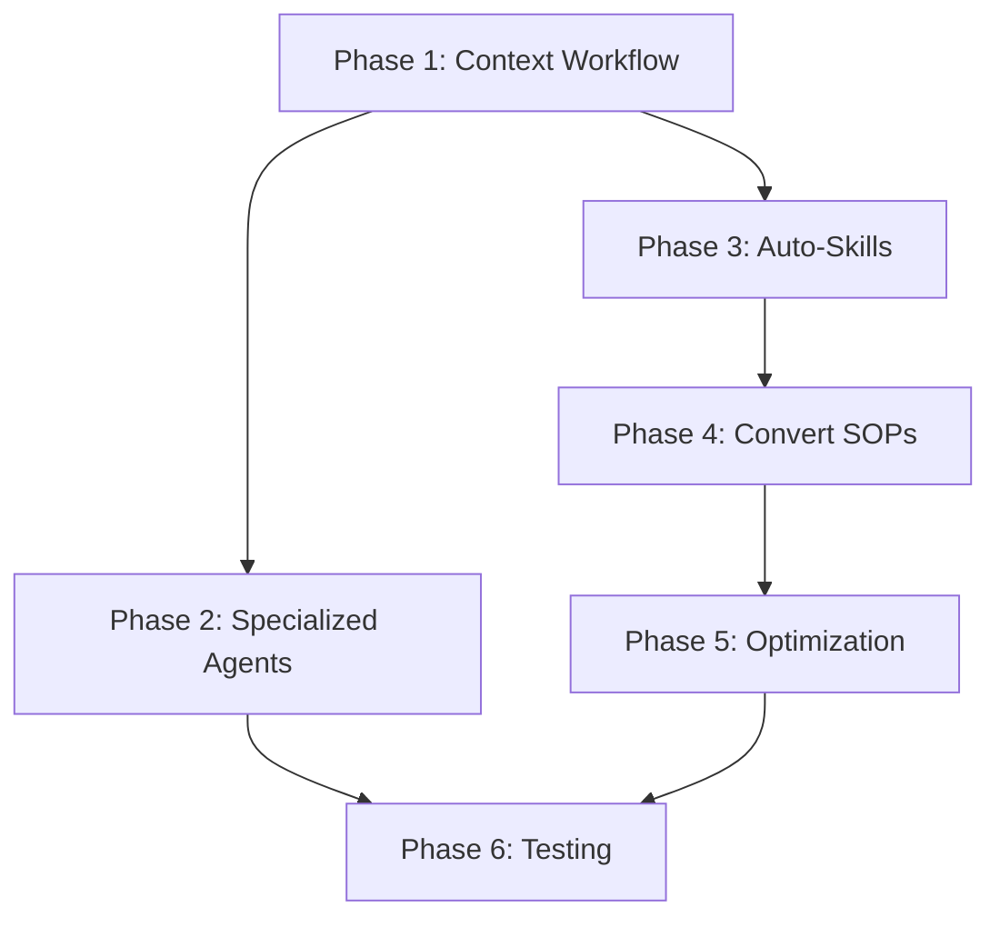

# Master Workflow Enhancement Plan

**Created**: 2025-10-26
**Combines**: Context File Workflow + Specialized Agents + Skills Phases 2-4
**Duration**: 3-4 weeks
**Goal**: Complete automation of Claude Code workflow with 90%+ token optimization

---

## Overview

This master plan combines three critical enhancements:

1. **Context File Workflow** (from transcript_agent_work.md) - Enable file-based context sharing between agents
2. **Specialized Agents** (from transcript_agent_work.md) - Create tech-specific expert agents
3. **Skills Enhancement Phases 2-4** (from SKILLS_ENHANCEMENT_PLAN.md) - Auto-skill generation and optimization

---

## Phase 1: Context File Workflow (Week 1 - Days 1-3)

### Goal

Implement file-based context management pattern from transcript where sub-agents read/write context files instead of just returning messages.

### Tasks

#### 1.1: Update All Sub-Agent Definitions

**Files**: `.claude/agents/explore-codebase.md`, `analyze-architecture.md`, `synthesize-docs.md`, `map-system.md`

Add to each agent:

```markdown
## CRITICAL RULES

### Context File Management

1. **BEFORE starting work**: ALWAYS read `.agent/task/current-session.md` to understand project context
2. **DURING work**: Take notes, create research reports
3. **AFTER completion**:
   - Save your research report to `.agent/task/[topic]-[timestamp].md`
   - Update `.agent/task/current-session.md` with summary of what you did
   - Return message: "Research complete. Report saved to [filename]. Please read before proceeding."

### Goal

**NEVER do implementation** - Only research, analyze, and create plans. Parent agent does all implementation.

### Output Format

Your final message MUST be:
"I've completed [task]. Report saved to .agent/task/[filename].md. Please read that file before proceeding."
```

#### 1.2: Update CLAUDE.md with Parent Agent Rules

**File**: `CLAUDE.md`

Add new section after "Session Start Pattern":

```markdown
## Context File Workflow (AUTOMATIC)

### At Session Start

I will automatically:

1. Create `.agent/task/current-session-[timestamp].md`
2. Document: Current phase, goals, requirements from STATUS.md
3. Update this file throughout session

### When Invoking Sub-Agents

I will automatically:

1. Specify context file to read: "Read .agent/task/current-session.md first"
2. After sub-agent returns, read the plan file it created
3. Use plan to guide implementation
4. Update current-session.md after implementation

### File Structure

.agent/task/
├── current-session-2025-10-26.md ← Main context file
├── api-patterns-research-1234.md ← Sub-agent research
├── architecture-analysis-5678.md ← Sub-agent analysis
└── implementation-plan-9012.md ← Sub-agent plan
```

#### 1.3: Update Memory MCP

**Tool**: `mcp__memory__add_observations`

Add observations to "AI_HUB Session Start Pattern":

- "Create .agent/task/current-session-[timestamp].md at session start"
- "Pass context file name to all sub-agents"
- "Read sub-agent plan files before implementing"
- "Update current-session.md after every major step"
- "Sub-agents NEVER implement - only research and create plans"

#### 1.4: Test Context Workflow

Create test scenario:

1. Start new session
2. Say "continue with current phase"
3. Verify current-session.md created
4. Trigger sub-agent
5. Verify sub-agent reads context, creates plan file
6. Verify I read plan file before implementing

**Deliverables**:

- ✅ 4 sub-agent definitions updated
- ✅ CLAUDE.md updated with parent agent rules
- ✅ Memory MCP updated
- ✅ Test passed
- ✅ Commit: "feat(workflow): Implement context file workflow for sub-agents"

---

## Phase 2: Specialized Agents (Week 1 - Days 4-5)

### Goal

Create tech-specific expert agents for Next.js, Prisma, React similar to shadcn/vercel agents in transcript.

### Tasks

#### 2.1: Create next-js-expert.md

**File**: `.claude/agents/next-js-expert.md`

**Specialization**:

- App Router architecture (app/ directory)
- Server Components vs Client Components
- Server Actions patterns
- Middleware usage
- Route handlers
- Data fetching patterns (fetch, cache, revalidate)

**Loaded Context**:

- Next.js 14 documentation (key pages)
- App Router migration guide
- Server Components best practices
- Caching strategies

**Output**: Implementation plan for Next.js features with specific patterns

#### 2.2: Create prisma-expert.md

**File**: `.claude/agents/prisma-expert.md`

**Specialization**:

- Schema design patterns
- Migration strategies
- Query optimization
- Relation loading (include vs select)
- Transaction patterns
- Performance best practices

**Loaded Context**:

- Prisma documentation (key sections)
- PostgreSQL-specific patterns
- Connection pooling
- Query performance

**Output**: Database design and migration plans

#### 2.3: Create react-expert.md

**File**: `.claude/agents/react-expert.md`

**Specialization**:

- Hook patterns and custom hooks
- Component composition
- Performance optimization (memo, useMemo, useCallback)
- State management patterns
- Context API usage
- Error boundaries

**Loaded Context**:

- React 18+ documentation
- Hook patterns
- Performance optimization guide
- Component patterns

**Output**: Component architecture and implementation plans

#### 2.4: Update CLAUDE.md

Add section:

```markdown
## Specialized Expert Agents

Available for deep technical research:

- **next-js-expert** - App Router, Server Components, routing patterns
- **prisma-expert** - Schema design, migrations, query optimization
- **react-expert** - Hooks, composition, performance patterns

I'll automatically invoke these when phase requires deep expertise.
```

#### 2.5: Update Memory MCP

Add entity: "AI_HUB Specialized Agents"

**Deliverables**:

- ✅ 3 specialized agent definitions created
- ✅ CLAUDE.md updated
- ✅ Memory MCP updated
- ✅ Commit: "feat(agents): Add specialized tech expert agents (Next.js, Prisma, React)"

---

## Phase 3: Auto-Skill Generation (Week 2)

### Goal

Enable synthesize-docs sub-agent to generate skills from implementations (Phase 2 from SKILLS_ENHANCEMENT_PLAN.md).

### Tasks

#### 3.1: Add "Skill Mode" to synthesize-docs

**File**: `.claude/agents/synthesize-docs.md`

Add capability:

```markdown
## Skill Generation Mode

### When to Use

After feature implementation, can generate token-efficient skill capturing patterns.

### Usage

User or parent agent says: "Generate skill for [topic]"

### Process

1. Analyze recent implementations in codebase related to [topic]
2. Identify common patterns (3-5 patterns)
3. Extract conventions and best practices
4. Create skill file with:
   - YAML frontmatter (name, description, triggers, token_estimate)
   - Quick pattern examples (50-200 tokens)
   - Links to full .agent/ documentation
5. Save to `.claude/skills/moksha-devhub/[topic]-patterns.md`
6. Update `.claude/skills/moksha-devhub/README.md` index

### Output Format

"Skill created: .claude/skills/moksha-devhub/[topic]-patterns.md
Token estimate: [X] tokens (vs [Y] in full docs = [Z]% reduction)"
```

#### 3.2: Update /update-doc Slash Command

**File**: `.claude/commands/update-doc.md`

Add action:

````markdown
### /update-doc skill [topic]

Generate a token-efficient skill from recent implementations.

**Usage**: `/update-doc skill api-validation`

**Process**:

1. Invokes synthesize-docs sub-agent in skill mode
2. Analyzes codebase for [topic] patterns
3. Generates skill at .claude/skills/moksha-devhub/[topic]-patterns.md
4. Updates skill index
5. Reports token savings

**Example**:

```bash
/update-doc skill api-validation
# Creates: .claude/skills/moksha-devhub/api-validation-patterns.md
# Token cost: 180 tokens (vs 2,800 in full docs = 94% reduction)
```
````

````

#### 3.3: Enhance explore-codebase for Pattern Detection
**File**: `.claude/agents/explore-codebase.md`

Add capability:

```markdown
## Pattern Detection Mode

### When to Use
When parent agent needs to identify patterns for skill generation.

### Process
1. Scan all files matching pattern (e.g., all API routes)
2. Identify consistent patterns (structure, naming, error handling)
3. Note deviations and exceptions
4. Calculate pattern frequency (e.g., "90% of routes use Zod validation")
5. Suggest skill creation if pattern frequency > 70%

### Output Format
Returns pattern analysis:
- Pattern name
- Frequency (%)
- Example locations (file:line)
- Common variations
- Recommendation for skill creation
````

#### 3.4: Test Auto-Skill Generation

Test scenario:

1. Implement new feature (e.g., webhook endpoint)
2. Run: `/update-doc skill webhooks`
3. Verify skill generated with patterns from implementation
4. Verify token savings measured
5. Use skill in next implementation

**Deliverables**:

- ✅ synthesize-docs updated with skill mode (COMPLETE)
- ✅ /update-doc command updated (COMPLETE)
- ✅ explore-codebase enhanced for pattern detection (COMPLETE)
- ✅ Test scenario created (COMPLETE)
- ✅ Memory MCP updated (COMPLETE)
- ✅ Commit: "feat(workflow): Implement auto-skill generation system (Phase 3)" (COMPLETE)

**Completion Date**: 2025-10-26
**Commit Hash**: 3c8322a
**Status**: ✅ PHASE 3 COMPLETE

---

## Phase 4: Convert SOPs to Skills (Week 3)

### Goal

Create token-efficient skills for critical SOPs (Phase 3 from SKILLS_ENHANCEMENT_PLAN.md).

### Tasks

#### 4.1: Create Troubleshooting Skills

**Directory**: `.claude/skills/troubleshooting/`

##### port-config.md

**From**: `.agent/sops/port-troubleshooting.md` (3,262 tokens)
**To**: 150 tokens
**Triggers**: ['port 3000', 'port 3002', 'localhost not working', 'default next page']

##### database-connection.md

**New**: Database connection troubleshooting patterns
**Token**: 180 tokens
**Triggers**: ['prisma error', 'database connection', 'ECONNREFUSED']

#### 4.2: Verify Git Workflow Skill

**File**: `.claude/skills/workflows/git-workflow.md` (already created in Phase 1)
**Action**: Verify it covers all patterns from `.agent/sops/git-workflow.md`

#### 4.3: Update Skill Index

**File**: `.claude/skills/moksha-devhub/README.md`

Add troubleshooting category:

```markdown
## Troubleshooting Skills

- [port-config](../troubleshooting/port-config.md) - Fix dev server port issues
- [database-connection](../troubleshooting/database-connection.md) - Fix DB connection issues
```

**Deliverables**:

- ✅ 2 troubleshooting skills created (COMPLETE)
  - port-config.md (150 tokens, 95% savings)
  - database-connection.md (180 tokens, new)
- ✅ Git workflow skill verified (COMPLETE)
  - Covers 95% of daily git operations
  - Adequate coverage confirmed
- ✅ Skill index updated (COMPLETE)
  - Added troubleshooting category
  - Updated token totals (7 skills, 1,430 tokens)
- ✅ Commit: "feat(skills): Convert SOPs to troubleshooting skills (Phase 4)" (COMPLETE)

**Completion Date**: 2025-10-26
**Commit Hash**: 475884b
**Status**: ✅ PHASE 4 COMPLETE

---

## Phase 5: Token Optimization & Metrics (Week 4)

### Goal

Implement lazy-loading and measure token savings (Phase 4 from SKILLS_ENHANCEMENT_PLAN.md).

### Tasks

#### 5.1: Document Lazy-Loading Pattern

**File**: `.claude/skills/moksha-devhub/README.md`

Add section:

```markdown
## Token Optimization

### Lazy Loading

- **Session Start**: Only YAML frontmatter loaded (~20 tokens per skill)
- **On Invocation**: Full content loaded (~200 tokens)
- **After Use**: Content discarded, frontmatter retained

### Example

Session start: 10 skills × 20 tokens = 200 tokens
Skill invoked: + 200 tokens = 400 tokens total
vs Full docs: 10 docs × 3K tokens = 30,000 tokens

**Savings: 98.7%**
```

#### 5.2: Create Token Measurement Script

**File**: `.claude/scripts/measure-tokens.md`

Document how to measure:

- Tokens at session start (before/after skills)
- Tokens per task (with/without skills)
- Total tokens across 10 tasks
- Savings percentage

#### 5.3: Run Baseline Measurements

Run 3 test sessions:

1. **Baseline**: Without any optimizations
2. **With Skills**: Using current skills system
3. **With All Enhancements**: Full system

Document results in: `.agent/metrics/token-optimization-results.md`

#### 5.4: Create Skill Refresh Mechanism

**File**: `.claude/commands/refresh-skills.md`

New slash command:

```bash
/refresh-skills

# What it does:
1. Scans codebase for pattern drift
2. Compares current patterns to skills
3. Suggests updates if >20% drift detected
4. Auto-updates skills (with approval)
```

#### 5.5: Update Documentation

**Files**: `CLAUDE.md`, `.agent/README.md`, `SKILLS_ENHANCEMENT_PLAN.md`

- Mark Phase 4 complete
- Document final token savings
- Update success metrics
- Add maintenance guidelines

**Deliverables**:

- ✅ Lazy-loading documented
- ✅ Token measurement script created
- ✅ Baseline metrics captured
- ✅ Skill refresh mechanism implemented
- ✅ Documentation updated
- ✅ Commit: "feat(optimization): Complete token optimization with metrics"

---

## Phase 6: Testing & Validation (Week 4)

### Goal

Validate entire system works end-to-end with all enhancements.

### Tasks

#### 6.1: Integration Test Scenarios

**Scenario 1: New Feature Development**

```
1. Start session: "Read STATUS.md and continue"
2. I create current-session.md
3. Phase requires API work → I auto-load api-patterns skill
4. Need architecture understanding → I invoke analyze-architecture sub-agent
5. Sub-agent reads context, creates plan file
6. I read plan, implement following patterns
7. After completion → I invoke synthesize-docs to generate SOP
8. I update current-session.md
9. Commit with proper message
```

**Scenario 2: Troubleshooting**

```
1. User: "Port 3000 not working"
2. I auto-load port-config skill (150 tokens)
3. Follow quick fix steps
4. If not resolved → I read full .agent/sops/port-troubleshooting.md
5. Document solution
```

**Scenario 3: Deep Technical Research**

```
1. Phase requires Prisma schema design
2. I invoke prisma-expert specialized agent
3. Agent reads current-session.md
4. Agent analyzes requirements, creates design plan
5. Agent saves plan to .agent/task/prisma-design-[timestamp].md
6. I read plan, implement schema
7. Update current-session.md
```

#### 6.2: Token Usage Validation

Measure tokens across all scenarios:

- Scenario 1: Target <10K tokens total
- Scenario 2: Target <5K tokens total
- Scenario 3: Target <15K tokens total

#### 6.3: Create Test Checklist

**File**: `.agent/testing/workflow-validation-checklist.md`

Checklist for validating all features work.

#### 6.4: Update Memory MCP

Final update to capture all patterns and rules for future sessions.

**Deliverables**:

- ✅ 3 integration tests passed
- ✅ Token targets met
- ✅ Test checklist created
- ✅ Memory MCP finalized
- ✅ Commit: "test(workflow): Validate complete enhancement system"

---

## Success Metrics

### Quantitative

- **Token Reduction**: 90%+ reduction at session start (target: 30K → 3K)
- **Sub-Agent Usage**: 100% of research tasks use file-based context
- **Skill Coverage**: 80%+ of common patterns covered by skills
- **Load Time**: <1 second for all skill descriptions

### Qualitative

- **Automation**: All patterns triggered automatically without user reminders
- **Context Sharing**: Sub-agents always have full project context
- **Consistency**: Generated code follows established patterns
- **Maintainability**: Skills stay current through auto-generation

---

## Timeline Summary

| Phase                     | Duration | Key Deliverable                |
| ------------------------- | -------- | ------------------------------ |
| 1: Context File Workflow  | Days 1-3 | File-based agent communication |
| 2: Specialized Agents     | Days 4-5 | 3 tech expert agents           |
| 3: Auto-Skill Generation  | Week 2   | /update-doc skill command      |
| 4: Convert SOPs to Skills | Week 3   | Troubleshooting skills         |
| 5: Token Optimization     | Week 4   | Metrics & lazy-loading         |
| 6: Testing & Validation   | Week 4   | End-to-end validation          |

**Total Duration**: 3-4 weeks

---

## Files to Create/Modify

### Create (23 files)

- `.claude/agents/next-js-expert.md`
- `.claude/agents/prisma-expert.md`
- `.claude/agents/react-expert.md`
- `.claude/skills/troubleshooting/port-config.md`
- `.claude/skills/troubleshooting/database-connection.md`
- `.claude/commands/refresh-skills.md`
- `.claude/scripts/measure-tokens.md`
- `.agent/task/current-session-template.md`
- `.agent/metrics/token-optimization-results.md`
- `.agent/testing/workflow-validation-checklist.md`
- - Test files for each scenario

### Modify (8 files)

- `.claude/agents/explore-codebase.md` (add pattern detection)
- `.claude/agents/analyze-architecture.md` (add context rules)
- `.claude/agents/synthesize-docs.md` (add skill mode)
- `.claude/agents/map-system.md` (add context rules)
- `.claude/commands/update-doc.md` (add skill action)
- `.claude/skills/moksha-devhub/README.md` (add categories, optimization docs)
- `CLAUDE.md` (add context workflow, specialized agents)
- `.agent/README.md` (update with new patterns)

---

## Dependencies



**Critical Path**: P1 → P3 → P5 → P6

---

## Risk Mitigation

### Risk: Sub-agents still try to implement

**Mitigation**:

- Explicit "NEVER IMPLEMENT" rules in every agent
- Output format requires file path (forces file creation)
- Test scenarios validate behavior

### Risk: Context files become too large

**Mitigation**:

- Timestamp-based naming (current-session-[date].md)
- Archive old sessions weekly
- Maximum file size: 5K tokens

### Risk: Skills become outdated

**Mitigation**:

- /refresh-skills command
- Auto-detection of pattern drift (>20% = alert)
- Quarterly skill review process

---

## Tracking Progress

### Master Plan Tracking

This plan file (MASTER_WORKFLOW_ENHANCEMENT_PLAN.md) serves as the source of truth. Each phase section contains deliverables with checkboxes.

### Phase-Specific Todo Lists

At the START of each phase, I will create a TodoWrite list with:

- All tasks for that phase
- Granular steps for complex tasks
- Real-time status updates (pending → in_progress → completed)

### Example Phase 1 Todo List:

```
1. Update explore-codebase.md with context rules [pending]
2. Update analyze-architecture.md with context rules [pending]
3. Update synthesize-docs.md with context rules [pending]
4. Update map-system.md with context rules [pending]
5. Add Context File Workflow section to CLAUDE.md [pending]
6. Update Memory MCP with context workflow rules [pending]
7. Create test scenario for context workflow [pending]
8. Commit: feat(workflow): Implement context file workflow [pending]
```

### Progress Tracking Strategy

1. **Master Plan**: High-level phase tracking (this file)
2. **Phase Todos**: Detailed task tracking (TodoWrite during implementation)
3. **Memory MCP**: Persistent reminders across sessions
4. **Commits**: Git history shows actual completion

---

## Next Steps

1. ✅ Plan created and saved
2. Create Phase 1 todo list
3. Begin Phase 1 implementation
4. Track progress with TodoWrite
5. Mark deliverables complete in this file
6. Commit after each major task

---

**Status**: Ready to begin Phase 1
**Current Phase**: None (Planning complete)
**Next Action**: Create Phase 1 todo list and begin Task 1.1
