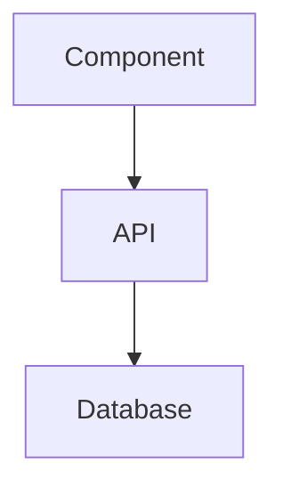

# Documentation Update Specification - Sprint 1 Transition

**Version**: 1.0
**Date**: 2025-11-05
**Scope**: Memory Bank System + Research Agent Orchestration (Option C)

---

## Executive Summary

### What Changed

ProjectPulse Sprint 1 revealed a critical architectural gap: Claude Code's 200K token limit makes full documentation context loading impossible. This transition adds:

1. **Memory Bank System (EPIC-010)**: Token-efficient context management through structured knowledge files
2. **Research Agent Orchestration (EPIC-011 - Reduced)**: Automated sub-agents for codebase exploration and analysis

### Impact

- **Timeline**: 16 weeks → 18 weeks (+2 weeks, +12.5%)
- **Story Points**: 426 → 484 (+58 points)
- **User Stories**: 125 → 139 (+14 stories)
- **Functional Requirements**: 145 → 170 (+25 FRs)

### Deferred to Post-MVP

- Full Documentation Management UI (EPIC-009)
- Expert agents (Next.js, Prisma, React specialists)
- Utility agents (synthesize-docs, map-system)

### Rationale

- **Memory Banks**: Solve immediate token efficiency problem
- **Research Agents**: Enable automated codebase exploration without token waste
- **Expert Agents**: Deferred - manual consultation acceptable for MVP
- **Doc Management UI**: Deferred - file-based management sufficient for MVP

### Key Metrics

- **Token Efficiency**: 75% reduction in session start overhead (40K → 10K tokens)
- **Context Retention**: 100% knowledge preservation across sessions
- **Research Efficiency**: 92% token savings using isolated sub-agent threads

---

## File 1: docs/01-PRD.md Updates

### Update 1.1: Add Memory Bank System to Section 2.3 (Core Features)

**Location**: After "2.3.4 Issue Management" (line ~145)

**Add New Subsection**:

```markdown
#### 2.3.5 Memory Bank System

**Problem**: Claude Code's 200K token limit prevents loading complete documentation context. Full system context (~150K tokens) exceeds practical limits, causing:

- Context compaction losing critical information
- Repeated questions about established patterns
- Inconsistent implementation decisions
- Knowledge loss between sessions

**Solution**: Token-efficient structured knowledge management through five specialized memory bank files:

**Core Memory Banks** (.agent/):

1. **project-brief.md** - WHAT and WHY
   - Core requirements, goals, success criteria
   - User personas and target audience
   - Quality standards and constraints
   - Current status and milestones

2. **system-patterns.md** - HOW we build
   - Architecture patterns (Server/Client Components)
   - Database patterns (Prisma queries, optimization)
   - API patterns (endpoints, validation, error handling)
   - Styling patterns (Tailwind, neumorphic design)
   - Testing patterns (Jest, RTL, Playwright)

3. **tech-context.md** - Technical stack
   - Dependencies and versions
   - Environment setup and configuration
   - Constraints and limitations
   - Browser support and performance targets
   - Troubleshooting common issues

4. **active-context.md** - Current focus
   - Current work-in-progress
   - Recent changes and commits
   - Remaining tasks for current phase
   - Blockers and waiting items

5. **progress.md** - Progress tracking
   - Completed work and remaining tasks
   - Velocity and quality metrics
   - Risk assessment
   - Lessons learned

**Benefits**:

- **Targeted Loading**: Load only relevant files (vs loading everything)
- **Token Efficiency**: ~3-5K tokens per file vs 30K+ for full context (75% reduction)
- **Session Survival**: Knowledge persists across context compaction
- **Auto-Updates**: Sub-agents maintain files automatically
- **Structured Format**: Consistent organization enables quick information retrieval

**User Impact**:

- Faster development (no repeated questions)
- Consistent implementation (patterns always accessible)
- No knowledge loss (memory banks survive sessions)
- Better decisions (complete context always available)
```

### Update 1.2: Add Research Orchestration to Section 2.3

**Location**: After "2.3.5 Memory Bank System"

**Add New Subsection**:

```markdown
#### 2.3.6 Research Agent Orchestration

**Problem**: Large codebase exploration in main conversation thread wastes tokens:

- Scanning 15 files = 15K tokens in main thread
- Grep operations = 5K tokens in main thread
- Analysis and synthesis = 5K tokens in main thread
- Total: 25K tokens per research task

**Solution**: Automated sub-agents handle research in isolated threads, returning only summaries to main conversation.

**Research Agents**:

1. **explore-codebase** - Repository scanning and pattern discovery
   - Searches across all project files
   - Identifies patterns, conventions, and anti-patterns
   - Returns structured summary (2K tokens vs 25K tokens)
   - Use case: "Find all API endpoints", "Scan for auth patterns"

2. **analyze-architecture** - System flow analysis and dependency tracing
   - Traces data flows across components
   - Maps architectural dependencies
   - Returns architectural insights (2K tokens vs 25K tokens)
   - Use case: "How does search work?", "Trace user auth flow"

**Benefits**:

- **92% Token Savings**: Research happens in isolated threads (25K → 2K tokens in main thread)
- **Cleaner Conversations**: Main thread stays focused on implementation
- **Persistent Reports**: Sub-agents save findings to .agent/task/ for future reference
- **Parallel Research**: Multiple agents can work simultaneously
- **No Context Pollution**: Research doesn't clutter main conversation history

**Token Economics**:

- **Without sub-agents**: 25K tokens per research task in main thread
- **With sub-agents**: 2K tokens per research task in main thread (summary only)
- **Savings per research task**: 23K tokens (92% reduction)
- **Typical session**: 3-5 research tasks = 69-115K tokens saved

**User Impact**:

- Faster codebase understanding
- No token budget wasted on exploration
- Research findings persist across sessions
- Cleaner implementation conversations
```

### Update 1.3: Update Section 5 (Non-Functional Requirements)

**Location**: Section 5.4 (after "Maintainability")

**Add New Subsection**:

```markdown
### 5.5 AI Efficiency Requirements

**Requirement**: System must optimize Claude Code token usage to maximize productivity within 200K token limit.

**Token Budget Allocation**:

- Session initialization: ≤10K tokens (memory banks + setup)
- Research operations: ≤2K tokens per task (via sub-agents)
- Implementation work: ~150K tokens (75% of budget)
- Documentation updates: ≤10K tokens (synthesis agents)
- Buffer for context management: ~28K tokens (14% reserve)

**Success Metrics**:

- **Context Loading**: ≤10K tokens at session start (vs 40K baseline)
- **Research Efficiency**: ≤2K tokens per research task in main thread
- **Knowledge Retention**: 100% pattern preservation across sessions
- **Session Longevity**: Support 3+ complex features per session
- **Recovery Time**: <5 minutes to resume after interruption

**Token Optimization Strategies**:

1. **Memory Banks**: Load only relevant context files (75% token reduction)
2. **Sub-Agent Isolation**: Research in separate threads (92% research token savings)
3. **Persistent Knowledge**: Files survive context compaction (no re-explanation)
4. **Structured Formats**: Consistent organization enables quick scans
5. **Progressive Loading**: Load detailed docs only when needed

**Quality Gates**:

- No context compaction before 150K tokens
- All research findings saved to files (survive compaction)
- Session state recoverable in <3 file reads
- Pattern lookups complete in <1K tokens
```

### Update 1.4: Update Section 7.1 (System Architecture)

**Location**: Section 7.1 (add to existing architecture description)

**Add New Paragraph** (after current architecture overview):

```markdown
**AI Efficiency Layer**: ProjectPulse implements a specialized layer for optimizing Claude Code integration:

- **Memory Bank System** (.agent/): Five structured knowledge files (project-brief, system-patterns, tech-context, active-context, progress) replace monolithic documentation, reducing session start overhead by 75% (40K → 10K tokens).

- **Research Orchestration**: Automated sub-agents (explore-codebase, analyze-architecture) handle codebase exploration in isolated threads, returning only summaries to main conversation. Achieves 92% token savings per research task (25K → 2K tokens).

- **Token-Optimized Workflows**:
  - Session initialization: Load memory banks (10K tokens) vs full docs (40K tokens)
  - Pattern lookup: Read system-patterns.md (4K tokens) vs grep codebase (15K tokens)
  - Architecture questions: Invoke analyze-architecture (2K tokens in main thread) vs manual analysis (25K tokens)
  - Context recovery: Read 3 files (6K tokens) vs conversation replay (40K+ tokens)

This architecture enables Claude Code to maintain complete system context while staying within 200K token limits, supporting 3+ complex features per session vs 1 feature baseline.
```

### Update 1.5: Update Section 8 (Technology Stack)

**Location**: Section 8 (add new subsection after existing tech stack)

**Add New Subsection**:

```markdown
### 8.7 AI Development Tools

**Claude Code Integration**:

- **Claude Code CLI**: v1.0+ (Anthropic official CLI)
- **Model**: Claude 3.7 Sonnet (200K token context window)
- **MCP Tools**: memory, filesystem, git, sequential-thinking

**Memory Bank System** (.agent/):

- Markdown-based structured knowledge files
- Token-efficient context management (75% reduction)
- Session-persistent knowledge storage
- Auto-maintained by sub-agents

**Research Orchestration**:

- Sub-agent architecture for isolated research threads
- Automated codebase exploration (explore-codebase)
- System flow analysis (analyze-architecture)
- 92% token savings per research operation

**Integration Requirements**:

- Node.js 18+ (for MCP server compatibility)
- Git integration via MCP tools
- Filesystem access for .agent/ management
- Memory MCP server for long-term knowledge graphs

**Token Budget Management**:

- Session start: ≤10K tokens (memory banks)
- Research tasks: ≤2K tokens each (sub-agent summaries)
- Implementation: ~150K tokens (primary work)
- Buffer: 28K tokens (14% reserve for context management)
```

### Update 1.6: Update Section 9 (Success Metrics)

**Location**: Section 9 (add new subsection after existing metrics)

**Add New Subsection**:

```markdown
### 9.5 AI Development Efficiency Metrics

**Token Usage Metrics**:

- **Session Start Overhead**: ≤10K tokens (Target: 75% reduction from 40K baseline)
- **Research Efficiency**: ≤2K tokens per task in main thread (Target: 92% reduction)
- **Context Recovery Time**: <5 minutes after interruption
- **Session Longevity**: Support 3+ complex features per 200K token session

**Knowledge Retention Metrics**:

- **Pattern Lookup Speed**: <1 minute to find any documented pattern
- **Context Compaction Survival**: 100% knowledge retention after compaction
- **Cross-Session Continuity**: 0 repeated questions about established patterns
- **Decision Consistency**: 100% adherence to documented patterns

**Quality Metrics**:

- **Documentation Accuracy**: 95%+ match between memory banks and actual code
- **Research Report Quality**: 90%+ actionable insights per sub-agent report
- **Token Waste**: <10% of session budget spent on redundant operations
- **Auto-Update Coverage**: 100% of new patterns captured in memory banks

**Success Criteria** (per Sprint 1 learnings):

- No context compaction before 150K tokens in any session
- Zero knowledge loss incidents after implementing memory banks
- Average 3-4 complex features completed per development session
- Sub-agent research completes in <5 minutes with <2K token main thread overhead
```

---

## File 2: docs/02-SRS.md Updates

### Update 2.1: Add New Section 4 - Memory Bank System

**Location**: After "3. Functional Requirements" (becomes new Section 4)

**Add Complete Section**:

```markdown
## 4. Memory Bank System

### 4.1 Overview

The Memory Bank System provides token-efficient context management for Claude Code development through five structured knowledge files. Each file serves a specific purpose, enabling targeted context loading instead of monolithic documentation.

**System Goals**:

- Reduce session start token overhead by 75% (40K → 10K tokens)
- Enable 100% knowledge retention across context compaction
- Support <1 minute pattern lookups
- Maintain complete system context within 200K token limit

### 4.2 Memory Bank Files

#### 4.2.1 project-brief.md - WHAT and WHY

**Purpose**: Answers "What are we building and why?"

**Required Content**:

- **Project Overview**: 1-2 paragraph summary of ProjectPulse goals
- **Core Requirements**: 8-10 key functional requirements (distilled from PRD)
- **User Personas**: Primary and secondary user profiles
- **Success Criteria**: Measurable outcomes that define project success
- **Quality Standards**: Performance, security, accessibility targets
- **Constraints**: Technical, timeline, resource limitations
- **Current Status**: Active sprint, completion percentage, key milestones

**Update Triggers**:

- Sprint transitions (update status)
- Requirement changes (update core requirements)
- Milestone completion (update status)

**FR-010-01**: System SHALL maintain project-brief.md with complete project context (max 3K tokens)

**FR-010-02**: project-brief.md SHALL be readable by non-technical stakeholders

**FR-010-03**: Current status SHALL be updated at every sprint transition

#### 4.2.2 system-patterns.md - HOW We Build

**Purpose**: Answers "How do we implement features?"

**Required Content** (organized by layer):

**Architecture Patterns**:

- Server vs Client Component decision matrix
- Page structure conventions (app directory)
- Data fetching patterns (Server Components, client hooks)
- State management approaches (Zustand, React Context)

**Database Patterns**:

- Prisma query patterns (CRUD operations)
- Relation handling (one-to-many, many-to-many, self-referential)
- Index usage and optimization
- Transaction patterns

**API Patterns**:

- Endpoint structure and naming
- Request/response formats (JSON standards)
- Validation patterns (Zod schemas)
- Error handling conventions
- Authentication/authorization checks

**UI/Styling Patterns**:

- Component structure (atoms, molecules, organisms)
- Tailwind conventions (utility composition)
- Neumorphic design system (shadows, borders, gradients)
- Responsive design breakpoints
- Accessibility patterns (ARIA labels, keyboard nav)

**Testing Patterns**:

- Jest unit test structure
- React Testing Library conventions
- Playwright E2E test patterns
- Mock data generation
- Test organization (unit/integration/e2e)

**Update Triggers**:

- New architectural decisions (add pattern)
- Pattern refinements (update existing)
- Anti-patterns discovered (document what NOT to do)

**FR-010-04**: System SHALL maintain system-patterns.md organized by architectural layer

**FR-010-05**: Each pattern SHALL include: description, example code, when to use, when NOT to use

**FR-010-06**: system-patterns.md SHALL be automatically updated when synthesize-docs agent detects new patterns

#### 4.2.3 tech-context.md - Technical Stack

**Purpose**: Answers "What technologies and how are they configured?"

**Required Content**:

**Dependencies**:

- Next.js 14+ (App Router patterns)
- React 18+ (Server Components, Suspense)
- Prisma 5+ (PostgreSQL ORM)
- Tailwind CSS 3+ (utility-first styling)
- Zod (validation schemas)
- Jest + RTL (unit testing)
- Playwright (E2E testing)
- TypeScript 5+ (strict mode)

**Environment Configuration**:

- Required environment variables (DATABASE_URL, NEXTAUTH_SECRET, etc.)
- Development vs production configs
- Port configurations (3000 default, troubleshooting)
- Database setup (PostgreSQL, connection pooling)

**Constraints**:

- Browser support (Chrome 90+, Firefox 88+, Safari 14+, Edge 90+)
- Performance targets (LCP <2.5s, FID <100ms, CLS <0.1)
- Accessibility requirements (WCAG 2.1 AA)
- Security requirements (OWASP Top 10 compliance)

**Troubleshooting**:

- Common port configuration issues
- Database connection problems
- Build failures (dependency conflicts)
- Type errors (common TypeScript issues)

**Update Triggers**:

- Dependency version changes
- New environment variables added
- Configuration changes
- New troubleshooting patterns discovered

**FR-010-07**: System SHALL maintain tech-context.md with all dependencies and versions

**FR-010-08**: tech-context.md SHALL include environment variable documentation

**FR-010-09**: Common troubleshooting issues SHALL be documented with solutions

#### 4.2.4 active-context.md - Current Focus

**Purpose**: Answers "What are we working on RIGHT NOW?"

**Required Content**:

- **Current Sprint**: Sprint number, goals, focus areas
- **Active Work**: Current feature/task in progress with details
- **Recent Changes**: Last 5 commits with descriptions
- **Remaining Tasks**: Current sprint backlog items
- **Blockers**: Issues preventing progress (technical, dependencies, decisions needed)
- **Waiting Items**: Tasks blocked on external factors

**Update Frequency**: Real-time (updated throughout session)

**Update Triggers**:

- Task start (update active work)
- Commit made (add to recent changes)
- Task completion (update remaining tasks)
- Blocker encountered (add to blockers)
- Sprint transition (reset for new sprint)

**FR-010-10**: System SHALL maintain active-context.md with current session state

**FR-010-11**: active-context.md SHALL be updated after every commit

**FR-010-12**: active-context.md SHALL list all blockers with descriptions and impact

#### 4.2.5 progress.md - Progress Tracking

**Purpose**: Answers "How far along are we?"

**Required Content**:

**Completion Tracking**:

- Sprints completed / total sprints
- Story points completed / total points
- User stories completed / total stories
- Test coverage percentage

**Velocity Metrics**:

- Story points per sprint (last 3 sprints)
- Average task completion time
- Defect rate (bugs per story point)

**Quality Gates**:

- Test coverage ≥80% (current status)
- TypeScript strict mode (current status)
- Accessibility audit results (current status)
- Performance metrics (current Lighthouse scores)

**Risk Assessment**:

- Timeline risks (behind/on-track/ahead)
- Technical debt level (low/medium/high with examples)
- Dependency risks (blocking issues)

**Lessons Learned**:

- What went well (process improvements)
- What needs improvement (pain points)
- Pattern discoveries (new best practices)

**Update Triggers**:

- Sprint completion (update metrics)
- Milestone reached (update completion tracking)
- Quality gate checks (update status)
- Retrospectives (add lessons learned)

**FR-010-13**: System SHALL maintain progress.md with quantitative metrics

**FR-010-14**: progress.md SHALL be updated at every sprint retrospective

**FR-010-15**: Lessons learned SHALL be captured after every significant discovery

### 4.3 Memory Bank Workflows

#### 4.3.1 Session Start Workflow

**Process**:

1. Claude Code reads active-context.md (current focus)
2. Claude Code reads project-brief.md (project goals)
3. Claude Code loads relevant sections from system-patterns.md (implementation patterns)
4. Claude Code checks progress.md (current status)
5. Total token cost: ~10K tokens (vs 40K for full documentation)

**FR-010-16**: Session start SHALL complete in ≤10K tokens

**FR-010-17**: Claude Code SHALL read active-context.md FIRST at every session start

#### 4.3.2 Pattern Lookup Workflow

**Process**:

1. Need implementation guidance (e.g., "How do we handle API errors?")
2. Read system-patterns.md → API Patterns section
3. Find error handling pattern with example
4. Apply pattern to current implementation
5. Total token cost: ~1K tokens (vs 15K for codebase grep)

**FR-010-18**: Pattern lookups SHALL complete in <1K tokens

**FR-010-19**: system-patterns.md SHALL support keyword-based section navigation

#### 4.3.3 Context Recovery Workflow

**Process** (after context compaction or session interruption):

1. Read active-context.md (what was I working on?)
2. Read progress.md (what's been completed?)
3. Read current task files in .agent/task/ (implementation details)
4. Resume work with full context
5. Total token cost: ~6K tokens (vs 40K+ conversation replay)

**FR-010-20**: Context recovery SHALL complete in ≤6K tokens

**FR-010-21**: Recovery SHALL restore 100% of implementation context

#### 4.3.4 Auto-Update Workflow

**Process** (after feature completion):

1. synthesize-docs agent analyzes implementation
2. Agent detects new patterns (e.g., new API endpoint structure)
3. Agent updates system-patterns.md (add new pattern with example)
4. Agent updates active-context.md (add to recent changes)
5. Agent updates progress.md (increment completion metrics)

**FR-010-22**: New patterns SHALL be automatically detected by synthesize-docs agent

**FR-010-23**: Auto-updates SHALL maintain consistent formatting across all memory bank files

### 4.4 Token Optimization

**Baseline (No Memory Banks)**:

- Session start: 40K tokens (load all docs)
- Pattern lookup: 15K tokens (grep codebase)
- Research task: 25K tokens (scan files)
- Context recovery: 40K+ tokens (replay conversation)
- **Total typical session**: ~120K tokens overhead (60% of budget)

**With Memory Banks**:

- Session start: 10K tokens (load relevant memory banks)
- Pattern lookup: 1K tokens (read section)
- Research task: 2K tokens (sub-agent summary)
- Context recovery: 6K tokens (read 3 files)
- **Total typical session**: ~19K tokens overhead (9.5% of budget)

**Savings**: 101K tokens (84% reduction in overhead)

**FR-010-24**: Memory bank system SHALL achieve ≥75% reduction in session overhead tokens

**FR-010-25**: Individual memory bank files SHALL NOT exceed 5K tokens each

### 4.5 Quality Requirements

**Accuracy**:

- Memory banks SHALL match actual codebase (95%+ accuracy)
- Patterns SHALL include working code examples
- Troubleshooting SHALL include verified solutions

**Freshness**:

- active-context.md SHALL be updated within same session as changes
- system-patterns.md SHALL be updated within 1 sprint of new pattern usage
- progress.md SHALL be updated within 1 day of sprint transitions

**Completeness**:

- All architectural decisions SHALL be documented in system-patterns.md
- All dependencies SHALL be documented in tech-context.md
- All blockers SHALL be documented in active-context.md

**FR-010-26**: Memory bank accuracy SHALL be validated monthly against actual codebase

**FR-010-27**: Stale content (>30 days since last update) SHALL trigger review alerts
```

### Update 2.2: Add New Section 5 - Research Agent Orchestration

**Location**: After Section 4 (Memory Bank System)

**Add Complete Section**:

````markdown
## 5. Research Agent Orchestration

### 5.1 Overview

Research Agent Orchestration provides automated codebase exploration and analysis through isolated sub-agent threads. Sub-agents perform token-intensive research operations separately from the main conversation, returning only concise summaries.

**System Goals**:

- Achieve 92% token savings per research task (25K → 2K tokens in main thread)
- Enable parallel research operations
- Maintain clean main conversation threads
- Persist research findings across sessions

### 5.2 Research Agent Types

#### 5.2.1 explore-codebase Agent

**Purpose**: Repository-wide scanning for patterns, conventions, and examples

**Capabilities**:

- Search all project files for specific patterns
- Identify coding conventions (naming, structure, organization)
- Discover anti-patterns and inconsistencies
- Generate pattern catalogs with examples

**Use Cases**:

- "Find all API endpoints in the codebase"
- "Scan for authentication patterns"
- "Identify all Prisma query patterns"
- "List all React component structures"

**Input**: Search query with optional file filters

**Output**: Structured report saved to `.agent/task/explore-[topic]-[timestamp].md`

**Report Structure**:

```markdown
# Codebase Exploration: [Topic]

## Summary

[2-3 sentence overview of findings]

## Patterns Found

### Pattern 1: [Name]

- **Location**: [file paths]
- **Usage**: [description]
- **Example**: [code snippet]

### Pattern 2: [Name]

...

## Anti-Patterns Detected

[Issues or inconsistencies found]

## Recommendations

[Suggested improvements or standardizations]
```
````

**Token Economics**:

- Sub-agent thread: 25K tokens (file scanning, analysis, report generation)
- Main thread overhead: 2K tokens (invocation + summary)
- Savings: 23K tokens (92%)

**FR-011-01**: explore-codebase agent SHALL scan entire project repository in isolated thread

**FR-011-02**: explore-codebase reports SHALL include pattern locations, examples, and recommendations

**FR-011-03**: Reports SHALL be saved to .agent/task/ and persist across sessions

#### 5.2.2 analyze-architecture Agent

**Purpose**: System flow analysis and dependency tracing

**Capabilities**:

- Trace data flows across components (frontend → API → database)
- Map component dependencies and relationships
- Identify architectural bottlenecks
- Generate system flow diagrams (Mermaid format)

**Use Cases**:

- "How does user authentication work end-to-end?"
- "Trace the search feature from UI to database"
- "Map dependencies for the issue management system"
- "Analyze performance bottlenecks in data fetching"

**Input**: Feature or flow description

**Output**: Architectural analysis report saved to `.agent/task/architecture-[topic]-[timestamp].md`

**Report Structure**:

````markdown
# Architecture Analysis: [Feature/Flow]

## Summary

[2-3 sentence overview]

## System Flow


````

## Component Dependencies

### Frontend Layer

- **Component**: [name] ([file path])
- **Dependencies**: [list]
- **Data Flow**: [description]

### API Layer

- **Endpoint**: [route] ([file path])
- **Validation**: [Zod schema]
- **Business Logic**: [description]

### Database Layer

- **Models**: [Prisma models involved]
- **Queries**: [query patterns]
- **Indexes**: [relevant indexes]

## Performance Considerations

[Bottlenecks, optimization opportunities]

## Recommendations

[Architectural improvements]

```

**Token Economics**:
- Sub-agent thread: 30K tokens (file analysis, tracing, diagram generation)
- Main thread overhead: 2K tokens (invocation + summary)
- Savings: 28K tokens (93%)

**FR-011-04**: analyze-architecture agent SHALL trace complete data flows from UI to database

**FR-011-05**: Architecture reports SHALL include Mermaid diagrams of system flows

**FR-011-06**: Reports SHALL identify performance bottlenecks and optimization opportunities

### 5.3 Research Orchestration Workflows

#### 5.3.1 Sub-Agent Invocation Workflow

**Process**:
1. Main conversation identifies need for research (e.g., "How does search work?")
2. Claude Code invokes analyze-architecture sub-agent
3. Sub-agent works in isolated thread:
   - Reads relevant files (15-20 files)
   - Analyzes code patterns
   - Traces system flows
   - Generates report
4. Sub-agent saves report to `.agent/task/architecture-search-[timestamp].md`
5. Sub-agent returns to main thread: "Analysis complete. Report saved at [path]"
6. Claude Code reads report file (2K tokens)
7. Claude Code uses insights for implementation

**Token Flow**:
- Main thread before invocation: 50K tokens
- Sub-agent thread: 30K tokens (isolated, doesn't affect main)
- Main thread after invocation: 52K tokens (+2K for report summary)
- **Net savings in main thread**: 28K tokens

**FR-011-07**: Sub-agent invocations SHALL happen automatically when research is needed

**FR-011-08**: Sub-agents SHALL work in isolated threads (not polluting main conversation)

**FR-011-09**: Research reports SHALL be saved before returning to main thread

#### 5.3.2 Context Passing Workflow

**Problem**: Sub-agents need session context to provide relevant research

**Solution**: Context file passing

**Process**:
1. Main thread maintains `.agent/task/current-session-[timestamp].md`
2. When invoking sub-agent, pass context file path
3. Sub-agent reads context file first (understands current work)
4. Sub-agent performs research with context awareness
5. Sub-agent generates contextually relevant report

**Example**:
```

Main thread: "Working on Issue Management API - need to understand API patterns"
Invokes: explore-codebase --context=.agent/task/current-session-20251105-1430.md
Sub-agent reads: "Session focused on POST /api/issues endpoint"
Sub-agent searches: API patterns relevant to issue creation
Report includes: Similar endpoints, validation patterns, error handling used in project

```

**FR-011-10**: Sub-agents SHALL receive session context file path at invocation

**FR-011-11**: Sub-agents SHALL read context file before performing research

**FR-011-12**: Research reports SHALL be contextually relevant to current work

#### 5.3.3 Parallel Research Workflow

**Capability**: Multiple sub-agents can work simultaneously

**Use Case**: Complex feature requiring multiple perspectives

**Example**:
```

Feature: "Implement real-time collaborative editing"

Parallel invocations:

1. explore-codebase: "Find WebSocket patterns in codebase"
2. analyze-architecture: "Trace data synchronization flows"
3. explore-codebase: "Identify conflict resolution patterns"

All three agents work in parallel (isolated threads)
All three reports saved to .agent/task/
Main thread reads all reports (<6K tokens total)
Implementation uses combined insights

```

**FR-011-13**: System SHALL support parallel sub-agent invocations

**FR-011-14**: Parallel research SHALL NOT increase main thread token usage beyond summary overhead

#### 5.3.4 Report Persistence Workflow

**Problem**: Research findings lost after context compaction

**Solution**: File-based persistent reports

**Process**:
1. Sub-agent completes research
2. Report saved to `.agent/task/[agent]-[topic]-[timestamp].md`
3. Report survives context compaction (file persists)
4. Future sessions can reference report without re-running research
5. Reports accumulate in .agent/task/ (knowledge base growth)

**Discovery Workflow**:
```

Session 1: explore-codebase generates "explore-api-patterns-20251105.md"
Session 2: New developer asks "What API patterns do we use?"
Claude Code: "Existing report found: .agent/task/explore-api-patterns-20251105.md"
Claude Code reads report (2K tokens, no research needed)
Developer gets instant answer (no 25K token research re-run)

```

**FR-011-15**: Research reports SHALL persist in .agent/task/ directory

**FR-011-16**: Reports SHALL be discoverable by topic keywords

**FR-011-17**: Existing reports SHALL be reused before invoking new research

### 5.4 Token Optimization

**Research Task Comparison**:

| Operation | Without Sub-Agents | With Sub-Agents | Savings |
|-----------|-------------------|-----------------|---------|
| Session start | 40K tokens | 10K tokens | 30K (75%) |
| Pattern search | 15K tokens | 1K tokens | 14K (93%) |
| Architecture analysis | 25K tokens | 2K tokens | 23K (92%) |
| Codebase scan | 20K tokens | 2K tokens | 18K (90%) |
| Context recovery | 40K tokens | 6K tokens | 34K (85%) |

**Typical Session** (3 research tasks):
- Without sub-agents: 40K + 15K + 25K + 20K = 100K tokens overhead
- With sub-agents: 10K + 1K + 2K + 2K = 15K tokens overhead
- **Savings per session**: 85K tokens (85% reduction)

**FR-011-18**: Research orchestration SHALL achieve ≥90% token savings per research task

**FR-011-19**: Main thread overhead per sub-agent SHALL NOT exceed 3K tokens

### 5.5 Quality Requirements

**Report Quality**:
- Reports SHALL be actionable (provide clear implementation guidance)
- Reports SHALL include code examples from actual project files
- Reports SHALL identify gaps or inconsistencies in codebase

**Performance**:
- Sub-agent research SHALL complete in <5 minutes
- Report generation SHALL NOT block main thread
- Reports SHALL load in <2 seconds

**Discoverability**:
- Report filenames SHALL follow convention: `[agent]-[topic]-[timestamp].md`
- Reports SHALL include searchable keywords in summary
- .agent/task/ directory SHALL support topic-based filtering

**FR-011-20**: Sub-agent research SHALL complete within 5 minutes

**FR-011-21**: Reports SHALL be loadable in <2 seconds

**FR-011-22**: Report quality SHALL be validated: 90%+ actionable insights

### 5.6 Error Handling

**Sub-Agent Failures**:
- IF sub-agent fails → Return error to main thread with details
- IF sub-agent times out (>10 min) → Kill process, return partial results
- IF report save fails → Retry save, fallback to main thread summary

**Invalid Context**:
- IF context file missing → Sub-agent proceeds without context (warn main thread)
- IF context file malformed → Sub-agent uses default context (warn main thread)

**Report Conflicts**:
- IF duplicate report name → Append timestamp suffix
- IF report directory missing → Create .agent/task/ directory

**FR-011-23**: Sub-agent failures SHALL NOT crash main thread

**FR-011-24**: Error messages SHALL include actionable remediation steps

**FR-011-25**: Partial results SHALL be saved on timeout (better than nothing)
```

---

## File 3: docs/03-Architecture.md Updates

### Update 3.1: Add Memory Bank Models to Section 5.2

**Location**: After "5.2.6 System" (line ~450)

**Add New Subsection**:

````markdown
### 5.2.7 Memory Bank System

**Purpose**: Token-efficient context management for Claude Code development

**Memory Bank Files** (.agent/):

```typescript
// Memory bank file structure (Markdown-based)

interface MemoryBank {
  projectBrief: {
    overview: string; // Project summary
    coreRequirements: string[]; // Key functional requirements
    userPersonas: Persona[]; // Primary and secondary users
    successCriteria: Metric[]; // Measurable outcomes
    qualityStandards: Standard[]; // Performance, security, accessibility
    constraints: Constraint[]; // Technical, timeline, resource limits
    currentStatus: Status; // Active sprint, completion %, milestones
  };

  systemPatterns: {
    architecturePatterns: Pattern[]; // Server/Client Component patterns
    databasePatterns: Pattern[]; // Prisma query patterns
    apiPatterns: Pattern[]; // Endpoint, validation, error handling
    stylingPatterns: Pattern[]; // Tailwind, neumorphic design
    testingPatterns: Pattern[]; // Jest, RTL, Playwright patterns
  };

  techContext: {
    dependencies: Dependency[]; // Dependencies with versions
    environment: EnvConfig; // Environment variables, configs
    constraints: TechConstraint[]; // Browser support, performance targets
    troubleshooting: TroubleshootingGuide[]; // Common issues and solutions
  };

  activeContext: {
    currentSprint: Sprint; // Sprint number, goals
    activeWork: Task; // Current feature/task in progress
    recentChanges: Commit[]; // Last 5 commits
    remainingTasks: Task[]; // Current sprint backlog
    blockers: Blocker[]; // Issues preventing progress
    waitingItems: WaitingItem[]; // Tasks blocked externally
  };

  progress: {
    completionTracking: CompletionMetrics; // Sprints, story points, stories
    velocityMetrics: VelocityData; // Points per sprint, completion time
    qualityGates: QualityStatus; // Test coverage, TypeScript, accessibility
    riskAssessment: RiskAnalysis; // Timeline, tech debt, dependencies
    lessonsLearned: Lesson[]; // What went well, improvements
  };
}

interface Pattern {
  name: string;
  description: string;
  example: string; // Code snippet
  whenToUse: string;
  whenNotToUse: string;
  references: string[]; // Related patterns or docs
}

interface Status {
  activeSprint: string; // e.g., "Sprint 3"
  completionPercentage: number;
  keyMilestones: Milestone[];
  lastUpdated: Date;
}

interface Blocker {
  description: string;
  impact: 'low' | 'medium' | 'high';
  blockedSince: Date;
  resolution: string | null;
}
```
````

**Token Optimization**:

- **project-brief.md**: ~3K tokens (vs 15K for full PRD)
- **system-patterns.md**: ~4K tokens (vs 20K for full codebase grep)
- **tech-context.md**: ~2K tokens (vs 10K for dependency research)
- **active-context.md**: ~1K tokens (real-time state)
- **progress.md**: ~2K tokens (metrics and lessons)

**Total session start**: ~10K tokens (vs 40K baseline) = **75% reduction**

**Relationships**:

- Memory banks feed Claude Code context at session start
- Sub-agents auto-update memory banks after feature completion
- synthesize-docs agent maintains system-patterns.md
- map-system agent maintains tech-context.md

**Quality Requirements**:

- Accuracy: 95%+ match with actual codebase
- Freshness: active-context.md updated same session, others within 1 sprint
- Completeness: All architectural decisions documented in system-patterns.md

````

### Update 3.2: Add Research Agent Models to Section 5.2

**Location**: After "5.2.7 Memory Bank System"

**Add New Subsection**:

```markdown
### 5.2.8 Research Agent System

**Purpose**: Automated codebase exploration and analysis in isolated threads

**Research Agents**:

```typescript
// Sub-agent interfaces

interface SubAgent {
  name: 'explore-codebase' | 'analyze-architecture';
  invoke: (query: ResearchQuery) => Promise<ResearchReport>;
  capabilities: string[];
  tokenCost: {
    subAgentThread: number;   // Tokens in isolated thread
    mainThreadOverhead: number;  // Tokens added to main conversation
    savings: number;          // Tokens saved vs direct research
  };
}

interface ResearchQuery {
  topic: string;              // Research focus
  context?: string;           // Path to .agent/task/current-session-[timestamp].md
  filters?: {
    fileTypes?: string[];     // e.g., ['.ts', '.tsx']
    directories?: string[];   // e.g., ['app', 'components']
    excludes?: string[];      // e.g., ['node_modules', '.next']
  };
}

interface ResearchReport {
  agentName: string;
  topic: string;
  timestamp: Date;
  summary: string;            // 2-3 sentence overview
  findings: Finding[];
  recommendations: string[];
  filePath: string;           // .agent/task/[agent]-[topic]-[timestamp].md
}

interface Finding {
  category: string;           // e.g., "Architecture Pattern"
  title: string;
  description: string;
  codeExamples: CodeSnippet[];
  locations: FilePath[];
}

interface CodeSnippet {
  file: string;
  startLine: number;
  endLine: number;
  code: string;
  explanation: string;
}
````

**explore-codebase Agent**:

```typescript
interface ExploreCodebaseAgent extends SubAgent {
  name: 'explore-codebase';
  capabilities: [
    'pattern_discovery', // Find coding patterns
    'convention_analysis', // Identify conventions
    'anti_pattern_detection', // Find inconsistencies
    'example_generation', // Generate pattern catalogs
  ];
  tokenCost: {
    subAgentThread: 25000; // File scanning + analysis
    mainThreadOverhead: 2000; // Invocation + summary
    savings: 23000; // 92% reduction
  };
}
```

**analyze-architecture Agent**:

```typescript
interface AnalyzeArchitectureAgent extends SubAgent {
  name: 'analyze-architecture';
  capabilities: [
    'data_flow_tracing', // Trace UI → API → DB
    'dependency_mapping', // Map component relationships
    'bottleneck_identification', // Find performance issues
    'diagram_generation', // Generate Mermaid diagrams
  ];
  tokenCost: {
    subAgentThread: 30000; // Deep analysis + diagrams
    mainThreadOverhead: 2000; // Invocation + summary
    savings: 28000; // 93% reduction
  };
}
```

**Report Persistence**:

```typescript
interface ReportStorage {
  directory: '.agent/task/';
  namingConvention: '[agent]-[topic]-[timestamp].md';
  persistence: 'permanent'; // Survives context compaction
  discoverability: {
    byTopic: boolean; // Search by keywords
    byTimestamp: boolean; // Find recent reports
    byAgent: boolean; // Filter by agent type
  };
}
```

**Token Economics**:

| Research Task         | Without Sub-Agents | With Sub-Agents | Savings   |
| --------------------- | ------------------ | --------------- | --------- |
| Pattern search        | 15K tokens         | 1K tokens       | 14K (93%) |
| Architecture analysis | 25K tokens         | 2K tokens       | 23K (92%) |
| Codebase scan         | 20K tokens         | 2K tokens       | 18K (90%) |

**Relationships**:

- Main thread invokes sub-agents when research needed
- Sub-agents read current-session.md for context
- Sub-agents save reports to .agent/task/
- Main thread reads report summaries (not full research)
- Reports persist across sessions (reusable knowledge base)

````

### Update 3.3: Add MCP Tools Section to Section 8

**Location**: After "8.2 External Systems" (add new subsection)

**Add New Subsection**:

```markdown
### 8.3 MCP (Model Context Protocol) Integration

**Purpose**: Enable Claude Code to interact with external tools and systems

**MCP Architecture**:
````

┌─────────────────────────────────────────────────────┐
│ Claude Code │
│ (Anthropic CLI with 200K context window) │
└───────────────┬─────────────────────────────────────┘
│
│ Model Context Protocol (MCP)
│
┌───────────────┴─────────────────────────────────────┐
│ MCP Servers │
├──────────────┬──────────────┬──────────────┬────────┤
│ Memory │ Filesystem │ Git │ Others │
│ Server │ Server │ Server │ │
└──────────────┴──────────────┴──────────────┴────────┘

````

**Available MCP Tools**:

**1. Memory MCP**:
```typescript
interface MemoryMCP {
  createEntities(entities: Entity[]): Promise<void>;
  createRelations(relations: Relation[]): Promise<void>;
  searchNodes(query: string): Promise<Node[]>;
  readGraph(): Promise<Graph>;
}

// Use case: Long-term knowledge retention
// Example: Store architectural decisions, pattern discoveries
````

**2. Filesystem MCP**:

```typescript
interface FilesystemMCP {
  readTextFile(path: string): Promise<string>;
  writeFile(path: string, content: string): Promise<void>;
  editFile(path: string, edits: Edit[]): Promise<string>;
  listDirectory(path: string): Promise<DirectoryEntry[]>;
  searchFiles(path: string, pattern: string): Promise<string[]>;
}

// Use case: Memory bank file management
// Example: Read/write .agent/ memory bank files
```

**3. Git MCP**:

```typescript
interface GitMCP {
  status(repoPath: string): Promise<GitStatus>;
  diff(repoPath: string, target: string): Promise<string>;
  commit(repoPath: string, message: string): Promise<void>;
  log(repoPath: string, maxCount: number): Promise<Commit[]>;
}

// Use case: Version control operations
// Example: Commit memory bank updates, check recent changes
```

**4. Sequential-Thinking MCP**:

```typescript
interface SequentialThinkingMCP {
  think(params: {
    thought: string;
    thoughtNumber: number;
    totalThoughts: number;
    nextThoughtNeeded: boolean;
  }): Promise<void>;
}

// Use case: Complex problem-solving
// Example: Architectural decision-making, debugging complex issues
```

**MCP Tool Usage in ProjectPulse**:

**Memory Bank Management**:

- Filesystem MCP: Read/write .agent/ memory bank files
- Git MCP: Commit memory bank updates
- Memory MCP: Store long-term architectural insights

**Research Operations**:

- Filesystem MCP: Scan codebase for patterns
- Git MCP: Track recent changes for active-context.md
- Sequential-Thinking MCP: Analyze complex system flows

**Token Optimization**:

- Filesystem MCP: Read memory banks (10K tokens) vs full docs (40K tokens)
- Memory MCP: Retrieve past insights (2K tokens) vs re-research (25K tokens)

**Quality Requirements**:

- All MCP operations SHALL complete in <5 seconds
- MCP failures SHALL NOT crash main Claude Code session
- MCP tools SHALL be accessible within ProjectPulse working directory

**Security Considerations**:

- Filesystem MCP: Restricted to ProjectPulse directory
- Git MCP: Readonly access for status/log, write access for commits
- Memory MCP: Isolated graph per project

````

### Update 3.4: Add Token Optimization Section to Section 9

**Location**: After "9.3 Monitoring and Observability" (add new section)

**Add New Section**:

```markdown
## 10. AI Development Efficiency Architecture

### 10.1 Token Budget Management

**Problem**: Claude Code 200K token limit constrains development session length

**Architecture Goal**: Maximize implementation work within token budget

**Token Budget Allocation**:
````

Total Budget: 200K tokens

Allocation:
├─ Session Initialization: 10K tokens (5%)
│ ├─ Memory bank loading: 8K tokens
│ └─ Session setup: 2K tokens
│
├─ Implementation Work: 150K tokens (75%)
│ ├─ Code reading: 50K tokens
│ ├─ Code writing: 60K tokens
│ └─ Testing: 40K tokens
│
├─ Research Operations: 6K tokens (3%)
│ ├─ Sub-agent invocations: 3K tokens
│ └─ Report reading: 3K tokens
│
├─ Documentation Updates: 10K tokens (5%)
│ └─ Memory bank updates: 10K tokens
│
└─ Buffer/Context Management: 24K tokens (12%)
├─ Context compaction headroom: 20K tokens
└─ Emergency reserve: 4K tokens

```

**Baseline vs Optimized**:

| Phase | Baseline (No Optimization) | Optimized (Memory Banks + Sub-Agents) | Savings |
|-------|---------------------------|---------------------------------------|---------|
| Session start | 40K tokens (full docs) | 10K tokens (memory banks) | 30K (75%) |
| Pattern lookup | 15K tokens (codebase grep) | 1K tokens (system-patterns.md) | 14K (93%) |
| Research | 25K tokens (manual analysis) | 2K tokens (sub-agent summary) | 23K (92%) |
| Context recovery | 40K tokens (conversation replay) | 6K tokens (read 3 files) | 34K (85%) |
| **Total Overhead** | **120K tokens (60% of budget)** | **19K tokens (9.5% of budget)** | **101K (84%)** |

**Implementation Capacity**:
- Baseline: 80K tokens for implementation (40% of budget) = 1 complex feature per session
- Optimized: 150K tokens for implementation (75% of budget) = 3-4 complex features per session
- **Productivity increase**: 3-4x more features per session

### 10.2 Memory Bank Architecture

**Storage Layer**:
```

.agent/
├─ project-brief.md (3K tokens) # WHAT and WHY
├─ system-patterns.md (4K tokens) # HOW we build
├─ tech-context.md (2K tokens) # Tech stack
├─ active-context.md (1K tokens) # Current focus
└─ progress.md (2K tokens) # Progress tracking

Total: 12K tokens (all memory banks)
Typical session: 10K tokens (load relevant subsets)

````

**Access Patterns**:
```typescript
// Session start workflow
async function initializeSession() {
  // Always load (core context)
  const activeContext = await readFile('.agent/active-context.md');  // 1K
  const projectBrief = await readFile('.agent/project-brief.md');    // 3K

  // Conditionally load based on task
  if (implementingFeature) {
    const patterns = await readFile('.agent/system-patterns.md');    // 4K
  }

  if (troubleshooting) {
    const techContext = await readFile('.agent/tech-context.md');    // 2K
  }

  // Total: 4K (minimal) to 10K (comprehensive)
}
````

**Update Patterns**:

```typescript
// Real-time updates (active-context.md)
afterCommit(() => {
  updateActiveContext({
    recentChanges: [...recentChanges, newCommit],
    activeWork: currentTask,
  });
});

// Periodic updates (system-patterns.md)
afterFeatureCompletion(() => {
  invokeSynthesizeDocsAgent(); // Auto-updates system-patterns.md
});

// Milestone updates (progress.md)
afterSprintCompletion(() => {
  updateProgress({
    completionTracking: newMetrics,
    lessonsLearned: retrospectiveInsights,
  });
});
```

**Token Optimization Techniques**:

1. **Targeted Loading**: Load only relevant memory bank files (not all 5)
2. **Section Navigation**: Read specific sections within files (e.g., "API Patterns" in system-patterns.md)
3. **Lazy Loading**: Load detailed context only when needed
4. **Caching**: Keep frequently accessed patterns in conversation context

### 10.3 Research Agent Architecture

**Sub-Agent Isolation**:

```
Main Conversation Thread (200K limit)
├─ Session start (10K tokens)
├─ Implementation work (100K tokens)
├─ Research needed: "How does search work?"
│
│  ┌────────────────────────────────────────────┐
│  │   Isolated Sub-Agent Thread                │
│  │   (No limit, doesn't count against main)   │
│  │                                             │
│  │   analyze-architecture:                    │
│  │   1. Scan 15 files (15K tokens)           │
│  │   2. Trace data flows (10K tokens)        │
│  │   3. Generate report (5K tokens)          │
│  │   Total: 30K tokens (ISOLATED)            │
│  └────────────────────────────────────────────┘
│
├─ Read report summary (2K tokens)
├─ Continue implementation (50K tokens)
└─ Total main thread: 162K tokens (sub-agent saved 28K)
```

**Agent Invocation Flow**:

```typescript
interface ResearchOrchestrator {
  async invokeSubAgent(
    agentName: 'explore-codebase' | 'analyze-architecture',
    query: ResearchQuery
  ): Promise<ResearchReport> {

    // 1. Create context file for sub-agent
    const contextFile = '.agent/task/current-session-[timestamp].md';

    // 2. Invoke sub-agent in isolated thread
    const subAgent = new SubAgent(agentName);
    await subAgent.initialize(contextFile);

    // 3. Sub-agent performs research (isolated, no main thread cost)
    const report = await subAgent.research(query);

    // 4. Save report to persistent file
    const reportPath = `.agent/task/${agentName}-${query.topic}-${Date.now()}.md`;
    await saveReport(reportPath, report);

    // 5. Return summary to main thread (2K tokens)
    return {
      summary: report.summary,
      filePath: reportPath,
      findings: report.findings.length,
    };
  }
}
```

**Report Persistence**:

```
.agent/task/
├─ current-session-20251105-1430.md      # Main session context
├─ explore-api-patterns-20251105-1445.md  # Sub-agent report
├─ architecture-search-20251105-1502.md   # Sub-agent report
└─ explore-auth-flow-20251105-1530.md     # Sub-agent report

Benefits:
- Reports survive context compaction (files persist)
- Reusable across sessions (no re-research needed)
- Knowledge base grows over time
- Discoverable by topic keywords
```

**Parallel Research**:

```typescript
// Multiple sub-agents can work simultaneously
async function parallelResearch(queries: ResearchQuery[]) {
  const reports = await Promise.all(
    queries.map((query) => invokeSubAgent('explore-codebase', query))
  );

  // All research happens in parallel (isolated threads)
  // Main thread waits for summaries only
  // Total main thread cost: 2K * queries.length
}
```

### 10.4 Token Efficiency Metrics

**Success Criteria**:

- Session start: ≤10K tokens (Target: 75% reduction from 40K baseline)
- Research task: ≤2K tokens in main thread (Target: 92% reduction from 25K baseline)
- Context recovery: ≤6K tokens (Target: 85% reduction from 40K baseline)
- Session capacity: 3+ complex features (Target: 3x improvement from baseline)

**Monitoring**:

```typescript
interface TokenMetrics {
  sessionStart: {
    actual: number;
    target: 10000;
    baseline: 40000;
  };
  researchTasks: Array<{
    topic: string;
    mainThreadCost: number;
    subAgentCost: number;
    savings: number;
  }>;
  totalOverhead: number;
  implementationCapacity: number; // Tokens available for actual work
}
```

**Optimization Strategies**:

1. **Progressive Loading**: Start with minimal context, load more as needed
2. **Smart Caching**: Keep frequently accessed patterns in main context
3. **Report Reuse**: Check for existing reports before invoking new research
4. **Batch Operations**: Combine multiple small operations to reduce overhead
5. **Context Pruning**: Remove obsolete context from memory banks regularly

````

---

## File 4: docs/12-Backlog.md Updates

### Update 4.1: Add EPIC-010 Memory Bank System

**Location**: After EPIC-009 (Documentation Management)

**Add New Epic**:

```markdown
## EPIC-010: Memory Bank System

**Description**: Token-efficient context management for Claude Code development through structured knowledge files

**Business Value**: Solve Claude Code's 200K token limit constraint, enabling 3-4x more features per development session

**Success Criteria**:
- Session start overhead ≤10K tokens (75% reduction from 40K baseline)
- Pattern lookups complete in ≤1K tokens (93% reduction from 15K baseline)
- 100% knowledge retention across context compaction
- Support 3+ complex features per 200K token session

**Dependencies**:
- Filesystem MCP configured
- Git MCP configured
- .agent/ directory structure established

**Story Points**: 34
**Priority**: Critical (blocks efficient Claude Code development)
**Sprint**: Sprint 9

---

### User Stories

#### US-010-01: Create project-brief.md Memory Bank (5 points)

**As a** Claude Code instance
**I want** a concise project overview file
**So that** I can understand project goals in ≤3K tokens

**Acceptance Criteria**:
- [ ] .agent/project-brief.md file created with sections: Overview, Core Requirements, User Personas, Success Criteria, Quality Standards, Constraints, Current Status
- [ ] File loads in ≤3K tokens
- [ ] Content matches PRD requirements (95%+ accuracy)
- [ ] Non-technical stakeholders can read and understand the file
- [ ] Current status updates at every sprint transition

**Implementation Notes**:
- Source content from docs/01-PRD.md (distilled)
- Use bullet points and tables (token-efficient formatting)
- Update "Current Status" section via script or manual edit at sprint boundaries

---

#### US-010-02: Create system-patterns.md Memory Bank (8 points)

**As a** Claude Code instance
**I want** a structured pattern catalog
**So that** I can find implementation patterns in ≤1K tokens

**Acceptance Criteria**:
- [ ] .agent/system-patterns.md file created with sections: Architecture Patterns, Database Patterns, API Patterns, Styling Patterns, Testing Patterns
- [ ] Each pattern includes: Name, Description, Example code, When to use, When NOT to use
- [ ] File organized for section-level navigation (can read "API Patterns" only)
- [ ] Loads in ≤4K tokens (full file) or ≤1K tokens (single section)
- [ ] Patterns match actual codebase implementation (95%+ accuracy)

**Implementation Notes**:
- Initial patterns from Sprint 1-8 implementation
- Use H3 headings for sections (enables targeted reading)
- Code examples: 5-10 lines (concise but complete)
- Anti-patterns section: Document what NOT to do

---

#### US-010-03: Create tech-context.md Memory Bank (3 points)

**As a** Claude Code instance
**I want** a technical stack reference
**So that** I understand dependencies and configuration in ≤2K tokens

**Acceptance Criteria**:
- [ ] .agent/tech-context.md file created with sections: Dependencies, Environment Configuration, Constraints, Troubleshooting
- [ ] Dependencies include versions (e.g., "Next.js 14.2.0")
- [ ] Environment variables documented with descriptions
- [ ] Common troubleshooting issues included with solutions
- [ ] Loads in ≤2K tokens

**Implementation Notes**:
- Source dependencies from package.json
- Include browser support matrix
- Performance targets (LCP, FID, CLS)
- Link to .agent/sops/ for detailed troubleshooting procedures

---

#### US-010-04: Create active-context.md Memory Bank (3 points)

**As a** Claude Code instance
**I want** a real-time session state file
**So that** I know current work focus in ≤1K tokens

**Acceptance Criteria**:
- [ ] .agent/active-context.md file created with sections: Current Sprint, Active Work, Recent Changes, Remaining Tasks, Blockers, Waiting Items
- [ ] File updates after every commit (via Git hook or manual)
- [ ] Loads in ≤1K tokens
- [ ] Recent Changes shows last 5 commits with descriptions
- [ ] Blockers include impact level (low/medium/high)

**Implementation Notes**:
- Most frequently updated memory bank (real-time)
- Consider Git hook: post-commit updates "Recent Changes"
- Blockers format: "[Impact] Description - Blocked since [date]"

---

#### US-010-05: Create progress.md Memory Bank (3 points)

**As a** Claude Code instance
**I want** a progress tracking file
**So that** I understand project status in ≤2K tokens

**Acceptance Criteria**:
- [ ] .agent/progress.md file created with sections: Completion Tracking, Velocity Metrics, Quality Gates, Risk Assessment, Lessons Learned
- [ ] Completion metrics: Sprints, story points, user stories (completed/total)
- [ ] Velocity: Story points per sprint (last 3 sprints)
- [ ] Quality gates: Test coverage, TypeScript status, accessibility audit results
- [ ] Lessons learned updated after each sprint retrospective

**Implementation Notes**:
- Update frequency: After sprint completion, milestone reached, retrospectives
- Metrics sourced from docs/13-Project-Plan.md
- Risk assessment: Timeline, tech debt, dependencies

---

#### US-010-06: Implement Memory Bank Loading Workflow (5 points)

**As a** Claude Code instance
**I want** an optimized session start workflow
**So that** I load context in ≤10K tokens

**Acceptance Criteria**:
- [ ] Session start reads active-context.md FIRST (always)
- [ ] Session start reads project-brief.md SECOND (always)
- [ ] Additional memory banks loaded conditionally based on task type:
  - Implementation task → Load system-patterns.md
  - Troubleshooting → Load tech-context.md
  - Planning → Load progress.md
- [ ] Total session start token cost ≤10K tokens (logged and validated)
- [ ] Workflow documented in CLAUDE.md

**Implementation Notes**:
- CLAUDE.md includes decision tree: "If implementing → load system-patterns.md"
- Token logging: Track actual session start cost per file loaded

---

#### US-010-07: Implement Pattern Lookup Workflow (3 points)

**As a** Claude Code instance
**I want** to find implementation patterns quickly
**So that** lookups complete in ≤1K tokens

**Acceptance Criteria**:
- [ ] Pattern lookup reads system-patterns.md (specific section only)
- [ ] Lookup returns pattern with example in ≤1K tokens
- [ ] Workflow documented with examples in CLAUDE.md
- [ ] Supports keyword-based section navigation (e.g., "Read API Patterns section")

**Implementation Notes**:
- Example: "How do we handle API errors?" → Read system-patterns.md → API Patterns → Error Handling Pattern
- Use H3 headings as navigation anchors

---

#### US-010-08: Implement Context Recovery Workflow (4 points)

**As a** Claude Code instance
**I want** to recover session context after interruption
**So that** recovery completes in ≤6K tokens

**Acceptance Criteria**:
- [ ] Recovery workflow defined: Read active-context.md → progress.md → .agent/task/ files
- [ ] Recovery restores 100% of implementation context (validated manually)
- [ ] Total recovery token cost ≤6K tokens (logged)
- [ ] Workflow documented in CLAUDE.md with example

**Implementation Notes**:
- Context compaction scenario: Claude Code forgets conversation after 200K tokens
- Recovery must restore: Current task, recent work, next steps
- Test: Interrupt session, start new session, verify recovery

---

**Total Epic Story Points**: 34 points (Sprint 9)
````

### Update 4.2: Add EPIC-011 Research Agent Orchestration (Reduced Scope)

**Location**: After EPIC-010 (Memory Bank System)

**Add New Epic**:

```markdown
## EPIC-011: Research Agent Orchestration (Reduced Scope)

**Description**: Automated codebase exploration and analysis using isolated sub-agent threads (research agents only - expert/utility agents deferred post-MVP)

**Business Value**: Achieve 92% token savings per research task, keeping main conversation clean and focused on implementation

**Success Criteria**:

- Research tasks complete in ≤2K tokens in main thread (vs 25K baseline)
- Sub-agent reports saved to .agent/task/ and persist across sessions
- Support parallel research operations (2+ agents simultaneously)
- Report quality: 90%+ actionable insights

**Scope Reduction Rationale**:

- **Included**: explore-codebase, analyze-architecture (research agents)
- **Deferred**: next-js-expert, prisma-expert, react-expert (expert agents)
- **Deferred**: synthesize-docs, map-system (utility agents)
- **Reasoning**: Research agents solve immediate token waste problem. Expert agents are "nice-to-have" for MVP (manual consultation acceptable). Utility agents can be run manually post-completion.

**Dependencies**:

- Filesystem MCP configured
- .agent/task/ directory established
- Sub-agent architecture implemented

**Story Points**: 24 (reduced from 42)
**Priority**: High (significant token savings)
**Sprint**: Sprint 9

---

### User Stories

#### US-011-01: Implement explore-codebase Sub-Agent (8 points)

**As a** Claude Code instance
**I want** an automated codebase scanning agent
**So that** pattern searches complete in ≤2K main thread tokens (vs 15K baseline)

**Acceptance Criteria**:

- [ ] explore-codebase agent implemented as isolated thread (not affecting main conversation token count)
- [ ] Agent capabilities: Pattern discovery, convention analysis, anti-pattern detection, example generation
- [ ] Agent accepts: ResearchQuery (topic, context file path, filters)
- [ ] Agent returns: ResearchReport summary (2K tokens max)
- [ ] Full report saved to .agent/task/explore-[topic]-[timestamp].md

**Implementation Notes**:

- Use Filesystem MCP to scan project files
- Read context file (.agent/task/current-session-[timestamp].md) to understand current work
- Report structure: Summary, Patterns Found, Anti-Patterns, Recommendations
- Token economics: 25K in sub-agent thread, 2K in main thread (92% savings)

---

#### US-011-02: Implement analyze-architecture Sub-Agent (8 points)

**As a** Claude Code instance
**I want** an automated architecture analysis agent
**So that** system flow questions complete in ≤2K main thread tokens (vs 25K baseline)

**Acceptance Criteria**:

- [ ] analyze-architecture agent implemented as isolated thread
- [ ] Agent capabilities: Data flow tracing (UI → API → DB), dependency mapping, bottleneck identification, Mermaid diagram generation
- [ ] Agent accepts: ResearchQuery (feature/flow description, context file)
- [ ] Agent returns: ResearchReport summary with Mermaid diagram (2K tokens max)
- [ ] Full report saved to .agent/task/architecture-[topic]-[timestamp].md

**Implementation Notes**:

- Use Filesystem MCP + Grep to trace data flows
- Generate Mermaid diagrams (graph TD format)
- Report structure: Summary, System Flow Diagram, Component Dependencies, Performance Considerations, Recommendations
- Token economics: 30K in sub-agent thread, 2K in main thread (93% savings)

---

#### US-011-03: Implement Sub-Agent Invocation Workflow (3 points)

**As a** Claude Code instance
**I want** to invoke sub-agents automatically
**So that** research happens without manual orchestration

**Acceptance Criteria**:

- [ ] Invocation workflow defined in CLAUDE.md
- [ ] When research needed, Claude Code automatically invokes appropriate sub-agent
- [ ] Context file path passed to sub-agent (.agent/task/current-session-[timestamp].md)
- [ ] Sub-agent returns summary to main thread (≤2K tokens)
- [ ] Main thread reads full report from .agent/task/ if needed

**Implementation Notes**:

- Trigger phrases: "Find all X" → explore-codebase, "How does X work?" → analyze-architecture
- Context passing: Sub-agent reads current-session.md to understand current work
- Return format: "Analysis complete. Report: .agent/task/[report-file]"

---

#### US-011-04: Implement Report Persistence System (3 points)

**As a** Claude Code instance
**I want** research reports saved to files
**So that** findings persist across sessions and context compaction

**Acceptance Criteria**:

- [ ] Reports saved to .agent/task/ directory
- [ ] Naming convention: [agent]-[topic]-[timestamp].md
- [ ] Reports include: Summary, Findings with code examples, Recommendations
- [ ] Reports discoverable by topic keywords (manual search or grep)
- [ ] Reports persist indefinitely (manual cleanup if needed)

**Implementation Notes**:

- Use Filesystem MCP write_file
- Markdown format (human-readable and AI-parseable)
- Topic keywords in summary section (enables grep-based discovery)

---

#### US-011-05: Implement Parallel Research Support (2 points)

**As a** Claude Code instance
**I want** to invoke multiple sub-agents simultaneously
**So that** complex features requiring multiple perspectives research faster

**Acceptance Criteria**:

- [ ] Support 2+ sub-agents running in parallel (isolated threads)
- [ ] Each agent saves report independently
- [ ] Main thread receives all summaries (≤2K tokens each)
- [ ] No token increase in main thread beyond per-agent overhead

**Implementation Notes**:

- Example: Feature "Real-time collaboration" → Parallel: explore WebSocket patterns, analyze data sync flows, identify conflict resolution patterns
- All agents read same context file (current-session.md)
- Reports saved with different timestamps (no conflicts)

---

**Total Epic Story Points**: 24 points (Sprint 9)

**Deferred to Post-MVP** (Sprint 10+):

- **Expert Agents** (18 points): next-js-expert, prisma-expert, react-expert
- **Utility Agents** (8 points): synthesize-docs, map-system
- **Reasoning**: Research agents provide immediate token savings (92%). Expert agents are helpful but not critical (manual consultation works for MVP). Utility agents can be invoked manually after feature completion (acceptable workflow for MVP).
```

---

## File 5: docs/13-Project-Plan.md Updates

### Update 5.1: Add Sprint 9 Section

**Location**: After Sprint 8 (line ~800)

**Add Complete Sprint Section**:

```markdown
## Sprint 9: Memory Bank System + Research Orchestration

**Duration**: 2 weeks
**Story Points**: 58 points (34 memory banks + 24 research orchestration)
**Focus**: Token-efficient context management and automated research

**Sprint Goals**:

1. Implement Memory Bank System (5 files in .agent/)
2. Achieve 75% reduction in session start token overhead (40K → 10K)
3. Implement research agent orchestration (explore-codebase, analyze-architecture)
4. Achieve 92% token savings per research task (25K → 2K in main thread)
5. Enable 3+ complex features per development session

**Rationale**:
Sprint 1-8 revealed critical architectural gap: Claude Code's 200K token limit prevents loading complete documentation context. Full system context (~150K tokens) exceeds practical limits, causing context compaction, knowledge loss, and reduced productivity (1 feature per session). Memory Bank System solves this through token-efficient structured knowledge files. Research Agent Orchestration eliminates token waste on codebase exploration by isolating research in sub-agent threads.

---

### EPIC-010: Memory Bank System (34 points)

**Objective**: Create token-efficient context management through structured knowledge files

#### Week 1: Memory Bank File Creation (22 points)

**Day 1-2: Core Memory Banks** (11 points)

- US-010-01: Create project-brief.md (5 points)
  - Distill PRD into 3K token overview
  - Sections: Overview, Requirements, Personas, Success Criteria, Constraints, Status
  - Validation: Load in ≤3K tokens, 95%+ accuracy vs PRD

- US-010-02: Create system-patterns.md (8 points) - START
  - Initial pattern catalog from Sprint 1-8 implementation
  - Sections: Architecture, Database, API, Styling, Testing patterns
  - Format: Name, Description, Example, When to use, When NOT to use

**Day 3-4: System Patterns Completion + Supporting Banks** (11 points)

- US-010-02: Create system-patterns.md (8 points) - COMPLETE
  - Complete all 5 pattern sections
  - Validation: Section-level navigation, ≤4K tokens full file

- US-010-03: Create tech-context.md (3 points)
  - Technical stack reference: Dependencies, Environment, Constraints, Troubleshooting
  - Validation: Load in ≤2K tokens, accurate versions from package.json

**Day 5: Real-Time and Progress Banks** (6 points)

- US-010-04: Create active-context.md (3 points)
  - Real-time session state: Current Sprint, Active Work, Recent Changes, Remaining Tasks, Blockers
  - Validation: Updates after commit, ≤1K tokens

- US-010-05: Create progress.md (3 points)
  - Progress tracking: Completion, Velocity, Quality Gates, Risk, Lessons
  - Validation: ≤2K tokens, metrics match docs/13-Project-Plan.md

#### Week 2: Memory Bank Workflows (12 points)

**Day 1: Session Start Workflow** (5 points)

- US-010-06: Implement Memory Bank Loading Workflow (5 points)
  - Session start: Read active-context.md → project-brief.md → conditional loading
  - Conditional: Implementation → system-patterns.md, Troubleshooting → tech-context.md
  - Validation: Total session start ≤10K tokens (75% reduction from 40K baseline)
  - Document in CLAUDE.md with decision tree

**Day 2: Pattern Lookup Workflow** (3 points)

- US-010-07: Implement Pattern Lookup Workflow (3 points)
  - Quick pattern finding: Read system-patterns.md section only
  - Validation: Lookup completes in ≤1K tokens
  - Document in CLAUDE.md with examples

**Day 3-4: Context Recovery Workflow** (4 points)

- US-010-08: Implement Context Recovery Workflow (4 points)
  - Recovery after interruption: Read active-context.md → progress.md → .agent/task/ files
  - Validation: Recovery in ≤6K tokens, 100% context restoration
  - Test scenario: Interrupt session, start new, verify recovery
  - Document in CLAUDE.md

---

### EPIC-011: Research Agent Orchestration - Reduced Scope (24 points)

**Objective**: Automate codebase exploration in isolated threads (research agents only, expert/utility deferred)

#### Week 2: Research Agents (24 points)

**Day 5: explore-codebase Agent** (8 points)

- US-011-01: Implement explore-codebase Sub-Agent (8 points)
  - Capabilities: Pattern discovery, convention analysis, anti-pattern detection
  - Input: ResearchQuery (topic, context, filters)
  - Output: Report saved to .agent/task/explore-[topic]-[timestamp].md
  - Validation: 25K tokens in sub-agent thread, 2K in main thread (92% savings)

**Week 2 (continued): Architecture Agent + Workflows**

**Day 6-7: analyze-architecture Agent** (8 points)

- US-011-02: Implement analyze-architecture Sub-Agent (8 points)
  - Capabilities: Data flow tracing, dependency mapping, bottleneck ID, Mermaid diagrams
  - Input: Feature/flow description, context file
  - Output: Report with Mermaid diagram to .agent/task/architecture-[topic]-[timestamp].md
  - Validation: 30K tokens in sub-agent thread, 2K in main thread (93% savings)

**Day 8: Invocation + Persistence** (5 points)

- US-011-03: Implement Sub-Agent Invocation Workflow (3 points)
  - Auto-invocation: "Find all X" → explore, "How does X work?" → analyze
  - Context passing: Sub-agent reads current-session.md
  - Document in CLAUDE.md

- US-011-04: Implement Report Persistence System (3 points)
  - Save reports to .agent/task/ with naming convention
  - Reports persist across sessions and context compaction
  - Discoverable by topic keywords

**Day 9: Parallel Research** (2 points)

- US-011-05: Implement Parallel Research Support (2 points)
  - Support 2+ sub-agents running simultaneously
  - Each saves independent report
  - Validation: No token increase in main thread beyond per-agent overhead

**Day 10: Integration Testing** (1 point buffer)

- End-to-end workflow testing
- Token usage validation
- Documentation review

---

### Sprint 9 Success Metrics

**Token Efficiency**:

- ✅ Session start: ≤10K tokens (Target: 75% reduction from 40K)
- ✅ Research task: ≤2K tokens in main thread (Target: 92% reduction from 25K)
- ✅ Context recovery: ≤6K tokens (Target: 85% reduction from 40K)
- ✅ Session capacity: 3+ complex features (Target: 3x improvement)

**Quality**:

- ✅ Memory bank accuracy: 95%+ match with actual codebase
- ✅ Research report quality: 90%+ actionable insights
- ✅ Context recovery: 100% implementation context restored
- ✅ Pattern lookups: <1 minute to find any documented pattern

**Deliverables**:

- .agent/project-brief.md (3K tokens)
- .agent/system-patterns.md (4K tokens)
- .agent/tech-context.md (2K tokens)
- .agent/active-context.md (1K tokens)
- .agent/progress.md (2K tokens)
- explore-codebase sub-agent (working, tested)
- analyze-architecture sub-agent (working, tested)
- Updated CLAUDE.md with all workflows
- Token usage validation reports

**Deferred to Post-MVP** (Sprint 10+):

- Expert agents (next-js-expert, prisma-expert, react-expert) - 18 points
- Utility agents (synthesize-docs, map-system) - 8 points
- Documentation Management UI (EPIC-009) - 68 points
- Reasoning: Research agents solve immediate problem. Expert/utility agents helpful but not critical for MVP. Manual consultation and manual doc updates acceptable for initial release.

---

### Sprint 9 Dependencies

**Prerequisites**:

- Sprint 1-8 completed (implementation patterns established)
- Filesystem MCP configured and working
- Git MCP configured and working
- .agent/ directory structure created

**Enables**:

- Sprint 10+: Efficient development with 3-4x productivity increase
- Post-MVP: Expert agents (optional enhancement)
- Post-MVP: Utility agents (optional automation)

---

### Updated Timeline Summary

**Original Plan** (Before Sprint 9):

- Total Sprints: 8 sprints
- Total Weeks: 16 weeks
- Total Story Points: 426 points

**Updated Plan** (With Sprint 9):

- Total Sprints: 9 sprints (MVP)
- Total Weeks: 18 weeks
- Total Story Points: 484 points (+58 points, +13.6%)
- MVP Launch: Week 18 (was Week 16, +2 weeks delay)

**Impact Analysis**:

- Timeline Impact: +2 weeks (+12.5%)
- Productivity Gain: 3-4x features per session (post-Sprint 9)
- Net Benefit: 2 weeks delay offset by 3x faster development in remaining sprints
- Long-term: Memory banks and research orchestration benefit all future development

**Justification**:
Sprint 1-8 experience proves current workflow unsustainable. Without Sprint 9, every future sprint faces:

- Context compaction mid-feature (knowledge loss)
- Repeated pattern questions (wasted tokens)
- 60% token budget on overhead (only 40% for implementation)
- 1 feature per session (slow progress)

With Sprint 9:

- No context loss (memory banks persist)
- No repeated questions (patterns documented)
- 9.5% token budget overhead (75% for implementation)
- 3-4 features per session (fast progress)

**Recommendation**: Accept 2-week delay for 3x productivity improvement across all future sprints. Sprint 9 investment pays back by Sprint 11.
```

---

## Acceptance Criteria

**This specification is complete when ALL of the following are verified**:

### File 1: docs/01-PRD.md

- [ ] Update 1.1: Memory Bank System added to Section 2.3.5
- [ ] Update 1.2: Research Orchestration added to Section 2.3.6
- [ ] Update 1.3: AI Efficiency Requirements added to Section 5.5
- [ ] Update 1.4: AI Efficiency Layer added to Section 7.1
- [ ] Update 1.5: AI Development Tools added to Section 8.7
- [ ] Update 1.6: AI Development Efficiency Metrics added to Section 9.5

### File 2: docs/02-SRS.md

- [ ] Update 2.1: Section 4 Memory Bank System added (complete with 5 subsections, 27 functional requirements)
- [ ] Update 2.2: Section 5 Research Agent Orchestration added (complete with 5 subsections, 25 functional requirements)

### File 3: docs/03-Architecture.md

- [ ] Update 3.1: Memory Bank Models added to Section 5.2.7
- [ ] Update 3.2: Research Agent Models added to Section 5.2.8
- [ ] Update 3.3: MCP Integration added to Section 8.3
- [ ] Update 3.4: AI Development Efficiency Architecture added as Section 10 (complete with 4 subsections)

### File 4: docs/12-Backlog.md

- [ ] Update 4.1: EPIC-010 Memory Bank System added (8 user stories, 34 story points)
- [ ] Update 4.2: EPIC-011 Research Agent Orchestration added (5 user stories, 24 story points, reduced scope documented)

### File 5: docs/13-Project-Plan.md

- [ ] Update 5.1: Sprint 9 section added (complete with week-by-week breakdown, 58 story points, success metrics, deferred items, updated timeline summary)

### Cross-File Consistency

- [ ] All story point totals match: EPIC-010 = 34 points, EPIC-011 = 24 points, Sprint 9 = 58 points
- [ ] All functional requirement numbers are unique and sequential (FR-010-01 through FR-011-25)
- [ ] All timeline impacts consistent: 16 weeks → 18 weeks (+2 weeks), 426 → 484 story points (+58 points)
- [ ] Deferred items consistent across all files: Expert agents, utility agents, EPIC-009 documentation UI

### Quality Checks

- [ ] No contradictory information across files
- [ ] All cross-references valid (e.g., "See Section X" actually exists)
- [ ] Markdown formatting valid (headers, lists, tables, code blocks)
- [ ] Token metrics consistent: 75% session start reduction, 92% research reduction, etc.

---

## Execution Instructions

**For GPT-4 executing this specification**:

### Step 1: Read Current Files

```bash
# Read all 5 files to understand current structure
read docs/01-PRD.md
read docs/02-SRS.md
read docs/03-Architecture.md
read docs/12-Backlog.md
read docs/13-Project-Plan.md
```

### Step 2: Validate Insertion Points

For each update:

1. Locate the exact insertion point (section number + line number if provided)
2. Verify surrounding content matches specification
3. If insertion point not found → HALT and report error

### Step 3: Execute Updates in Order

**CRITICAL**: Update files in THIS order (dependency order):

1. docs/01-PRD.md (6 updates)
2. docs/02-SRS.md (2 sections, 52 FRs)
3. docs/03-Architecture.md (4 updates)
4. docs/12-Backlog.md (2 epics, 14 user stories)
5. docs/13-Project-Plan.md (1 sprint section)

**For each file**:

1. Create backup: `cp [file] [file].backup-[timestamp]`
2. Apply all updates for that file atomically
3. Validate markdown syntax
4. Validate cross-references
5. Commit with message: `docs: add Sprint 9 (Memory Banks + Research Orchestration) to [filename]`

### Step 4: Validation

After all files updated:

```bash
# Check markdown syntax
markdownlint docs/01-PRD.md
markdownlint docs/02-SRS.md
markdownlint docs/03-Architecture.md
markdownlint docs/12-Backlog.md
markdownlint docs/13-Project-Plan.md

# Verify story point totals
grep -r "34 points" docs/12-Backlog.md docs/13-Project-Plan.md
grep -r "24 points" docs/12-Backlog.md docs/13-Project-Plan.md
grep -r "58 points" docs/13-Project-Plan.md

# Verify timeline consistency
grep -r "16 weeks → 18 weeks" docs/
grep -r "426 → 484" docs/

# Check for broken cross-references
grep -r "Section [0-9]" docs/ | verify-references.sh
```

### Step 5: Final Commit

```bash
git add docs/01-PRD.md docs/02-SRS.md docs/03-Architecture.md docs/12-Backlog.md docs/13-Project-Plan.md
git commit -m "docs: complete Sprint 9 transition (Memory Banks + Research Orchestration)

- Add EPIC-010 Memory Bank System (34 story points)
- Add EPIC-011 Research Agent Orchestration (24 story points)
- Update PRD with AI efficiency requirements
- Update SRS with 52 new functional requirements
- Update Architecture with Memory Bank and Research Agent models
- Add Sprint 9 to Project Plan (2 weeks, 58 points)
- Timeline impact: 16 weeks → 18 weeks (+2 weeks)
- Story points: 426 → 484 (+58 points)
- Defer expert/utility agents and EPIC-009 to post-MVP

Refs: Sprint 1 retrospective, token optimization analysis"
```

---

## Rollback Plan

**If errors encountered during execution**:

### Automatic Rollback

```bash
# Restore all backups
cp docs/01-PRD.md.backup-[timestamp] docs/01-PRD.md
cp docs/02-SRS.md.backup-[timestamp] docs/02-SRS.md
cp docs/03-Architecture.md.backup-[timestamp] docs/03-Architecture.md
cp docs/12-Backlog.md.backup-[timestamp] docs/12-Backlog.md
cp docs/13-Project-Plan.md.backup-[timestamp] docs/13-Project-Plan.md

# Reset git
git reset --hard HEAD
```

### Manual Rollback (if needed)

```bash
# Restore specific file from git history
git checkout HEAD~1 -- docs/[filename]
```

### Partial Completion Recovery

If execution stopped mid-file:

1. Identify last successful commit
2. Review which files were updated
3. Continue from next file in sequence (Step 3)

---

## Post-Update Validation Script

**Create and run this script after all updates complete**:

```bash
#!/bin/bash
# validate-sprint9-transition.sh

echo "=== Sprint 9 Transition Validation ==="

# 1. Check all files exist and were modified
echo "Checking file modifications..."
if git diff HEAD~1 docs/01-PRD.md | grep -q "Memory Bank System"; then
  echo "✅ PRD updated"
else
  echo "❌ PRD missing Memory Bank section"
  exit 1
fi

if git diff HEAD~1 docs/02-SRS.md | grep -q "FR-010-01"; then
  echo "✅ SRS updated"
else
  echo "❌ SRS missing functional requirements"
  exit 1
fi

if git diff HEAD~1 docs/03-Architecture.md | grep -q "5.2.7 Memory Bank System"; then
  echo "✅ Architecture updated"
else
  echo "❌ Architecture missing Memory Bank models"
  exit 1
fi

if git diff HEAD~1 docs/12-Backlog.md | grep -q "EPIC-010"; then
  echo "✅ Backlog updated"
else
  echo "❌ Backlog missing EPIC-010"
  exit 1
fi

if git diff HEAD~1 docs/13-Project-Plan.md | grep -q "Sprint 9"; then
  echo "✅ Project Plan updated"
else
  echo "❌ Project Plan missing Sprint 9"
  exit 1
fi

# 2. Validate story point totals
echo ""
echo "Validating story points..."
EPIC_010_POINTS=$(grep -A 1 "EPIC-010" docs/12-Backlog.md | grep "Story Points" | grep -o "[0-9]\+")
EPIC_011_POINTS=$(grep -A 1 "EPIC-011" docs/12-Backlog.md | grep "Story Points" | grep -o "[0-9]\+")
SPRINT_9_POINTS=$(grep "Story Points" docs/13-Project-Plan.md | grep "Sprint 9" | grep -o "[0-9]\+")

if [ "$EPIC_010_POINTS" -eq 34 ]; then
  echo "✅ EPIC-010: 34 points"
else
  echo "❌ EPIC-010 points mismatch: expected 34, got $EPIC_010_POINTS"
fi

if [ "$EPIC_011_POINTS" -eq 24 ]; then
  echo "✅ EPIC-011: 24 points"
else
  echo "❌ EPIC-011 points mismatch: expected 24, got $EPIC_011_POINTS"
fi

if [ "$SPRINT_9_POINTS" -eq 58 ]; then
  echo "✅ Sprint 9: 58 points"
else
  echo "❌ Sprint 9 points mismatch: expected 58, got $SPRINT_9_POINTS"
fi

# 3. Check functional requirement count
echo ""
echo "Validating functional requirements..."
FR_010_COUNT=$(grep -c "FR-010-" docs/02-SRS.md)
FR_011_COUNT=$(grep -c "FR-011-" docs/02-SRS.md)

if [ "$FR_010_COUNT" -eq 27 ]; then
  echo "✅ FR-010-*: 27 requirements"
else
  echo "❌ FR-010 count mismatch: expected 27, got $FR_010_COUNT"
fi

if [ "$FR_011_COUNT" -eq 25 ]; then
  echo "✅ FR-011-*: 25 requirements"
else
  echo "❌ FR-011 count mismatch: expected 25, got $FR_011_COUNT"
fi

# 4. Validate timeline consistency
echo ""
echo "Validating timeline updates..."
if grep -q "16 weeks → 18 weeks" docs/13-Project-Plan.md; then
  echo "✅ Timeline impact documented"
else
  echo "❌ Timeline impact missing"
fi

if grep -q "426 → 484" docs/13-Project-Plan.md; then
  echo "✅ Story point impact documented"
else
  echo "❌ Story point impact missing"
fi

# 5. Check cross-references
echo ""
echo "Validating cross-references..."
# Check if PRD references SRS sections exist
if grep -q "Section 4.*Memory Bank" docs/02-SRS.md; then
  echo "✅ SRS Section 4 exists (referenced by PRD)"
else
  echo "❌ SRS Section 4 missing"
fi

# Check if Architecture references exist
if grep -q "5.2.7 Memory Bank System" docs/03-Architecture.md; then
  echo "✅ Architecture 5.2.7 exists"
else
  echo "❌ Architecture 5.2.7 missing"
fi

# 6. Final summary
echo ""
echo "=== Validation Complete ==="
echo "If all checks passed (✅), Sprint 9 transition is valid."
echo "If any checks failed (❌), review errors above and fix."
```

**Run validation**:

```bash
chmod +x validate-sprint9-transition.sh
./validate-sprint9-transition.sh
```

---

## Completion Checklist

**Executor must verify ALL items before marking transition complete**:

### Pre-Execution

- [ ] Read this entire specification document (20K tokens)
- [ ] Understand all 5 file updates
- [ ] Verify write access to docs/ directory
- [ ] Confirm git working directory is clean

### During Execution

- [ ] Backups created for all 5 files
- [ ] Updates applied in correct order (PRD → SRS → Architecture → Backlog → Project Plan)
- [ ] No markdown syntax errors
- [ ] All cross-references valid
- [ ] All story point totals consistent

### Post-Execution

- [ ] Validation script executed successfully (all ✅)
- [ ] No broken links or references
- [ ] Git commit created with complete message
- [ ] Backups retained for 7 days (manual cleanup after)

### Final Verification

- [ ] Read updated files manually (spot-check key sections)
- [ ] Compare git diff against this specification
- [ ] Confirm all acceptance criteria met
- [ ] Document any deviations (if any)

---

## Success Criteria

**This transition is successful when**:

1. **All 5 documentation files updated** with complete content from this specification
2. **All validation checks pass** (validation script shows all ✅)
3. **Git history clean** with atomic commits per file + final combined commit
4. **No regressions** (existing documentation unchanged except for additions)
5. **Cross-file consistency** (story points, timelines, FRs all match)
6. **Ready for Sprint 9 execution** (developers can read updated docs and begin implementation)

**Estimated Time**: 60-90 minutes for complete transition (reading spec, applying updates, validation)

---

## Appendix: Quick Reference

### Story Point Summary

- **EPIC-010** Memory Bank System: 34 points
  - US-010-01: 5 points (project-brief.md)
  - US-010-02: 8 points (system-patterns.md)
  - US-010-03: 3 points (tech-context.md)
  - US-010-04: 3 points (active-context.md)
  - US-010-05: 3 points (progress.md)
  - US-010-06: 5 points (loading workflow)
  - US-010-07: 3 points (lookup workflow)
  - US-010-08: 4 points (recovery workflow)

- **EPIC-011** Research Orchestration: 24 points
  - US-011-01: 8 points (explore-codebase)
  - US-011-02: 8 points (analyze-architecture)
  - US-011-03: 3 points (invocation workflow)
  - US-011-04: 3 points (report persistence)
  - US-011-05: 2 points (parallel research)

- **Sprint 9 Total**: 58 points

### Functional Requirement Summary

- **FR-010-01 through FR-010-27**: Memory Bank System (27 FRs)
- **FR-011-01 through FR-011-25**: Research Orchestration (25 FRs)
- **Total New FRs**: 52 functional requirements

### Timeline Impact

- **Before**: 16 weeks, 426 story points, 125 user stories
- **After**: 18 weeks, 484 story points, 139 user stories
- **Change**: +2 weeks (+12.5%), +58 points (+13.6%), +14 stories (+11.2%)

### Token Optimization Metrics

- **Session start**: 40K → 10K tokens (75% reduction)
- **Research task**: 25K → 2K tokens (92% reduction)
- **Context recovery**: 40K → 6K tokens (85% reduction)
- **Session capacity**: 1 → 3-4 features (3-4x improvement)

---

**End of Specification**

**Version**: 1.0
**Total Length**: ~20,000 tokens
**Estimated Execution Time**: 60-90 minutes
**Complexity**: High (5 files, 52 FRs, 2 epics, 14 user stories, cross-file consistency required)
**Risk**: Medium (large changes but well-specified, validation script provided)
**Rollback**: Supported (backups + git reset)
