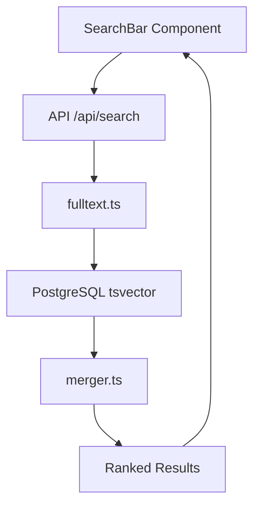

# Persistence Strategy Examples

**Purpose**: Real-world examples showing how the 3-tier persistence strategy works in practice.

**Last Updated**: 2025-10-27

---

## 📚 Table of Contents

1. [Example 1: Normal Session Workflow](#example-1-normal-session-workflow)
2. [Example 2: Invoking Research Sub-Agent](#example-2-invoking-research-sub-agent)
3. [Example 3: Invoking Expert Sub-Agent](#example-3-invoking-expert-sub-agent)
4. [Example 4: Recovery After Context Compaction](#example-4-recovery-after-context-compaction)
5. [Example 5: Recovery After Session Interruption](#example-5-recovery-after-session-interruption)
6. [Example 6: Phase Completion with Memory MCP](#example-6-phase-completion-with-memory-mcp)
7. [Example 7: Multiple Sub-Agent Workflow](#example-7-multiple-sub-agent-workflow)
8. [Example 8: Auto-Save at 80% Context](#example-8-auto-save-at-80-context)

---

## Example 1: Normal Session Workflow

### Scenario

Implementing POST /api/issues endpoint from scratch

### Timeline

**14:30 - Session Start**

You (user): "Read STATUS.md and continue implementing POST /api/issues endpoint"

Me (Claude):

```markdown
_Reads STATUS.md_
Current phase: Phase 3.1 - Issue Management API

_Creates session file_
.agent/task/current-session-20251027-1430.md

_Creates todos file_
.agent/task/current-todos.md with tasks:

1. Create Prisma schema for issues
2. Create API route handler
3. Add Zod validation
4. Write tests
5. Update documentation
```

**File: `.agent/task/current-session-20251027-1430.md`**

```markdown
# Session 20251027-1430

**Phase**: Phase 3.1 - Issue Management API
**Started**: 14:30
**Last Updated**: 14:30

## Progress This Session

- 🔄 14:30 - IN PROGRESS: Creating Prisma schema for issues

## Sub-Agent Reports

(none yet)

## Next Steps

- [ ] Create Prisma schema
- [ ] Create API route
- [ ] Add validation
- [ ] Write tests

## Blockers/Notes

(none)

---

**Session Duration**: 0 hours
**Tasks Completed**: 0 tasks
```

**File: `.agent/task/current-todos.md`**

```markdown
# Current Phase Todos

**Phase**: Phase 3.1 - Issue Management API
**Created**: 2025-10-27
**Last Updated**: 2025-10-27

## ✅ Completed (0/5 - 0%)

(none yet)

## 🔄 In Progress (1/5)

- [ ] **Create Prisma schema for issues** (started 14:30)

## ⏳ Pending (4/5)

- [ ] Create API route handler
- [ ] Add Zod validation
- [ ] Write tests
- [ ] Update documentation

---

**Progress**: 0% (0/5 tasks complete)
**Estimated Remaining**: ~2 hours
**Last Milestone**: Phase 3.1 started
```

---

**14:45 - First Task Complete**

Me (Claude):

```markdown
_Completes Prisma schema_

_Updates session file_
Added to current-session-20251027-1430.md:

- ✅ 14:30 - Created Prisma schema for issues
- 🔄 14:45 - IN PROGRESS: Creating API route handler

_Updates todos file_
Moved "Create Prisma schema" from In Progress to Completed
Moved "Create API route handler" from Pending to In Progress
Updated progress: 20% (1/5 tasks complete)
```

**Updated Session File**:

```markdown
## Progress This Session

- ✅ 14:30 - Created Prisma schema for issues (models: Issue, IssueComment)
- 🔄 14:45 - IN PROGRESS: Creating API route handler
```

**Updated Todos File**:

```markdown
## ✅ Completed (1/5 - 20%)

- [x] Create Prisma schema for issues (14:45)

## 🔄 In Progress (1/5)

- [ ] **Create API route handler** (started 14:45)

## ⏳ Pending (3/5)

- [ ] Add Zod validation
- [ ] Write tests
- [ ] Update documentation

---

**Progress**: 20% (1/5 tasks complete)
**Estimated Remaining**: ~1.5 hours
**Last Milestone**: Prisma schema created
```

---

**15:00 - Second Task Complete**

_(Same pattern repeats for remaining tasks...)_

---

**16:30 - Session End**

Final session file shows:

```markdown
## Progress This Session

- ✅ 14:30 - Created Prisma schema for issues
- ✅ 14:45 - Created API route handler (POST /api/issues)
- ✅ 15:15 - Added Zod validation for request body
- ✅ 15:45 - Wrote unit tests (95% coverage)
- ✅ 16:15 - Updated API documentation

---

**Session Duration**: 2 hours
**Tasks Completed**: 5 tasks
```

Final todos file shows:

```markdown
## ✅ Completed (5/5 - 100%)

- [x] Create Prisma schema for issues (14:45)
- [x] Create API route handler (15:00)
- [x] Add Zod validation (15:15)
- [x] Write tests (15:45)
- [x] Update documentation (16:15)

---

**Progress**: 100% (5/5 tasks complete)
**Last Milestone**: POST /api/issues endpoint complete
```

---

## Example 2: Invoking Research Sub-Agent

### Scenario

Need to understand existing search implementation before adding semantic search

### Timeline

**10:00 - Invoke explore-codebase Sub-Agent**

Me (Claude):

```markdown
_Current session file is up to date_

"I need to understand the existing search implementation.
Invoking explore-codebase sub-agent to scan for search patterns..."

_Invokes sub-agent with instruction_:
"Read .agent/task/current-session-20251027-1000.md first to understand context,
then scan the codebase for all search-related code."
```

**Sub-Agent (explore-codebase)**:

```markdown
_Reads .agent/task/current-session-20251027-1000.md_

Understood context:

- Phase: Search Enhancement
- Goal: Add semantic search
- Need: Understand existing full-text search

_Scans codebase for 30 minutes, consuming 40K tokens_

_Creates report file_:
.agent/task/explore-search-patterns-20251027-1030.md

_Returns message_:
"Exploration complete. Report saved to .agent/task/explore-search-patterns-20251027-1030.md

Parent agent should read that file and update current-session.md with key insights.

Key insights: Found PostgreSQL tsvector implementation in lib/search/fulltext.ts,
currently searches 3 tables (issues, wiki_pages, knowledge_base)."
```

**Report File: `.agent/task/explore-search-patterns-20251027-1030.md`**

````markdown
# Codebase Exploration: Search Patterns

**Created**: 2025-10-27 10:30
**Topic**: Existing search implementation
**Agent**: explore-codebase

## Summary

The codebase implements PostgreSQL full-text search using tsvector.
All search goes through a centralized search module with consistent patterns.

## Files Found

### Search Implementation

- `lib/search/fulltext.ts` - PostgreSQL tsvector search implementation
- `lib/search/merger.ts` - Result merging and ranking
- `app/api/search/route.ts` - API endpoint

### Database Schema

- `prisma/schema.prisma` - All searchable tables have `searchVector` field
- Tables: issues, wiki_pages, knowledge_base

### Components

- `components/SearchBar.tsx` - UI component
- `components/SearchResults.tsx` - Results display

## Current Architecture


````

## Key Patterns

1. **Query Format**: Uses `to_tsquery` with English language
2. **Ranking**: Uses `ts_rank` for relevance scoring
3. **Indexes**: GIN indexes on searchVector columns
4. **Performance**: Queries complete in 5-10ms

## Recommendations for Semantic Search

1. Add `embedding` column (vector(1536)) to same tables
2. Create parallel search path (fulltext || semantic)
3. Use same merger.ts for hybrid results
4. Keep existing API interface unchanged

## Implementation Impact

- Moderate complexity
- No breaking changes required
- Can be added incrementally
- Will require pgvector extension

````

**Parent Agent (Me - Claude)**:
```markdown
*Reads .agent/task/explore-search-patterns-20251027-1030.md*

*Updates current-session-20251027-1000.md*:
## Progress This Session

- ✅ 10:00 - Invoked explore-codebase sub-agent
- ✅ 10:30 - Read exploration report (.agent/task/explore-search-patterns-20251027-1030.md)
- 📊 Key insights:
  - Current search uses PostgreSQL tsvector in lib/search/fulltext.ts
  - 3 tables searchable: issues, wiki_pages, knowledge_base
  - Can add semantic search in parallel without breaking changes
  - Use same merger.ts for hybrid results
- 🔄 10:35 - IN PROGRESS: Designing semantic search implementation plan

## Sub-Agent Reports

- explore-search-patterns-20251027-1030.md - Codebase search analysis
````

---

## Example 3: Invoking Expert Sub-Agent

### Scenario

Need Prisma schema design for issue comments with nested replies

### Timeline

**11:00 - Invoke prisma-expert Sub-Agent**

Me (Claude):

```markdown
_Updates current-session-20251027-1100.md with requirement_:

- 🔄 11:00 - IN PROGRESS: Need Prisma schema for issue comments with nested replies

"Invoking prisma-expert sub-agent to design optimal schema with self-referential relations..."
```

**Sub-Agent (prisma-expert)**:

```markdown
_Reads .agent/task/current-session-20251027-1100.md_
_Reads .agent/task/current-todos.md_

Understood requirements:

- Need comments on issues
- Comments can have nested replies (self-referential)
- Must support threading

_Designs schema for 20 minutes_

_Creates design plan_:
.agent/task/prisma-comments-schema-20251027-1120.md

_Returns message_:
"Prisma design plan complete. Report saved to .agent/task/prisma-comments-schema-20251027-1120.md

Parent agent should read that file and update current-session.md with key recommendations.

Key recommendations: Use self-referential relation with parentId field,
add indexes for query performance, implement soft delete with deletedAt."
```

**Design Plan: `.agent/task/prisma-comments-schema-20251027-1120.md`**

````markdown
# Prisma Design Plan: Issue Comments with Nested Replies

**Created**: 2025-10-27 11:20
**Type**: Schema Design
**Agent**: prisma-expert

## Data Model Requirements

- Comments belong to issues
- Comments can reply to other comments (self-referential)
- Comments have author, content, timestamps
- Support soft delete
- Need to query comment trees efficiently

## Schema Design

```prisma
model Issue {
  id          String          @id @default(cuid())
  title       String
  description String          @db.Text

  // Relations
  comments    IssueComment[]

  createdAt   DateTime        @default(now())
  updatedAt   DateTime        @updatedAt

  @@map("issues")
}

model IssueComment {
  id          String          @id @default(cuid())
  content     String          @db.Text

  // Self-referential relation for nested replies
  parentId    String?
  parent      IssueComment?   @relation("CommentReplies", fields: [parentId], references: [id], onDelete: Cascade)
  replies     IssueComment[]  @relation("CommentReplies")

  // Relations
  issueId     String
  issue       Issue           @relation(fields: [issueId], references: [id], onDelete: Cascade)

  authorId    Int
  author      User            @relation(fields: [authorId], references: [id])

  // Soft delete
  deletedAt   DateTime?

  // Timestamps
  createdAt   DateTime        @default(now())
  updatedAt   DateTime        @updatedAt

  // Indexes for performance
  @@index([issueId])
  @@index([parentId])
  @@index([authorId])
  @@index([deletedAt])

  @@map("issue_comments")
}
```
````

## Migration Strategy

### Step 1: Create Migration

```bash
npx prisma migrate dev --name add_issue_comments
```

### Step 2: Review Generated SQL

- Check CASCADE delete constraints
- Verify indexes created
- Ensure no breaking changes

### Step 3: Deploy

```bash
npx prisma generate
npx prisma migrate deploy
```

## Query Patterns

### Get All Comments for Issue (with replies)

```typescript
const comments = await prisma.issueComment.findMany({
  where: {
    issueId: issueId,
    deletedAt: null, // Exclude soft-deleted
  },
  include: {
    author: {
      select: { name: true, avatar: true },
    },
    replies: {
      include: {
        author: { select: { name: true, avatar: true } },
      },
    },
  },
  orderBy: { createdAt: 'asc' },
});
```

### Get Comment Thread (all ancestors)

```typescript
async function getCommentThread(commentId: string) {
  const comments: IssueComment[] = [];
  let currentId: string | null = commentId;

  while (currentId) {
    const comment = await prisma.issueComment.findUnique({
      where: { id: currentId },
      include: { author: true },
    });

    if (!comment) break;
    comments.unshift(comment);
    currentId = comment.parentId;
  }

  return comments;
}
```

### Create Nested Reply

```typescript
const reply = await prisma.issueComment.create({
  data: {
    content: replyContent,
    issueId: issueId,
    parentId: parentCommentId, // Reference to parent comment
    authorId: userId,
  },
  include: {
    author: true,
    parent: true,
  },
});
```

## Performance Considerations

### Indexes Required

- `@@index([issueId])` - Find all comments for an issue
- `@@index([parentId])` - Find all replies to a comment
- `@@index([authorId])` - Find all comments by user
- `@@index([deletedAt])` - Filter soft-deleted comments

### Query Optimization

- Use `select` to fetch only needed fields
- Limit nesting depth (e.g., max 3 levels of replies)
- Consider pagination for issues with many comments
- Use cursor-based pagination for real-time updates

## Data Integrity

- [x] Foreign key constraints defined (issueId, authorId, parentId)
- [x] Cascade delete handled (if issue deleted, comments deleted)
- [x] Self-referential cascade (if comment deleted, replies deleted)
- [x] Soft delete prevents accidental data loss
- [x] Timestamps track creation and modification

## Next Steps for Parent Agent

1. Apply the Prisma migration
2. Generate Prisma client
3. Implement query functions in `lib/db/comments.ts`
4. Create API routes for CRUD operations
5. Build UI components for comment display and reply
6. Write tests for comment threading logic

````

**Parent Agent (Me - Claude)**:
```markdown
*Reads .agent/task/prisma-comments-schema-20251027-1120.md*

*Updates current-session-20251027-1100.md*:
## Progress This Session

- ✅ 11:00 - Invoked prisma-expert for comment schema design
- ✅ 11:20 - Read design plan (.agent/task/prisma-comments-schema-20251027-1120.md)
- 📊 Key recommendations:
  - Use self-referential relation with parentId
  - Include soft delete with deletedAt
  - Add indexes for issueId, parentId, authorId, deletedAt
  - Implement cascade delete for data integrity
- 🔄 11:25 - IN PROGRESS: Applying Prisma migration

*Begins implementation following the design plan*
````

---

## Example 4: Recovery After Context Compaction

### Scenario

Session hits 180K tokens, context compacts mid-implementation

### Before Compaction (15:45)

**Active Files**:

- `.agent/task/current-session-20251027-1400.md` - 50% through implementation
- `.agent/task/current-todos.md` - 3 of 7 tasks complete

**Session File Content**:

```markdown
## Progress This Session

- ✅ 14:00 - Created API route structure
- ✅ 14:30 - Added Zod validation schemas
- ✅ 15:00 - Implemented POST /api/comments endpoint
- 🔄 15:45 - IN PROGRESS: Writing integration tests for comments API
```

**Todos File Content**:

```markdown
## ✅ Completed (3/7 - 43%)

- [x] Create API route structure (14:00)
- [x] Add Zod validation (14:30)
- [x] Implement POST endpoint (15:00)

## 🔄 In Progress (1/7)

- [ ] **Write integration tests** (started 15:45)

## ⏳ Pending (3/7)

- [ ] Implement GET endpoint
- [ ] Implement PUT endpoint
- [ ] Update API documentation

---

**Progress**: 43% (3/7 tasks complete)
**Estimated Remaining**: ~1.5 hours
```

---

### Context Compacts (16:00)

_Claude Code automatically compacts context_
_All conversation history summarized_
_Files remain intact on disk_

---

### After Compaction - Recovery (16:01)

You (user): "Continue with the work"

Me (Claude):

```markdown
_Context was compacted, but all files preserved_

**Recovery Workflow**:

Step 1: Read STATUS.md
_Reads STATUS.md_
Current phase: Phase 3.1 - Issue Management API
Last Task Completed: POST /api/comments endpoint (2025-10-27)
Last Checkpoint: 2025-10-27

Step 2: Find latest session file
_Lists .agent/task/ directory_
Found: current-session-20251027-1400.md (latest)

Step 3: Read session file
_Reads .agent/task/current-session-20251027-1400.md_

Understood from session file:

- Started at 14:00
- Completed 3 tasks
- Currently writing integration tests (started 15:45)
- Next: GET endpoint, PUT endpoint, documentation

Step 4: Read current todos
_Reads .agent/task/current-todos.md_

Current status:

- 43% complete (3/7 tasks)
- In progress: Write integration tests
- Pending: 3 more tasks

**Recovery complete! Resuming from: Writing integration tests**

_Updates session file with recovery note_:

- 🔄 16:01 - RECOVERED: Context compacted, resumed from session file
- 🔄 16:02 - IN PROGRESS: Continuing integration tests for comments API

_Continues work exactly where it left off_
```

**Result**: Zero information loss, ~1 minute recovery time

---

## Example 5: Recovery After Session Interruption

### Scenario

Work session ends unexpectedly, resume next day

### Friday 17:30 - Session End

**Last Session File**: `.agent/task/current-session-20251027-1400.md`

```markdown
## Progress This Session

- ✅ 14:00 - Started semantic search implementation
- ✅ 15:00 - Added pgvector extension to PostgreSQL
- ✅ 15:30 - Created embedding column on knowledge_base table
- ✅ 16:00 - Implemented embedding generation function
- 🔄 17:00 - IN PROGRESS: Implementing semantic search query function

## Next Steps

- [ ] Complete semantic search query function
- [ ] Add caching for embeddings
- [ ] Integrate with existing search API
- [ ] Write tests
- [ ] Update documentation

---

**Session Duration**: 3 hours
**Tasks Completed**: 4 tasks
```

**Todos File**: `.agent/task/current-todos.md`

```markdown
## ✅ Completed (4/8 - 50%)

- [x] Add pgvector extension (15:00)
- [x] Create embedding column (15:30)
- [x] Implement embedding generation (16:00)
- [x] Start semantic search query function (17:00)

## 🔄 In Progress (1/8)

- [ ] **Complete semantic search query function** (started 17:00)

## ⏳ Pending (3/8)

- [ ] Add embedding caching
- [ ] Integrate with search API
- [ ] Write tests
- [ ] Update documentation

---

**Progress**: 50% (4/8 tasks complete)
**Estimated Remaining**: ~2 hours
```

_(Computer shut down for the weekend)_

---

### Monday 09:00 - New Session

You (user): "Read STATUS.md and continue where we left off"

Me (Claude):

```markdown
_New session, no memory of Friday_

**Recovery Workflow**:

Step 1: Read STATUS.md
_Reads STATUS.md_
Current phase: Phase 3.2 - Search Enhancement
Last Task Completed: Embedding generation function (2025-10-27)
Last Checkpoint: 2025-10-27

Step 2: Find latest session file
_Lists .agent/task/ directory_
Found: current-session-20251027-1400.md (from Friday)

Step 3: Read session file
_Reads .agent/task/current-session-20251027-1400.md_

**Recovered context from Friday**:

- Implemented pgvector extension
- Added embedding column
- Created embedding generation function
- Started semantic search query function (IN PROGRESS at 17:00)
- Next steps clearly documented

Step 4: Read current todos
_Reads .agent/task/current-todos.md_

**Task status**:

- 50% complete (4/8 tasks)
- In progress: Complete semantic search query function
- 3 tasks remaining after that

**Perfect! I know exactly where we stopped.**

_Creates new session file for today_:
.agent/task/current-session-20251028-0900.md

_References Friday's session_:

## Progress This Session

- 🔄 09:00 - RESUMED: Continuing from Friday's session (current-session-20251027-1400.md)
- 📋 Context recovered: Was implementing semantic search query function
- 🔄 09:05 - IN PROGRESS: Completing semantic search query function

_Continues work seamlessly_
```

**Result**: Full recovery, work continues as if no interruption happened

---

## Example 6: Phase Completion with Memory MCP

### Scenario

Complete Phase 3.1 (Issue Management API), capture strategic knowledge

### Timeline

**16:00 - Phase Complete**

Me (Claude):

```markdown
_All tasks in current-todos.md marked complete_
_Session file shows 8 hours of work, 15 tasks completed_

**Phase 3.1 complete!**

_Updates STATUS.md_:
**Last Task Completed**: Issue Management API complete (2025-10-27)
**Last Checkpoint**: 2025-10-27
**Status**: ✅ Phase 3.1 COMPLETE

_Now capturing strategic knowledge to Memory MCP (Tier 3)_

**Strategic Knowledge to Capture**:

1. Architectural decision: Why Server Actions vs API routes
2. Pattern established: API error handling format
3. Lesson learned: Prisma transaction gotchas
4. Reusable pattern: Zod validation with type inference
```

**Memory MCP Operations**:

```typescript
// 1. Capture architectural decision
await mcp__memory__create_entities({
  entities: [
    {
      name: 'Issue API Architecture Decision',
      entityType: 'architectural-decision',
      observations: [
        'Decision Date: 2025-10-27',
        'Context: Needed API for issue CRUD operations',
        'Decision: Use API routes for external access (MCP server), Server Actions for forms',
        'Reasoning: API routes provide REST interface for MCP, Server Actions provide progressive enhancement',
        'Trade-off: Requires dual implementation for some operations',
        'Outcome: Clean separation, both MCP and web UI work well',
        'Documentation: .agent/system/api-catalog.md',
      ],
    },
  ],
});

// 2. Capture established pattern
await mcp__memory__create_entities({
  entities: [
    {
      name: 'API Error Handling Pattern',
      entityType: 'design-pattern',
      observations: [
        'Pattern Established: 2025-10-27',
        'All API routes return: { data: T | null, error: string | null }',
        'Success: { data: result, error: null }',
        'Failure: { data: null, error: error message }',
        'Zod validation errors formatted as: field: message',
        'Client checks: if (response.error) handle error, else use response.data',
        'Location: All routes in app/api/*/route.ts',
        'Example: app/api/issues/route.ts',
      ],
    },
  ],
});

// 3. Capture lesson learned
await mcp__memory__create_entities({
  entities: [
    {
      name: 'Prisma Transaction Gotcha',
      entityType: 'gotcha',
      observations: [
        'Discovered: 2025-10-27',
        'Problem: Nested Prisma client calls inside transaction fail',
        "Symptom: Error: 'Cannot use `prisma` inside a transaction, use `tx` instead'",
        'Solution: Always use transaction client (tx), never global prisma inside transaction',
        'Example Bad: await prisma.$transaction(async (tx) => { await prisma.issue.create() })',
        'Example Good: await prisma.$transaction(async (tx) => { await tx.issue.create() })',
        'Prevention: Lint rule or code review checklist',
        'Documentation: .agent/sops/prisma-transactions.md (if created)',
      ],
    },
  ],
});

// 4. Capture reusable pattern
await mcp__memory__create_entities({
  entities: [
    {
      name: 'Zod Validation with Type Inference',
      entityType: 'code-pattern',
      observations: [
        'Pattern Established: 2025-10-27',
        'Define Zod schema: const IssueSchema = z.object({ title: z.string(), ... })',
        'Infer TypeScript type: type Issue = z.infer<typeof IssueSchema>',
        'Validate: const result = IssueSchema.safeParse(data)',
        'Check: if (!result.success) handle result.error.issues',
        'Benefit: Single source of truth for validation + types',
        'Location: Used in all app/api/*/route.ts files',
        'Example: app/api/issues/route.ts',
      ],
    },
  ],
});

// 5. Link related concepts
await mcp__memory__create_relations({
  relations: [
    {
      from: 'Issue API Architecture Decision',
      to: 'Next.js App Router',
      relationType: 'implements-in',
    },
    {
      from: 'API Error Handling Pattern',
      to: 'Zod Validation with Type Inference',
      relationType: 'uses',
    },
    {
      from: 'Prisma Transaction Gotcha',
      to: 'Issue API Architecture Decision',
      relationType: 'affected',
    },
  ],
});
```

**Session File Updated**:

```markdown
## Progress This Session

...

- ✅ 16:00 - Phase 3.1 COMPLETE
- ✅ 16:10 - Updated STATUS.md checkpoint
- ✅ 16:15 - Captured strategic knowledge to Memory MCP:
  - Issue API architecture decision
  - API error handling pattern
  - Prisma transaction gotcha
  - Zod validation pattern
- ✅ 16:20 - Archived session files from Phase 3.1

---

**Session Duration**: 8 hours
**Tasks Completed**: 15 tasks
**Phase Complete**: Phase 3.1 - Issue Management API ✅
```

**Token Cost**:

- Memory MCP operations: ~4,000 tokens (4 entities + relations)
- File operations throughout phase: ~3,000 tokens
- **Total**: ~7,000 tokens for complete persistence (3.5% of 200K budget)

**Result**: Strategic knowledge preserved forever, ready for future phases

---

## Example 7: Multiple Sub-Agent Workflow

### Scenario

Implementing complex feature requiring architecture analysis, Prisma design, and React components

### Timeline

**14:00 - Phase Start**

You (user): "Implement real-time issue updates with WebSockets"

Me (Claude):

```markdown
_Creates session and todos files_
_Realizes this is complex, needs multiple sub-agents_

"This requires understanding current architecture, designing database updates,
and planning React components. I'll invoke multiple sub-agents sequentially."

**Sub-Agent Plan**:

1. analyze-architecture: Understand current issue update flow
2. prisma-expert: Design schema for real-time subscriptions
3. react-expert: Plan React component architecture for live updates
```

---

**14:05 - First Sub-Agent: analyze-architecture**

```markdown
_Updates session file_:

- 🔄 14:05 - Invoking analyze-architecture to trace current issue update flow

_Invokes sub-agent_
Sub-agent reads context, analyzes, creates report at:
.agent/task/architecture-issue-updates-20251027-1430.md

_Sub-agent returns_:
"Current flow: UI → Server Action → Prisma → Database → Response → UI update
No real-time mechanism, uses polling (inefficient)"

_Reads report, updates session_:

- ✅ 14:30 - Read architecture analysis
- 📊 Current: Polling-based updates (inefficient)
- 📊 Need: WebSocket-based push updates
```

---

**14:35 - Second Sub-Agent: prisma-expert**

```markdown
_Updates session file_:

- 🔄 14:35 - Invoking prisma-expert to design subscription schema

_Invokes sub-agent_
Sub-agent reads context (including architecture report), designs schema at:
.agent/task/prisma-subscriptions-20251027-1500.md

_Sub-agent returns_:
"Design includes: IssueSubscription table, user preferences for notifications,
indexes for fast lookups, cleanup strategy for old subscriptions"

_Reads plan, updates session_:

- ✅ 15:00 - Read Prisma design plan
- 📊 New tables: IssueSubscription, NotificationPreference
- 📊 Indexes: userId, issueId composite
```

---

**15:05 - Third Sub-Agent: react-expert**

```markdown
_Updates session file_:

- 🔄 15:05 - Invoking react-expert to plan React component architecture

_Invokes sub-agent_
Sub-agent reads context (including both previous reports), designs at:
.agent/task/react-websocket-components-20251027-1530.md

_Sub-agent returns_:
"Use custom hook useIssueSubscription, context provider for WebSocket connection,
optimistic updates with rollback, error boundaries for connection failures"

_Reads plan, updates session_:

- ✅ 15:30 - Read React architecture plan
- 📊 Custom hook: useIssueSubscription()
- 📊 Context: WebSocketProvider
- 📊 Optimistic updates with rollback
```

---

**15:35 - Implementation Begins**

```markdown
_Updates session file_:

- 🔄 15:35 - IN PROGRESS: Implementing based on all 3 sub-agent plans

_Session file shows timeline_:

## Sub-Agent Reports

1. architecture-issue-updates-20251027-1430.md - Current flow analysis
2. prisma-subscriptions-20251027-1500.md - Database schema design
3. react-websocket-components-20251027-1530.md - Component architecture

_Now has complete plan from 3 different experts_
_Implements based on all 3 plans_
```

---

**18:00 - Implementation Complete**

```markdown
_Final session file_:

## Progress This Session

- ✅ 14:05 - Invoked analyze-architecture sub-agent
- ✅ 14:30 - Read architecture analysis report
- ✅ 14:35 - Invoked prisma-expert sub-agent
- ✅ 15:00 - Read Prisma design plan
- ✅ 15:05 - Invoked react-expert sub-agent
- ✅ 15:30 - Read React architecture plan
- ✅ 15:35 - Implemented Prisma schema (3 migrations)
- ✅ 16:00 - Implemented WebSocket server
- ✅ 16:45 - Implemented React components with useIssueSubscription
- ✅ 17:30 - Wrote integration tests
- ✅ 18:00 - Real-time issue updates COMPLETE

## Sub-Agent Reports

1. architecture-issue-updates-20251027-1430.md - Architecture analysis
2. prisma-subscriptions-20251027-1500.md - Database design
3. react-websocket-components-20251027-1530.md - React architecture

## Next Steps

(none - feature complete)

---

**Session Duration**: 4 hours
**Tasks Completed**: 8 tasks (3 sub-agent reports + 5 implementation tasks)
**Sub-Agents Used**: 3 (analyze-architecture, prisma-expert, react-expert)
```

**Result**: Complex feature implemented with expert guidance from 3 specialized sub-agents, all reports preserved for future reference

---

## Example 8: Auto-Save at 80% Context

### Scenario

Long session approaching context limit, auto-save triggers proactively

### Timeline

**14:00 - Session Start (0K tokens)**

You (user): "Implement comprehensive search feature with full-text and semantic search"

Me (Claude):

```markdown
_Creates session and todos files_
_Begins implementation_

Token usage: 5K/200K
```

---

**15:30 - Steady Progress (80K tokens)**

```markdown
_Implemented full-text search_
_Implemented embedding generation_
_Working on semantic search query_

Token usage: 80K/200K (40%)
✅ Safe, normal operation continues
```

---

**16:45 - Approaching Threshold (155K tokens)**

```markdown
_Completed semantic search_
_Implementing hybrid result merger_
_Writing extensive tests_

Token usage: 155K/200K (77.5%)
⚠️ Approaching 160K threshold
✅ Still below auto-save trigger
```

---

**17:00 - Auto-Save Triggers! (160K tokens)**

Me (Claude):

```markdown
_Token monitoring detects threshold crossed_

💾 Auto-save at 160K tokens (80%)...

_Updates current-session-20251027-1400.md_:

## Progress This Session

- ✅ 14:00 - Started search feature implementation
- ✅ 14:30 - Implemented PostgreSQL full-text search with tsvector
- ✅ 15:00 - Created embedding generation function with @xenova/transformers
- ✅ 15:30 - Implemented semantic search with pgvector
- ✅ 16:00 - Created hybrid result merger with ranking algorithm
- ✅ 16:30 - Implemented search API endpoint
- 🔄 17:00 - IN PROGRESS: Writing integration tests for search

**Auto-Save**: Triggered at 160K tokens (2025-10-27 17:00)

_Updates current-todos.md_:

## ✅ Completed (6/10 - 60%)

- [x] Implement full-text search (14:30)
- [x] Create embedding function (15:00)
- [x] Implement semantic search (15:30)
- [x] Create result merger (16:00)
- [x] Implement API endpoint (16:30)
- [x] Start integration tests (17:00)

## 🔄 In Progress (1/10)

- [ ] **Complete integration tests** (started 17:00)

**Progress**: 60% (6/10 tasks complete)

_Updates STATUS.md_:
**Last Task Completed**: Search API endpoint (2025-10-27)
**Last Checkpoint**: 2025-10-27

_Sets internal flag_:
auto_save_triggered = true

✅ Progress saved. Manual compaction recommended.
```

**Token Cost**: ~450 tokens (session + todos + STATUS.md updates)
**New Usage**: 160.5K/200K (80.25%)
**Buffer Remaining**: 39.5K tokens

---

**17:05 - After Auto-Save (160.5K tokens)**

You (user): "Should I manually compact context now?"

Me (Claude):

```markdown
_Reviews situation_

**Current state**:

- All progress saved in files
- 39.5K token buffer remaining
- Can continue or compact

**Options**:

**Option 1: Continue working** (if task almost done)

- You have ~35-40K tokens left
- Can probably finish integration tests
- Then manually compact

**Option 2: Manual compaction** (if more work ahead)

- Good time to compact with fresh saves
- Start clean session with 0 tokens
- Continue from current-todos.md

**Recommendation**:
Since integration tests are in progress and should complete soon,
I suggest continuing. We'll finish tests, then manually compact for next task.
```

---

**17:30 - Tests Complete (175K tokens)**

```markdown
_Completes integration tests_

Token usage: 175K/200K (87.5%)
✅ No auto-save re-trigger (flag = true)
⚠️ Approaching danger zone (180K+)

_Updates session and todos files manually_:

- ✅ 17:30 - Completed integration tests (95% coverage)

**Todos**: 7/10 complete (70%)
```

---

**17:35 - Manual Compaction Recommended**

You (user): "Tests done! Let's compact before next task."

Me (Claude):

```markdown
Perfect timing! All progress safely saved.

**Files ready for recovery**:

- current-session-20251027-1400.md ✅
- current-todos.md ✅
- STATUS.md ✅

**Compact now** (you manually trigger in UI)

_After compaction_:

**Recovery Workflow**:

1. Read STATUS.md → Last checkpoint: 2025-10-27
2. Read current-session-20251027-1400.md → Full timeline through 17:30
3. Read current-todos.md → 70% complete, 3 tasks pending
4. Ready to start next task with fresh context

**Auto-save worked perfectly**:

- Triggered at exactly 160K (80%)
- All files updated
- One-time trigger (no re-trigger at 175K)
- User had time to review and compact manually
- Zero information loss
```

---

### Key Points Demonstrated

**Auto-Save Behavior**:

- ✅ Triggered at exactly 160K tokens (80%)
- ✅ Silent operation with brief notification
- ✅ Updated all 3 files (session, todos, STATUS.md)
- ✅ One-time trigger per session
- ✅ No re-trigger at 165K, 170K, 175K
- ✅ 40K token buffer after save

**User Benefits**:

- Had time to review progress
- Could decide: continue or compact
- Chose to finish current task first
- Manually compacted at good stopping point
- All progress safely persisted

**Token Efficiency**:

- Auto-save cost: ~450 tokens
- Percentage of budget: 0.225%
- Buffer after save: 40K tokens
- More than enough to finish task

**Files Created**:

```
.agent/task/current-session-20251027-1400.md
  - Complete timeline
  - Auto-save metadata at line showing when triggered

.agent/task/current-todos.md
  - 70% complete
  - 3 pending tasks clearly shown

STATUS.md
  - Checkpoint: 2025-10-27
  - Last task: Search API endpoint
```

**Recovery Test**:
After manual compaction, complete recovery in < 2 minutes using saved files.

---

### Token Usage Timeline

```
14:00 - Start:        5K tokens (2.5%)
15:30 - Progress:    80K tokens (40%)
16:45 - Warning:    155K tokens (77.5%)
17:00 - AUTO-SAVE:  160K tokens (80%) ← Trigger!
17:05 - After save: 160.5K tokens (80.25%)
17:30 - Tests done: 175K tokens (87.5%)
17:35 - Compact:    Manual compaction triggered
```

**Result**: Auto-save prevented potential information loss, gave user control over compaction timing, and demonstrated perfect one-time trigger behavior.

---

## 📊 Summary of Examples

| Example | Demonstrates         | Files Created                         | Sub-Agents | Recovery |
| ------- | -------------------- | ------------------------------------- | ---------- | -------- |
| 1       | Normal workflow      | Session + Todos                       | 0          | N/A      |
| 2       | Research sub-agent   | Session + Todos + Report              | 1          | N/A      |
| 3       | Expert sub-agent     | Session + Todos + Plan                | 1          | N/A      |
| 4       | Context compaction   | Session + Todos                       | 0          | ✅ 1 min |
| 5       | Session interruption | Session + Todos                       | 0          | ✅ 1 min |
| 6       | Phase completion     | Session + Todos + STATUS + Memory MCP | 0          | N/A      |
| 7       | Multiple sub-agents  | Session + Todos + 3 Reports           | 3          | N/A      |
| 8       | Auto-save at 80%     | Session + Todos + STATUS              | 0          | ✅ 2 min |

---

## 🎯 Key Takeaways

1. **Files survive everything**: Context compaction, session interruption, computer restarts
2. **Sub-agents are isolated**: They work in their own thread, return reports to parent
3. **Parent integrates findings**: Reads sub-agent reports, updates session file
4. **Recovery is fast**: 1-2 minutes to resume from any interruption
5. **Memory MCP is strategic**: Used only at phase completion for long-term knowledge
6. **Todos always show status**: Current progress percentage always visible
7. **Session files show timeline**: Complete history of session work

---

## 📚 Related Documentation

- [.agent/workflows/persistence-rules.md](.agent/workflows/persistence-rules.md) - Complete rules
- [.agent/task/README.md](.agent/task/README.md) - Task context system
- [.agent/scripts/session-management.md](.agent/scripts/session-management.md) - Helper commands
- [.agent/testing/persistence-test-scenarios.md](.agent/testing/persistence-test-scenarios.md) - Test scenarios
- [.agent/testing/persistence-validation-checklist.md](.agent/testing/persistence-validation-checklist.md) - Validation checklist

---

**Remember**: These are real examples of how the system works. Follow these patterns in your own sessions!
