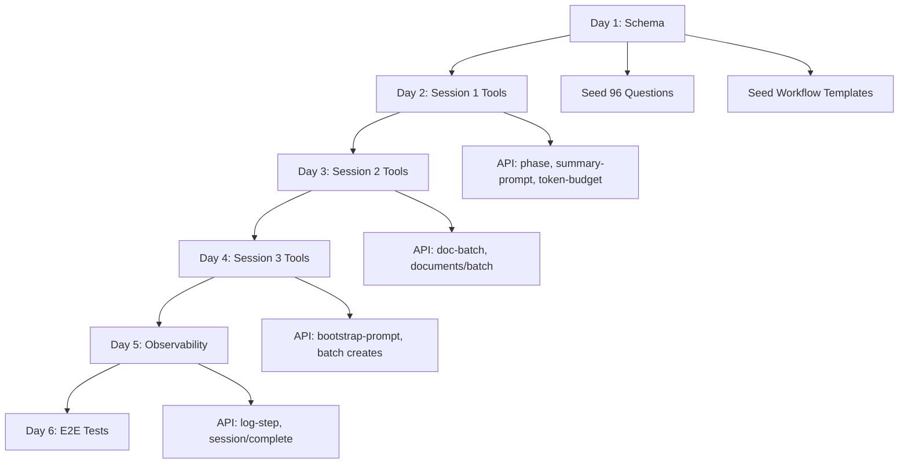

# Implementation Plan

**Related**: [Overview](./01-overview.md) | [Schema](./02-schema-changes.md) | [MCP Tools](./03-mcp-tools.md) | [Testing](./05-migration-testing.md)

---

## Overview

This document provides a week-by-week implementation plan for the onboarding refactor, including:
- Day-by-day tasks and deliverables
- File changes matrix
- Dependency order
- Estimated hours per task
- Success criteria checkpoints

**Total Effort**: 24 story points (~7-11 hours)  
**Duration**: 2-3 weeks (Sprint 9)  
**Team Size**: 1 developer (solo)

---

## Week 1: Schema + Session 1 Tools (8 points, ~3-4 hours)

### Day 1: Database Schema (3 hours)

#### Tasks
- [ ] Update `apps/web/prisma/schema.prisma` with new fields
- [ ] Generate Prisma migration
- [ ] Apply migration to dev database
- [ ] Update OnboardingQuestion seed (96 questions)
- [ ] Create WorkflowTemplate seed (16 templates)
- [ ] Run seeds on dev database
- [ ] Verify schema changes

#### Files Modified
```
apps/web/prisma/schema.prisma
apps/web/prisma/migrations/XXXXXX_onboarding_refactor/migration.sql (new)
apps/web/prisma/seeds/onboarding-questions.ts
apps/web/prisma/seeds/workflow-templates.ts (new)
apps/web/prisma/seed.ts
```

#### Commands
```bash
# In apps/web directory
cd apps/web

# Generate migration
pnpm prisma migrate dev --name onboarding_refactor_schema

# Verify
pnpm prisma db pull
pnpm prisma format

# Seed
pnpm prisma db seed

# Check seed data
psql -h 192.168.1.15 -U postgres -d projectpulse_dev
> SELECT COUNT(*) FROM onboarding_questions; -- Should be 96
> SELECT COUNT(*) FROM workflow_templates WHERE category='onboarding';
> \q
```

#### Success Criteria
- ✅ Migration applied successfully
- ✅ 96 questions seeded
- ✅ 16 workflow templates seeded
- ✅ Schema matches specification

### Day 2: Session 1 MCP Tools Refactor (4-5 hours)

#### Tasks
- [ ] Rename `getQuestions` → `getPhasedQuestions`
- [ ] Rename `saveAnswers` → `savePhase` (update to use `planningAnswers` field)
- [ ] Create `finalizeSummary` tool (fetch from WorkflowTemplate)
- [ ] Create `checkTokenBudget` tool
- [ ] Update API routes:
  - `/api/onboarding/questions` → fetch from DB + WorkflowTemplate
  - `/api/onboarding/phase` → store in `planningAnswers`
  - `/api/onboarding/summary-prompt` (new)
  - `/api/onboarding/token-budget` (new)
- [ ] Unit tests for new tools
- [ ] Register tools in MCP server index

#### Files Created
```
apps/mcp-server/src/tools/onboarding/getPhasedQuestionsTool.ts
apps/mcp-server/src/tools/onboarding/savePhaseTool.ts
apps/mcp-server/src/tools/onboarding/finalizeSummaryTool.ts
apps/mcp-server/src/tools/onboarding/checkTokenBudgetTool.ts
apps/web/app/api/onboarding/phase/route.ts
apps/web/app/api/onboarding/summary-prompt/route.ts
apps/web/app/api/onboarding/token-budget/route.ts
```

#### Files Modified
```
apps/mcp-server/src/tools/index.ts (register new tools)
apps/web/app/api/onboarding/questions/route.ts (inject WorkflowTemplate prompt)
```

#### API Route Implementations

**`POST /api/onboarding/phase`**:
```typescript
// apps/web/app/api/onboarding/phase/route.ts

import { NextRequest, NextResponse } from 'next/server';
import { z } from 'zod';
import { prisma } from '@/lib/prisma';

const requestSchema = z.object({
  projectId: z.number().int().positive(),
  phase: z.number().int().min(1).max(10),
  answers: z.record(z.union([z.string(), z.number(), z.array(z.string())]))
});

export async function POST(request: NextRequest) {
  const body = await request.json();
  const { projectId, phase, answers } = requestSchema.parse(body);
  
  // Get or create session
  let session = await prisma.onboardingSession.findUnique({
    where: { projectId_sessionNumber: { projectId, sessionNumber: 1 } }
  });
  
  if (!session) {
    session = await prisma.onboardingSession.create({
      data: {
        projectId,
        sessionNumber: 1,
        status: 'in_progress',
        startedAt: new Date()
      }
    });
  }
  
  // Merge answers into planningAnswers
  const currentAnswers = (session.planningAnswers as any) || {};
  const updatedAnswers = {
    ...currentAnswers,
    [`phase${phase}`]: answers
  };
  
  // Merge into projectContextJson
  const updatedContext = mergePhaseToContext(
    session.projectContextJson as any,
    phase,
    answers
  );
  
  // Update session
  await prisma.onboardingSession.update({
    where: { id: session.id },
    data: {
      planningAnswers: updatedAnswers,
      projectContextJson: updatedContext,
      metrics: {
        phasesComplete: phase,
        tokensUsed: (session.metrics as any)?.tokensUsed || 0
      }
    }
  });
  
  const phasesComplete = phase;
  const progress = (phasesComplete / 10) * 100;
  const nextPhase = phase < 10 ? phase + 1 : null;
  
  return NextResponse.json({
    success: true,
    projectId,
    phase,
    phasesComplete,
    progress,
    nextPhase,
    message: `Phase ${phase} saved ✅. ${nextPhase ? `Proceed to Phase ${nextPhase}.` : 'All phases complete!'}`
  });
}
```

**`GET /api/onboarding/summary-prompt`**:
```typescript
// apps/web/app/api/onboarding/summary-prompt/route.ts

export async function GET(request: NextRequest) {
  const projectId = parseInt(request.nextUrl.searchParams.get('projectId')!);
  
  // Get session with all phase answers
  const session = await prisma.onboardingSession.findUnique({
    where: { projectId_sessionNumber: { projectId, sessionNumber: 1 } },
    select: { planningAnswers: true, projectContextJson: true }
  });
  
  if (!session) {
    return NextResponse.json({ error: 'Session 1 not found' }, { status: 404 });
  }
  
  // Fetch prompt template
  const template = await prisma.workflowTemplate.findUnique({
    where: { name_isActive: { name: 'onboarding-session-1-executive-summary', isActive: true } }
  });
  
  // Inject variables into prompt
  const userPrompt = injectVariables(template!.userPrompt, {
    phase1Answers: (session.planningAnswers as any).phase1,
    phase2Answers: (session.planningAnswers as any).phase2,
    // ... phase3-10
  });
  
  return NextResponse.json({
    projectId,
    systemPrompt: template!.systemPrompt,
    userPrompt,
    metadata: {
      totalQuestions: 96,
      totalPhases: 10,
      userPromptCharacters: userPrompt.length,
      estimatedTokens: Math.ceil(userPrompt.length / 3)
    },
    wordCountTarget: 500,
    temperature: template!.temperature
  });
}
```

**`POST /api/onboarding/token-budget`**:
```typescript
// apps/web/app/api/onboarding/token-budget/route.ts

const requestSchema = z.object({
  projectId: z.number().int().positive(),
  estimatedTokens: z.number().int().positive()
});

export async function POST(request: NextRequest) {
  const { projectId, estimatedTokens } = requestSchema.parse(await request.json());
  
  const session = await prisma.onboardingSession.findFirst({
    where: { projectId, status: 'in_progress' },
    select: { sessionNumber: true, metrics: true }
  });
  
  const tokensUsed = (session?.metrics as any)?.tokensUsed || 0;
  const totalEstimated = tokensUsed + estimatedTokens;
  const budgetLimit = 200000;
  const remaining = budgetLimit - totalEstimated;
  const safe = totalEstimated < budgetLimit;
  
  return NextResponse.json({
    projectId,
    sessionNumber: session?.sessionNumber,
    tokensUsed,
    estimatedTokens,
    totalEstimated,
    budgetLimit,
    remaining,
    safe,
    recommendation: safe 
      ? 'Proceed with operation' 
      : 'Token budget exceeded - defer remaining operations to next session'
  });
}
```

#### Success Criteria
- ✅ All 4 tools callable via MCP
- ✅ API routes return correct schemas
- ✅ Data stored in new schema fields
- ✅ Unit tests passing

---

## Week 2: Session 2 & 3 Tools (10 points, ~4-5 hours)

### Day 3: Session 2 Batch Tools (4-5 hours)

#### Tasks
- [ ] Create `getDocBatchPrompt` tool (4 batches)
- [ ] Extend `storeDocument` to `storeBatch` (bulk mode)
- [ ] Update WorkflowTemplate seed with 4 batch prompts
- [ ] Create API routes:
  - `/api/onboarding/doc-batch` (new)
  - `/api/onboarding/documents/batch` (new)
- [ ] Integration tests for batched flow

#### Files Created
```
apps/mcp-server/src/tools/onboarding/getDocBatchPromptTool.ts
apps/mcp-server/src/tools/onboarding/storeBatchTool.ts
apps/web/app/api/onboarding/doc-batch/route.ts
apps/web/app/api/onboarding/documents/batch/route.ts
```

#### Batch Definitions
```typescript
// Batch configurations
const BATCHES = {
  1: { // Planning
    docs: ['01-PRD.md', '02-SRS.md', '12-Backlog.md', '13-Project-Plan.md'],
    category: 'planning',
    estimatedTokens: 45000
  },
  2: { // Architecture
    docs: ['03-Architecture.md', '04-Data-Model.md', '05-API-Spec.md'],
    category: 'architecture',
    estimatedTokens: 35000
  },
  3: { // Implementation
    docs: ['06-UI-UX.md', '07-Security.md', '08-Testing.md'],
    category: 'implementation',
    estimatedTokens: 35000
  },
  4: { // Operations
    docs: ['09-Deployment.md', '10-Observability.md', '11-Performance.md', '14-Team-Onboarding.md', '15-Maintenance.md'],
    category: 'operations',
    estimatedTokens: 50000
  }
};
```

#### Success Criteria
- ✅ 4 batch prompts in WorkflowTemplate table
- ✅ `getDocBatchPrompt` returns batch-specific prompts
- ✅ `storeBatch` creates multiple documents atomically
- ✅ Total 15 docs tracked correctly

### Day 4: Session 3 Bootstrap Tools (5-6 hours)

#### Tasks
- [ ] Create `getBootstrapPrompt` tool (replace `bootstrap`)
- [ ] Create batch creation tools:
  - `agentPersona.createBatch`
  - `skill.createBatch`
  - `workflowTemplate.createBatch`
  - `sop.createBatch`
- [ ] Create `repo.writeMinimal` tool (optional writes)
- [ ] Create API routes:
  - `/api/onboarding/bootstrap-prompt` (new)
  - `/api/agent-personas/batch` (new)
  - `/api/skills/batch` (new)
  - `/api/workflows/batch` (new)
  - `/api/sops/batch` (new)
  - `/api/repo/write-minimal` (new)
- [ ] Update bootstrap prompt template with structured output schema

#### Files Created
```
apps/mcp-server/src/tools/onboarding/getBootstrapPromptTool.ts
apps/mcp-server/src/tools/agentPersona/createBatchTool.ts
apps/mcp-server/src/tools/skill/createBatchTool.ts
apps/mcp-server/src/tools/workflow/createBatchTool.ts
apps/mcp-server/src/tools/sop/createBatchTool.ts
apps/mcp-server/src/tools/repo/writeMinimalTool.ts
apps/web/app/api/onboarding/bootstrap-prompt/route.ts
apps/web/app/api/agent-personas/batch/route.ts
apps/web/app/api/skills/batch/route.ts
apps/web/app/api/workflows/batch/route.ts
apps/web/app/api/sops/batch/route.ts
apps/web/app/api/repo/write-minimal/route.ts
```

#### Example: `agentPersona.createBatch` API
```typescript
// apps/web/app/api/agent-personas/batch/route.ts

const requestSchema = z.object({
  projectId: z.number().int().positive(),
  personas: z.array(z.object({
    name: z.string().min(1).max(100),
    description: z.string().min(10).max(1000),
    activationTriggers: z.array(z.string()).optional()
  })).min(3).max(10)
});

export async function POST(request: NextRequest) {
  const { projectId, personas } = requestSchema.parse(await request.json());
  
  // Bulk create with transaction
  const created = await prisma.$transaction(
    personas.map(persona => 
      prisma.agentPersona.create({
        data: {
          projectId,
          ...persona
        }
      })
    )
  );
  
  return NextResponse.json({
    success: true,
    projectId,
    created: created.length,
    totalPersonas: created.length,
    message: `Created ${created.length} agent personas ✅`
  });
}
```

#### Success Criteria
- ✅ 6 new tools registered and callable
- ✅ Batch creates work atomically (all or nothing)
- ✅ `repo.writeMinimal` only writes if called
- ✅ Bootstrap prompt includes structured output schema

---

## Week 3: Observability & Testing (6 points, ~2-3 hours)

### Day 5: Progress Tracking & Validation (2-3 hours)

#### Tasks
- [ ] Create `logStep` tool (AgentAction logging)
- [ ] Create `completeSession` tool (validation reports)
- [ ] Update MCP tool index (register all 17 tools)
- [ ] Add backward compatibility: Legacy tool redirects
- [ ] Update API routes:
  - `/api/onboarding/log-step` (new)
  - `/api/onboarding/session/complete` (new)

#### Files Created
```
apps/mcp-server/src/tools/onboarding/logStepTool.ts
apps/mcp-server/src/tools/onboarding/completeSessionTool.ts
apps/web/app/api/onboarding/log-step/route.ts
apps/web/app/api/onboarding/session/complete/route.ts
```

#### Files Modified
```
apps/mcp-server/src/tools/index.ts (final tool registration)
apps/mcp-server/src/tools/onboarding/getQuestions.ts (add deprecation redirect)
apps/mcp-server/src/tools/onboarding/saveAnswers.ts (add deprecation redirect)
```

#### Backward Compatibility Example
```typescript
// apps/mcp-server/src/tools/onboarding/getQuestions.ts (DEPRECATED)

export const getQuestionsTool: ToolDefinition = {
  name: 'projectpulse_onboarding_getQuestions',
  description: 'DEPRECATED: Use getPhasedQuestions instead. Redirects to new tool.',
  schema: getPhasedQuestionsTool.schema,
  inputSchema: getPhasedQuestionsTool.inputSchema,
  
  async execute(params: unknown, context: ToolContext) {
    context.logger.warn('Using deprecated getQuestions - redirecting to getPhasedQuestions');
    return getPhasedQuestionsTool.execute(params, context);
  }
};
```

#### Success Criteria
- ✅ All 17 tools registered
- ✅ Legacy tools redirect without breaking
- ✅ `logStep` writes to AgentAction table
- ✅ `completeSession` validates and updates status

### Day 6: E2E Test Fixes (3-4 hours)

#### Tasks
- [ ] Fix test isolation (unique projectId per test)
- [ ] Update test fixtures (new tool names)
- [ ] Update E2E tests for batched flow:
  - Session 1: Phase-by-phase with checkpoints
  - Session 2: Batch-by-batch with token checks
  - Session 3: Separate batch creates
- [ ] Run full test suite: Target 10/10 passing
- [ ] Performance benchmarks (token efficiency)

#### Files Modified
```
apps/mcp-server/tests/e2e/setup/fixtures.ts (add generateUniqueProjectId)
apps/mcp-server/tests/e2e/setup/cleanup-test-data.ts (expand)
apps/mcp-server/tests/e2e/onboarding/session1-strategic-planning.test.ts
apps/mcp-server/tests/e2e/onboarding/session2-documentation.test.ts
apps/mcp-server/tests/e2e/onboarding/session3-bootstrap.test.ts
apps/mcp-server/tests/e2e/onboarding/full-onboarding-workflow.test.ts
```

#### Test Pattern Updates
```typescript
// Before (shared projectId)
const TEST_PROJECT_ID = 3;

// After (unique per test)
let testProjectId: number;

beforeEach(() => {
  testProjectId = generateUniqueProjectId();
});

afterEach(async () => {
  await cleanupProjectData(testProjectId);
});
```

#### Success Criteria
- ✅ 10/10 E2E tests passing
- ✅ Tests can run in any order
- ✅ Token usage <200K per session (measured)
- ✅ 88-92% token reduction confirmed

---

## File Changes Matrix

### New Files (26)
| File | Type | LOC | Purpose |
|------|------|-----|---------|
| `prisma/seeds/workflow-templates.ts` | Seed | 300 | 16 prompt templates |
| `prisma/migrations/*/migration.sql` | Migration | 100 | Schema changes |
| MCP tools (15 new) | Tool | ~2000 | New/refactored tools |
| API routes (11 new) | Route | ~1500 | Backend implementations |

### Modified Files (8)
| File | Changes | Impact |
|------|---------|--------|
| `prisma/schema.prisma` | +2 models, +4 fields | Medium |
| `prisma/seeds/onboarding-questions.ts` | 96 questions | High |
| `mcp-server/src/tools/index.ts` | Register 17 tools | High |
| E2E tests (5 files) | Unique IDs, cleanup | High |

### Total LOC Changes
- **New**: ~3,900 LOC
- **Modified**: ~500 LOC
- **Deleted**: ~200 LOC (old tools)
- **Net**: ~4,200 LOC

---

## Dependency Order



**Critical Path**: Schema → Session 1 → Session 2 → Session 3 → Tests

**Parallelizable**:
- Seed scripts (can run together)
- API routes within same session (can develop in parallel)
- Tool tests (can write before API routes complete)

---

## Risk Mitigation

### Risk 1: Migration Breaks Existing Data
**Mitigation**: 
- Keep `response` field during Sprint 9
- Run migration script to copy data
- Test with backup database first

### Risk 2: E2E Tests Still Fail
**Mitigation**:
- Fix isolation first (Day 6 priority)
- Run individual tests to isolate failures
- Use unique projectIds + cleanup hooks

### Risk 3: Prompt Templates Too Large
**Mitigation**:
- Test template injection early (Day 2)
- Measure token counts in tests
- Trim prompts if >200K total

### Risk 4: Time Overrun
**Mitigation**:
- Prioritize: Schema → Session 1 → Tests
- Session 2/3 can slip to Week 3 if needed
- Cut scope: Remove `logStep` if time-constrained

---

## Success Checkpoints

### Week 1 End
- ✅ Schema migrated
- ✅ 96 questions + 16 templates seeded
- ✅ Session 1 tools working
- ✅ Token budget tracking functional

### Week 2 End
- ✅ Session 2 batched flow working
- ✅ Session 3 bootstrap tools working
- ✅ All 17 tools registered

### Week 3 End (Sprint 9 Complete)
- ✅ 10/10 E2E tests passing
- ✅ Token efficiency 88-92% reduction
- ✅ Backward compatibility verified
- ✅ Demo: Full 3-session flow

---

## Post-Implementation Tasks

### Sprint 10 Cleanup
- [ ] Remove `response` field (deprecated)
- [ ] Remove legacy tool redirects
- [ ] Update documentation
- [ ] Performance optimization

### Sprint 11 Enhancements
- [ ] UI dashboard for onboarding progress
- [ ] Real-time SSE progress updates
- [ ] Agent analytics (token usage trends)

---

## Next Steps

After completing implementation:
1. **Run Full Demo** → Create project → Agent completes 3 sessions → Verify DB + UI
2. **Measure Metrics** → Token efficiency, latency, autonomy %
3. **Update Documentation** → User guides, agent guides, API reference
4. **Plan Sprint 10** → Cleanup + polish

**Ready to start?** Begin with [Day 1: Database Schema](#day-1-database-schema-3-hours)
