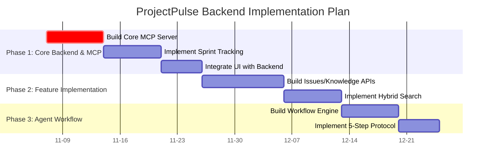

# ProjectPulse Analysis & Strategic Plan

**Date:** 2025-11-06
**Author:** Kilo Code

## 1. Executive Summary

ProjectPulse is a highly ambitious, agent-first project management platform designed for 95% automation of software development workflows. The documentation outlines a sophisticated system where AI agents are the primary users, interacting via a Model Context Protocol (MCP) server. The database serves as the single source of truth, and a comprehensive UI exists for human monitoring.

However, a **critical gap** exists between the documented architecture and the current implementation. The core MCP server, which is the heart of the agent-first system, has not been built. The UI is 100% complete, but it is a frontend without a backend.

This document summarizes the project's current state and proposes a strategic plan to bridge this gap by building the necessary backend infrastructure.

## 2. Current State Analysis

### 2.1. Documentation Review

- **AGENTS.md**: Defines the agent-first philosophy, rules, and available agent personas. It's the "source of truth" for agent behavior.
- **High-Level Docs (PRD, SRS, README)**: Detail a comprehensive vision for a meta-platform that generates agent workflow infrastructure. The requirements are extensive, with 220 Functional Requirements (FRs) defined.
- **Architecture & Schema Docs**: Describe a C4 model architecture with a clear separation of concerns. The database schema is well-defined in Prisma and supports all documented features.

### 2.2. Codebase Examination

- **`apps/web`**: A complete Next.js 14 application. All UI pages and components described in the documentation are present and well-structured. It is, however, a frontend-only implementation that needs to be connected to a backend.
- **`apps/mcp-docker`**: A small, specialized MCP server for Docker management. This is **not** the main application MCP server.
- **Missing Component**: The primary MCP server that should expose the 41 core application tools is absent.

## 3. Core Architectural Concepts

- **Database as Source of Truth**: All project state (sprints, issues, knowledge) resides in a PostgreSQL database. Markdown files are auto-generated from this data, ensuring consistency.
- **Agent-First Interaction**: Agents interact with the system via an MCP server, not directly with the database or a REST API. This is the intended primary workflow.
- **Token Efficiency**: The architecture is designed to minimize token usage through a "Memory Bank" system and a hybrid knowledge search (semantic + full-text).

## 4. The Strategic Gap: Missing Backend

The project is at a critical juncture. The frontend and the documentation are complete, but the backend that powers the entire agent-first vision is missing.

**The immediate priority is to build the core backend infrastructure.**

## 5. Proposed Strategic Plan

To make ProjectPulse functional, we must build the missing pieces. I propose the following high-level plan, which we can refine.

### 5.1. Detailed Todo List

I will create a detailed todo list to track our progress. This list will be our guide for the implementation work.

- **[ ] Phase 1: Foundational Backend**
  - **[ ] Task 1.1:** Create the main MCP server in a new `apps/mcp-server` directory.
  - **[ ] Task 1.2:** Implement the `sprint.*` MCP tools for sprint/phase tracking.
  - **[ ] Task 1.3:** Connect the Next.js UI to the new MCP server to display real data.
  - **[ ] Task 1.4:** Implement the "database as source of truth" markdown sync.
- **[ ] Phase 2: Core Features**
  - **[ ] Task 2.1:** Implement the `issues.*` and `knowledge.*` MCP tools.
  - **[ ] Task 2.2:** Build the hybrid search engine using `pgvector` and `tsvector`.
  - **[ ] Task 2.3:** Integrate the Issues and Knowledge pages of the UI.
- **[ ] Phase 3: Agent Automation**
  - **[ ] Task 3.1:** Implement the `workflow.*` MCP tools and the state machine engine.
  - **[ ] Task 3.2:** Implement the 5-step mandatory protocol for agents.

## 6. Next Steps

1.  **Approve the Plan**: Review the proposed strategic plan and todo list.
2.  **Switch to Implementation**: Once the plan is approved, we will switch to `code` mode to begin building the MCP server.

This analysis provides a clear path forward. By focusing on building the missing backend components, we can bring the powerful vision of ProjectPulse to life.
