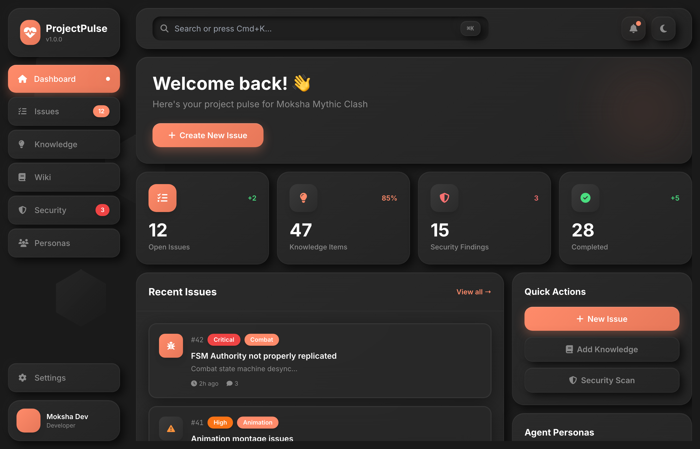

<div align="center">

# ProjectPulse



### The Project Management Platform Built for AI Agents

<p>
  <strong>86+ MCP Tools</strong> · <strong>98% Token Reduction</strong> · <strong>15 Auto-Generated Docs</strong>
</p>

[](LICENSE)
[](https://www.typescriptlang.org/)
[](https://nextjs.org/)
[](https://www.postgresql.org/)
[](https://modelcontextprotocol.io/)

[Getting Started](#-quick-start) · [Features](#-features) · [Documentation](docs/) · [Contributing](CONTRIBUTING.md)

</div>

---

## Why ProjectPulse?

Traditional project management tools like JIRA, Linear, and GitHub Issues weren't designed for AI-assisted development. When you work with Claude Code or other AI agents, you face:

- **Context Loss**: AI agents lose memory between sessions
- **Token Waste**: Loading framework docs burns thousands of tokens
- **Manual Tracking**: You become the glue between AI and project state
- **No Integration**: AI can't create tickets or update progress directly

**ProjectPulse solves this.** It's an **agent-first** platform where **95% of interactions happen via MCP tools**, not clicking through UIs.

---

## ✨ Features

### 🤖 Agent-First Architecture

- **86+ Production-Ready MCP Tools** across 19 categories
- **Self-Guiding Workflows**: Agents know what to do next via `context_load`
- **Session Continuity**: Work survives context compaction with checkpoints
- **Token-Efficient**: Skills system achieves **98% token reduction**

### 📋 Smart Ticket Management

- **Parent-Child Hierarchies**: Features → Tasks → Subtasks
- **Sprint Scheduling**: Assign tickets to sprints with Kanban boards
- **Traceability**: Track requirements → tickets → implementation
- **Agent-Friendly**: Create, search, update tickets programmatically

### 📚 Intelligent Knowledge Base

- **Hybrid Search**: PostgreSQL tsvector + pgvector semantic search
- **Local Embeddings**: Privacy-first with Transformers.js (no cloud API)
- **Graph Traversal**: Find related knowledge items automatically
- **92% Context Reduction** vs loading full documentation

### 🗺️ Roadmap & Progress Tracking

- **5-Level Hierarchy**: Phase → Sprint → Week → Day → Task
- **Automatic Cascade**: Progress rolls up from tasks to phases
- **Visual Roadmaps**: Timeline and Kanban views in web UI
- **Sprint Management**: Plan, track, and deliver incrementally

### 🎯 3-Session Guided Onboarding

Transform project setup from days to hours:

| Session | What Happens |
|---------|--------------|
| **Session 1** | 96 questions across 10 expert roles → Executive summary |
| **Session 2** | Auto-generate 15 planning documents (PRD, SRS, etc.) |
| **Session 3** | Bootstrap personas, skills, workflows, SOPs |

### 🔧 Developer Experience

- **Memory Banks**: 5 specialized banks (project brief, patterns, tech context, active context, progress)
- **Expert Personas**: Load specialized expertise (React Expert, Prisma Expert, etc.)
- **Skills System**: Lazy-load coding patterns only when needed
- **SOPs**: Standard Operating Procedures for consistent workflows

---

## 📊 By the Numbers

| Metric | Value |
|--------|-------|
| MCP Tools | 86+ |
| Token Reduction (Skills) | 98% |
| Token Reduction (Knowledge) | 92% |
| Auto-Generated Documents | 15 |
| Onboarding Questions | 96 |
| Hierarchy Levels | 5 |
| Memory Banks | 5 |

---

## 🚀 Quick Start

### Prerequisites

- **Docker** & Docker Compose
- **Node.js** 18+
- **pnpm** 8+

### Installation

```bash
# Clone the repository
git clone https://github.com/ProjectPulse/ProjectPulse.git
cd ProjectPulse

# Install dependencies
pnpm install

# Start database (PostgreSQL with pgvector)
docker compose -f docker-compose.cloud.yml up -d

# Set up environment
cp apps/web/.env.example apps/web/.env.local
# Edit .env.local with your database connection

# Run migrations
pnpm --filter web prisma migrate dev

# Start development server
pnpm dev
```

**Access the application:**
- **Web UI**: http://localhost:3000
- **API Health**: http://localhost:3000/api/health

### Configure Claude Code

Add ProjectPulse to your Claude Code MCP servers:

```json
{
  "mcpServers": {
    "projectpulse": {
      "command": "node",
      "args": ["/path/to/ProjectPulse/apps/mcp-server/dist/index.js"],
      "env": {
        "API_URL": "http://localhost:3000/api"
      }
    }
  }
}
```

Then start any session with:
```
projectpulse_context_load(projectId: YOUR_PROJECT_ID)
```

---

## 🏗️ Architecture

```
┌─────────────────────────────────────────────────────────────────┐
│                      Claude Code / AI Agent                      │
└────────────────────────────┬────────────────────────────────────┘
                             │ MCP Protocol
                             ▼
┌─────────────────────────────────────────────────────────────────┐
│                     ProjectPulse MCP Server                      │
│  ┌──────────┐ ┌──────────┐ ┌──────────┐ ┌──────────┐           │
│  │ Context  │ │ Tickets  │ │ Knowledge│ │ Roadmap  │  86+ tools│
│  └──────────┘ └──────────┘ └──────────┘ └──────────┘           │
└────────────────────────────┬────────────────────────────────────┘
                             │ REST API
                             ▼
┌─────────────────────────────────────────────────────────────────┐
│                    Next.js 14 Application                        │
│  ┌──────────────────────────────────────────────────────────┐   │
│  │              App Router + Server Components               │   │
│  └──────────────────────────────────────────────────────────┘   │
│  ┌──────────────────────────────────────────────────────────┐   │
│  │              Prisma ORM + Type-Safe Queries               │   │
│  └──────────────────────────────────────────────────────────┘   │
└────────────────────────────┬────────────────────────────────────┘
                             │
                             ▼
┌─────────────────────────────────────────────────────────────────┐
│                   PostgreSQL 16 + pgvector                       │
│  ┌──────────┐ ┌──────────┐ ┌──────────┐ ┌──────────┐           │
│  │ tsvector │ │ pgvector │ │  JSONB   │ │ Triggers │           │
│  │ (search) │ │(semantic)│ │ (custom) │ │ (cascade)│           │
│  └──────────┘ └──────────┘ └──────────┘ └──────────┘           │
└─────────────────────────────────────────────────────────────────┘
```

### Tech Stack

| Layer | Technologies |
|-------|--------------|
| **Frontend** | Next.js 14, React 18, TypeScript, Tailwind CSS, shadcn/ui |
| **Backend** | Next.js App Router, Server Actions, REST API |
| **Database** | PostgreSQL 16, pgvector, Prisma ORM |
| **Search** | PostgreSQL tsvector + pgvector hybrid |
| **AI** | Transformers.js (local embeddings), MCP SDK |
| **Testing** | Jest, Playwright, React Testing Library |

---

## 🛠️ MCP Tools Reference

### Context Management
```typescript
context_load(projectId)      // Load all memory banks + session state
context_lookup(bankType)     // Query specific memory bank
context_update(bankType)     // Update memory bank content
```

### Agent Sessions
```typescript
agent_session_start()        // Start tracking work session
agent_session_update()       // Checkpoint progress every 15K tokens
agent_session_resume()       // Resume paused session with full context
agent_session_end()          // Complete session, auto-sync to banks
```

### Ticket Management
```typescript
ticket_create()              // Create feature, task, bug, etc.
ticket_search()              // Find tickets with filters
ticket_update()              // Modify ticket fields
ticket_getHierarchy()        // Get parent-child relationships
```

### Knowledge & Resources
```typescript
knowledge_search(query)      // Hybrid semantic + full-text search
knowledge_create()           // Store new knowledge items
skill_get(slug)              // Load coding patterns on-demand
persona_get(slug)            // Load expert persona
sop_get(slug)                // Load standard operating procedure
```

See [docs/features/mcp-tools-guide.md](docs/features/mcp-tools-guide.md) for the complete 86+ tool reference.

---

## 📁 Project Structure

```
ProjectPulse/
├── apps/
│   ├── web/                 # Next.js 14 web application
│   │   ├── app/            # App Router pages & API routes
│   │   ├── components/     # React components (shadcn/ui)
│   │   ├── lib/            # Business logic & utilities
│   │   └── prisma/         # Database schema & migrations
│   │
│   ├── mcp-server/         # MCP Server (86+ tools)
│   │   └── src/tools/      # Tool implementations
│   │
│   └── mcp-docker/         # Docker-based MCP variant
│
├── docs/                    # Feature documentation
│   ├── features/           # Feature guides
│   └── architecture/       # ADRs and design docs
│
└── mockups/                 # UI design mockups
```

---

## 🔒 Security

- **Local-First**: All data stays on your infrastructure
- **No Cloud Dependencies**: Embeddings generated locally via Transformers.js
- **Prepared Statements**: SQL injection prevention via Prisma
- **Input Validation**: All user inputs validated and sanitized

See [SECURITY.md](SECURITY.md) for our security policy and vulnerability reporting.

---

## 🤝 Contributing

We welcome contributions! ProjectPulse is open source under the MIT license.

1. Fork the repository
2. Create a feature branch (`git checkout -b feature/amazing-feature`)
3. Commit your changes using [Conventional Commits](https://www.conventionalcommits.org/)
4. Push to the branch (`git push origin feature/amazing-feature`)
5. Open a Pull Request

See [CONTRIBUTING.md](CONTRIBUTING.md) for detailed guidelines.

---

## 📖 Documentation

| Document | Description |
|----------|-------------|
| [MCP Tools Guide](docs/features/mcp-tools-guide.md) | Complete 86+ tool reference |
| [Skills System](docs/features/skills-system-guide.md) | Token-efficient skills loading |
| [Database Schema](docs/features/database-schema.md) | Prisma models reference |
| [API Reference](docs/features/api-reference.md) | REST API documentation |
| [Architecture](docs/03-Architecture.md) | System architecture overview |

---

## 📄 License

This project is licensed under the MIT License - see the [LICENSE](LICENSE) file for details.

---

## 🙏 Acknowledgments

- Built with [Claude Code](https://claude.ai/claude-code) as our daily driver
- Inspired by Linear, GitHub Issues, and Notion
- MCP SDK by [Anthropic](https://www.anthropic.com/)
- UI components from [shadcn/ui](https://ui.shadcn.com/)

---

<div align="center">

**[Documentation](docs/)** · **[Issues](https://github.com/ProjectPulse/issues)** · **[Contributing](CONTRIBUTING.md)**

Made with ❤️ for the AI-assisted development community

</div>
