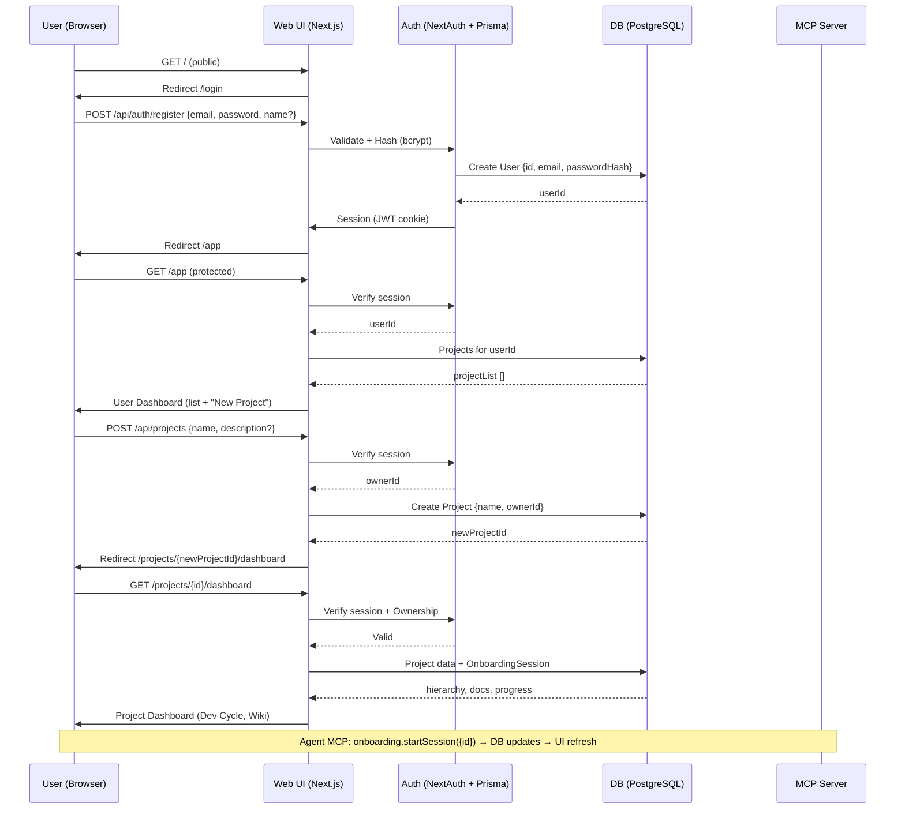

# User Authentication & Dashboard Specification

**Project:** ProjectPulse  
**Document ID:** DOC-015  
**Version:** 1.0.0 (MVP Front Door Implementation)  
**Created:** 2025-11-20  
**Status:** Active  
**Standards:** IEEE 830-1998, Aligned with Agent-First Architecture (ADR-001), OWASP Authentication Best Practices  

---

## Document Purpose

This specification defines the foundational user authentication and dashboard features for ProjectPulse, enabling a complete end-to-end MVP flow: Humans sign up/login via a secure web UI, access a user dashboard to create/open projects, and route to the project-specific dashboard (e.g., Dev Cycle, Wiki) for monitoring. This closes the critical gap in the current prototype—providing a "front door" for secondary users (solo/small-team developers, 5% interactions) while preserving agent-first operations (95% MCP-driven via 41 tools for CRUD/onboarding/workflows). All user/project state persists in PostgreSQL as the single source of truth—no local files or repo clutter—ensuring clean repositories (optional `claude.md`/`agents.md` only post-onboarding).

**Improvements Over Proposed Spec:**  
- **Minimal Deps:** Adopt NextAuth.js (v4+) with credentials provider + bcrypt for hashing—balances simplicity/security without custom flows (avoids reinventing sessions).  
- **Explicit Relations:** Full Prisma schema updates with `User` → `Project` one-to-many; future `ProjectMember` join for multi-user (post-MVP).  
- **UI Consistency:** Leverage shadcn/ui for forms/cards/modals; add onboarding progress viz in dashboards (e.g., from `OnboardingSession.metrics`).  
- **Security Enhancements:** Rate limiting via self-hosted Redis (existing Docker stack on Mac mini), CSRF protection, and session expiry (7 days default).  
- **Testability:** Built-in E2E (Playwright) for full loop (signup → create → onboard via MCP sim → monitor).  
- **Traceability:** Maps to NFR-005 (Security), FR-121–125 (Personas/UI), and new EPIC-013 (User Flow, 20 points).  

**Scope:** Core auth (signup/login/logout), user dashboard (project list/create/open), route protection. Out of scope: Multi-user sharing (post-MVP), advanced auth (MFA, social logins beyond Google), API keys for MCP (agent auth via bearer tokens in Sprint 10). For current development, existing test projects can be dropped; a clean database reset/seed is expected after this phase.  

**Related Documents:**  
- [02-SRS.md](02-SRS.md): NFR-005 (Auth), FR-001 (Project Create).  
- [03-Architecture.md](03-Architecture.md): Section 5 (Deployment: Multi-User Support).  
- [04-Data-and-Model-Spec.md](04-Data-and-Model-Spec.md): Extends Project/User models.  
- [07-UI-UX.md](07-UI-UX.md): shadcn/ui integration for neumorphic theme.  
- [12-Backlog.md](12-Backlog.md): New EPIC-013 (8 US, 20 points).  
- [13-Project-Plan.md](13-Project-Plan.md): Replaces Sprint 9 partial (compress to Week 17).  

---

## 1. High-Level Architecture

**Flow Overview:**  
1. **Public Entry:** User hits `/` → Redirect to `/login` (if unauth).  
2. **Auth Gates:** Signup/Login → Secure session (JWT cookie) → `/app` (User Dashboard).  
3. **User Hub:** List projects → Create new (POST `/api/projects`) → Open (route to `/projects/[id]/dashboard`).  
4. **Project Deep-Dive:** Existing dashboard features (Dev Cycle progress from hierarchy, Wiki for docs) now protected/auth-aware.  
5. **Agent Tie-In:** On project open, MCP tools auto-scope to `projectId` (e.g., `onboarding.startSession(projectId)`); UI shows agent activity (e.g., "Onboarding: Session 1 Complete").  

**Mermaid Diagram:**  


**Principles Alignment:**  
- **Agent-First:** Auth/UI for humans (5%); MCP unchanged (agents hit tools with `projectId`).  
- **DB Truth:** Users/projects in Prisma; sessions stateless (JWT).  
- **Clean Repos:** No impact—onboarding still writes minimal files optionally.  
- **Token/UI Efficiency:** <200ms auth; dashboards lazy-load (e.g., progress roll-up from `OnboardingSession.metrics`).  

---

## 2. Data Model (Prisma Schema Updates)

**New/Extended Models:** Run `prisma migrate dev --name user-auth-dashboard` (development). After implementation is stable, perform a clean DB reset/seed to remove legacy test-only projects and start with auth-aware data.  

```prisma
model User {
  id           String   @id @default(cuid())
  email        String   @unique
  name         String?
  passwordHash String   // bcrypt v14+
  isActive     Boolean  @default(true)
  createdAt    DateTime @default(now())
  updatedAt    DateTime @updatedAt

  projects     Project[] // One-to-many
  sessions     Session[] // For auth state (if using DB sessions)

  @@map("users")
}

model Project {
  // Existing fields...
  ownerId      String
  owner        User     @relation(fields: [ownerId], references: [id], onDelete: Cascade)

  // Future: 
  // members     ProjectMember[] // For shared access (post-MVP)
  
  @@map("projects")
}

// Optional: For NextAuth DB sessions (if not pure JWT)
model Session {
  id           String   @id @default(cuid())
  sessionToken String   @unique
  userId       String
  expires      DateTime
  user         User     @relation(fields: [userId], references: [id], onDelete: Cascade)
  
  @@map("sessions")
}

// Extend OnboardingSession for dashboard viz
model OnboardingSession {
  // Existing...
  // Note: OnboardingSession always scopes to projectId for MCP tools.
  // userId is optional and used only for UI-level queries (e.g., "sessions started by this user").
  userId       String?
  user         User?    @relation(fields: [userId], references: [id])
  
  @@index([userId])
}
```

**Validation/Constraints:**  
- Email: Unique, lowercase-normalized.  
- Password: Min 8 chars, hashed on create (bcrypt.genSaltSync(10)).  
- Ownership: Enforce via middleware (e.g., `Project.ownerId === session.userId`).  

**Seed Data:** Add sample user/project: `prisma db seed` (e.g., {email: 'dev@example.com', projects: [{name: 'Test Project'}]}).  

**Traceability:**  
| Model/Field | PRD Section | SRS FR/NFR | Backlog US |  
|-------------|-------------|------------|------------|  
| User (all) | 5.5 (Multi-User) | NFR-005 (Security) | US-013-01 (Signup) |  
| Project.ownerId | 4.2.1 (Project Create) | FR-001 | US-013-03 (Create Project) |  
| OnboardingSession.userId | 4.2.2 (Workflow) | FR-032 | US-013-05 (Progress Viz) |  

---

## 3. Authentication Implementation

**Library:** NextAuth.js v4+ (minimal deps: `@next-auth/prisma-adapter`, `bcryptjs`). Credentials provider for email/password; optional Google OAuth (env: `GOOGLE_CLIENT_ID`). Sessions: JWT (stateless, secure cookie: `httpOnly: true, secure: true`).  

**Config (`lib/auth.ts`):**  
```typescript
import NextAuth from 'next-auth';
import CredentialsProvider from 'next-auth/providers/credentials';
import { PrismaAdapter } from '@next-auth/prisma-adapter';
import bcrypt from 'bcryptjs';
import { prisma } from './prisma';

export const authOptions = {
  adapter: PrismaAdapter(prisma),
  providers: [
    CredentialsProvider({
      name: 'Credentials',
      credentials: { email: {}, password: {} },
      async authorize(credentials) {
        const user = await prisma.user.findUnique({ where: { email: credentials.email } });
        if (user && bcrypt.compareSync(credentials.password, user.passwordHash)) {
          return { id: user.id, email: user.email, name: user.name };
        }
        return null;
      },
    }),
    // Google: providers.Google({ clientId: process.env.GOOGLE_CLIENT_ID, ... })
  ],
  session: { strategy: 'jwt' },
  callbacks: {
    jwt: ({ token, user }) => { if (user) token.userId = user.id; return token; },
    session: ({ session, token }) => { session.userId = token.userId; return session; },
  },
  pages: { signIn: '/login', error: '/login?error=...' },
  secret: process.env.NEXTAUTH_SECRET, // 32+ chars
};

export default NextAuth(authOptions);
```

**Hashing (on Signup):** `const hash = bcrypt.hashSync(password, 10);`.  

**Security (NFR-005):**  
- Rate Limit: 5 attempts/15min per IP (Upstash Redis: `npm i @upstash/ratelimit`).  
- Expiry: Sessions 7 days; refresh on activity.  
- CSRF: NextAuth built-in.  
- Env: `.env`: `NEXTAUTH_SECRET`, `NEXTAUTH_URL=http://192.168.1.15:3000`.  

**Traceability:** US-013-01/02 (Signup/Login, 4 points); TEST-013-01 (E2E auth flow).  

---

## 4. Routes & Pages

**Public Routes (Unauth Access):**  
- **GET `/login` (Page):** shadcn form (email/password fields, submit button, "Sign Up" link). Error handling: Query param `?error=invalid` → Toast "Invalid credentials." Callback: `?callbackUrl=/app`.  
- **POST `/api/auth/signin`:** NextAuth handler (`auth.ts`); on success → Redirect callback or `/app`.  
- **POST `/api/auth/signup`:** Custom route: Zod validate (`email: z.string().email()`, `password: z.string().min(8)`); Create user → Auto-signin → Redirect `/app`.  
- **POST `/api/auth/signout`:** NextAuth signOut → Redirect `/login`.  

**Protected User-Level Routes:**  
- **GET `/app` (User Dashboard Page):** Requires auth (middleware). Fetch `prisma.project.findMany({where: {ownerId: session.userId}, include: {onboardingSessions: true}})` → Render list.  
- **POST `/api/projects`:** Auth check; `prisma.project.create({data: {name, ownerId: session.userId}})` → Return `{id}` → Redirect `/projects/[id]/dashboard`. Optional: Auto-init `OnboardingSession` (status: 'pending').  

**Protected Project-Level Routes (Existing + Prefix):**  
- Adopt `/projects/[projectId]/...` for clarity (e.g., `/projects/[id]/dashboard` for Dev Cycle). Fallback: If `/dashboard` hit, resolve from session (last project or query).  
- All require: Auth + Ownership (`prisma.project.findUnique({where: {id, ownerId: session.userId}})`).  
- Examples:  
  - **GET `/projects/[id]/dashboard`:** Existing project view + onboarding button ("Start Onboarding" → MCP `onboarding.startSession(id)`).  
  - **GET `/projects/[id]/wiki`:** Existing Wiki (docs from `Document`).  

**Implementation Note:** Use Next.js App Router (`app/` dir); shadcn forms for inputs, cards for project list.  

**Traceability:** US-013-03/04 (Dashboard/List, 6 points); FR-106–115 (Wiki Access).  

---

## 5. Route Protection & Redirects

**Middleware (`middleware.ts`):**  
```typescript
import { withAuth } from 'next-auth/middleware';
import { NextResponse } from 'next/server';

export default withAuth(
  function middleware(req) {
    // Custom logic: e.g., ownership check for /projects/[id]
    const { pathname } = req.nextUrl;
    if (pathname.startsWith('/projects/')) {
      const projectId = pathname.split('/')[2];
      // Fetch ownership via headers/session (or defer to page loader)
    }
    return NextResponse.next();
  },
  {
    callbacks: {
      authorized: ({ token, req }) => !!token && (req.nextUrl.pathname.startsWith('/app') || req.nextUrl.pathname.startsWith('/projects')),
    },
    pages: { signIn: '/login' },
  }
);

export const config = { matcher: ['/app/:path*', '/projects/:path*', '/dashboard'] };
```

**Redirect Logic:**  
- No session + protected path → `/login?callbackUrl=${encodeURIComponent(pathname)}`.  
- Post-login → Callback URL or `/app`.  
- Ownership fail → `/app?error=unauthorized`.  

**Edge Cases:**  
- Guest to `/` → `/login`.  
- Logged-in to `/login` → `/app`.  
- Invalid project → 404 or back to `/app`.  

**Traceability:** NFR-005; US-013-05 (Protection, 2 points).  

---

## 6. User Dashboard Behavior

**Page: `/app` (shadcn Layout):** Neumorphic theme; sections: Header ("My Projects"), Card Grid (projects), Footer CTA.  

**Content:**  
- **Project List:** Responsive cards (1-col mobile, 2-col desktop):  
  | Element | Data Source | Viz |  
  |---------|-------------|-----|  
  | Name | Project.name | Bold title |  
  | Status | OnboardingSession.status (latest) | Badge ("Pending" / "Session 1" / "Complete") |  
  | Progress | Metrics JSON (e.g., phasesComplete/10 * 100%) | Progress bar (from Dev Cycle logic) |  
  | Created | Project.createdAt | Subtle timestamp |  
- **Actions:**  
  - **New Project:** Modal form (shadcn Dialog): Name (required), Description (optional). Submit → POST `/api/projects` → Refresh list + Redirect to new dashboard.  
  - **Open Project:** Card click → `router.push(`/projects/${id}/dashboard`)`.  
  - **No Projects:** Empty state: "Get started by creating your first project!" + CTA button.  

**Onboarding Integration:** If project has `OnboardingSession`, show "Continue Onboarding" in card (links to MCP prompt in dashboard).  

**Traceability:** US-013-03 (List, 3 points); FR-002 (Progress Roll-Up).  

---

## 7. Project Dashboard Integration

**Existing Features Protected:**  
- All current pages (e.g., `/projects/[id]/dashboard` → Dev Cycle viz from hierarchy; `/projects/[id]/wiki` → Docs search).  
- Add: Ownership check on load; "Back to Projects" button (to `/app`).  
- Onboarding CTA: If no session → Button "Start Onboarding" → Inject MCP prompt (e.g., `onboarding.startSession(id)` via agent guide in UI).  
- Real-Time: SSE for updates (e.g., agent progress → Dashboard refresh).  

**URL Prefix Adoption:** Migrate existing routes (e.g., `/dashboard` → `/projects/[defaultId]/dashboard` via middleware).  

**Traceability:** US-013-04 (Open Project, 3 points); FR-032 (Workflow Start).  

---

## 8. Testing & Validation

**Unit/Integration:**  
- Auth: `npm test` (Zod validation, bcrypt compare).  
- Dashboard: React Testing Lib (render project list, simulate create).  

**E2E (Playwright):**  
- Full Loop: `tests/e2e/auth-flow.spec.ts` – Signup → `/app` → Create project → Open → Dashboard load → Logout.  
- Coverage: 80% (auth edges: Invalid login, expired session).  

**Security Scans:** Semgrep for OWASP Top 10 (e.g., no plain passwords).  

**Success Criteria:**  
- [ ] End-to-End: User signs up → Creates project → Views dashboard with onboarding progress → Agent MCP works (sim).  
- [ ] Perf: <200ms login; <500ms dashboard load (P95).  
- [ ] Metrics: 100% E2E pass; Zero auth vulns.  

**Traceability:** TEST-013-01–05; US-013-06 (Testing, 2 points).  

---

## 9. Implementation Plan (Sprint 9: MVP Front Door, 20 Points)

**Duration:** 2 weeks (40 hours; solo dev).  
**Epics:** EPIC-013 User Flow (12 points) + Integration (8 points).  

**Week 1: Auth Core (12 points)**  
- Day 1-2: Schema/Migrations (2 points; US-013-01).  
- Day 3-4: Auth Routes/Pages (6 points; US-013-02).  
- Day 5: Protection Middleware (4 points; US-013-05).  

**Week 2: Dashboards & Polish (8 points)**  
- Day 1-3: User Dashboard (4 points; US-013-03).  
- Day 4: Project Integration (3 points; US-013-04).  
- Day 5: Tests + Deploy (1 point; US-013-06).  

**Files Matrix:**  
| Category | Files | LOC Est. |  
|----------|-------|----------|  
| Schema | `prisma/schema.prisma`, `migrations/...` | 150 |  
| Auth | `lib/auth.ts`, `app/api/auth/[...nextauth]/route.ts` | 300 |  
| Pages | `app/login/page.tsx`, `app/app/page.tsx` | 500 |  
| API | `app/api/projects/route.ts` | 200 |  
| Middleware | `middleware.ts` | 100 |  
| Tests | `tests/e2e/auth.spec.ts` | 250 |  

**Commands:** `pnpm add next-auth @next-auth/prisma-adapter bcryptjs @upstash/ratelimit`; `prisma generate`; `docker-compose up`.  

**Risks/Mitigation:** Auth deps conflict? Fallback to custom (1 extra day). Timeline: Buffer 20%.  

**Next Steps:** Claude: Implement per plan; output `15-Auth-Dashboard-Complete.md`. This unlocks testable MVP—login → dashboard → agent magic. Vision intact: Humans enter via UI, agents thrive via MCP, all DB-clean. Ready to hand off?