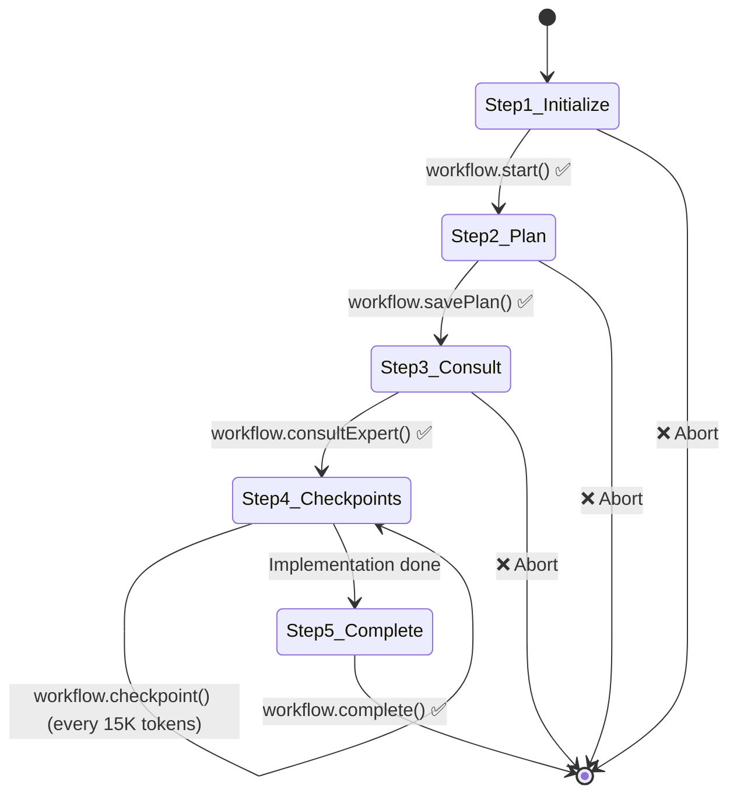

# AgentOps Plan

**Document ID:** MOKSHA-AGENTOPS-001
**Version:** 1.0
**Last Updated:** 2025-11-02
**Status:** Draft
**Owner:** Architecture Team

---

## Document Control

| Version | Date       | Author            | Changes          |
| ------- | ---------- | ----------------- | ---------------- |
| 1.0     | 2025-11-02 | Architecture Team | Initial creation |

---

## Scope Clarification: Product-Only, No Doc Coding

ProjectPulse is a cloud-based system. All state is persisted in PostgreSQL and exposed via the Web UI and MCP tools. Local repository files (e.g., `.agent/` folders, `STATUS.md`, `current-*.md`) are not used by the product and must not be treated as product behavior.

## Table of Contents

1. [Overview](#1-overview)
2. [MCP Tools Catalog](#2-mcp-tools-catalog)
3. [Five-Step Mandatory Protocol](#3-five-step-mandatory-protocol)
4. [Context Management](#4-context-management)
5. [Checkpoint Workflow](#5-checkpoint-workflow)
6. [Sub-Agent Invocation](#6-sub-agent-invocation)
7. [Error Handling & Recovery](#7-error-handling--recovery)
8. [Token Optimization](#8-token-optimization)
9. [Session Management](#9-session-management)
10. [Workflow Compliance](#10-workflow-compliance)
11. [Observability](#11-observability)
12. [Cross-References](#12-cross-references)

---

## 1. Overview

### 1.1 Purpose

The **AgentOps Plan** defines the operational framework for AI agent workflows in ProjectPulse. This document ensures:

- **Consistency:** All agents follow standardized 5-step protocol
- **Traceability:** Every action is logged and traceable
- **Efficiency:** Token optimization through lazy-loading and context management
- **Reliability:** Checkpoints prevent work loss, error handling ensures graceful recovery
- **Autonomy:** 95% of operations via MCP tools, minimal human intervention

**Target Users:**

- AI Agents (Claude Code, Cursor AI, etc.)
- System Architects (understanding workflow design)
- DevOps Engineers (monitoring and troubleshooting)

### 1.2 Agent-First Philosophy

ProjectPulse is built **agent-first** (not UI-first):

- **Primary User:** AI Agent (95% of interactions)
- **Secondary User:** Human Developer (5% oversight)
- **Interaction Method:** MCP Protocol (Model Context Protocol)
- **Data Source:** PostgreSQL database (single source of truth)
- **Context Files:** Markdown files (auto-generated from database)

**Why Agent-First?**

See [ADR-001: Agent-First Architecture](architecture/ADRs/ADR-001-agent-first-architecture.md) for detailed rationale.

### 1.3 Success Metrics

**North Star Metric:** Zero Human Intervention for Complete Features

| Metric                       | Target        | Measurement                          |
| ---------------------------- | ------------- | ------------------------------------ |
| Workflow Completion Rate     | >95%          | Complete workflows / total workflows |
| MCP Tool Usage               | 95%           | MCP operations / total operations    |
| Human Intervention Rate      | <5%           | Manual CRUD / total operations       |
| Token Efficiency (Skills)    | 92% reduction | 220 tokens vs 2,500 tokens           |
| Token Efficiency (Knowledge) | 88% reduction | 1,200 tokens vs 10,000 tokens        |

**Requirements:** FR-032 to FR-056 (Workflow Orchestration)

---

## 2. MCP Tools Catalog

### 2.1 Overview

ProjectPulse provides **46 MCP tools** across **8 functional categories** (42 original + 4 Sprint 8.5 additions):

1. **Sprint/Phase Tracking** (11 tools) - FR-001 to FR-025, FR-027 to FR-030 (Sprint 8.5)
2. **Workflow Orchestration** (5 tools) - FR-032 to FR-056
3. **Issues Management** (5 tools) - FR-051 to FR-070
4. **Knowledge Graph** (5 tools) - FR-071 to FR-090
5. **Skills System** (4 tools) - FR-091 to FR-105
6. **Wiki Documentation** (5 tools) - FR-106 to FR-115
7. **Project Health** (4 tools) - FR-116 to FR-120
8. **Agent Personas** (4 tools) - FR-121 to FR-125
9. **Dashboard** (3 tools) - Cross-cutting

**Architecture:** All tools served from a single MCP server via HTTP JSON-RPC (tool calls) and SSE (streaming updates)

**Design Decision:** See [ADR-004: Single MCP Server Architecture](architecture/ADRs/ADR-004-single-mcp-server.md)

### 2.2 Category 1: Sprint/Phase Tracking (7 tools)

**Purpose:** Track progress through 5-level hierarchy (Phase → Week → Day → Task → Session)

#### Tool: `sprint.phase.create`

**Description:** Create new phase with title, start date, goals

**Inputs:**

```typescript
{
  title: string; // "Phase A: MVP Core Features"
  startDate: Date;
  goals: string[]; // ["Implement sprint tracking", "Build issue tracker"]
  duration: number; // weeks
}
```

**Outputs:**

```typescript
{
  phaseId: number;
  status: 'PLANNED' | 'IN_PROGRESS' | 'COMPLETED';
  weeksCount: number; // Auto-created weeks based on duration
}
```

**Usage Example:**

```typescript
// Agent creates Phase A with 8 weeks
const phase = await mcp.call('sprint.phase.create', {
  title: 'Phase A: MVP Core Features',
  startDate: new Date('2025-01-01'),
  goals: ['Sprint tracking', 'Issue management', 'Knowledge graph'],
  duration: 8,
});
// Returns: { phaseId: 1, status: "PLANNED", weeksCount: 8 }
```

**Requirements:** FR-001, FR-002, FR-003

---

#### Tool: `sprint.week.create`

**Description:** Create week within phase (auto-numbered: Week 1, Week 2, ...)

**Inputs:**

```typescript
{
  phaseId: number;
  goals: string[]; // Weekly goals
}
```

**Outputs:**

```typescript
{
  weekId: number;
  weekNumber: number; // Auto-incremented
  daysCount: number; // Fixed at 5 (Mon-Fri)
}
```

**Requirements:** FR-004, FR-005

---

#### Tool: `sprint.day.start`

**Description:** Start new day (auto-creates if not exists)

**Inputs:**

```typescript
{
  weekId: number;
  dayNumber: number; // 1-5 (Mon-Fri)
}
```

**Outputs:**

```typescript
{
  dayId: number;
  status: 'PLANNED' | 'IN_PROGRESS' | 'COMPLETED';
  tasksCount: number; // Existing tasks for this day
}
```

**Requirements:** FR-006, FR-007

---

#### Tool: `sprint.task.create`

**Description:** Create task within day (can have sub-tasks via parentTaskId)

**Inputs:**

```typescript
{
  dayId: number;
  title: string;
  description?: string;
  estimatedHours?: number;
  parentTaskId?: number; // For sub-tasks
}
```

**Outputs:**

```typescript
{
  taskId: number;
  status: 'TODO' | 'IN_PROGRESS' | 'DONE' | 'BLOCKED';
  path: string; // "Phase A > Week 1 > Day 3 > Task: API Implementation"
}
```

**Requirements:** FR-008, FR-009, FR-010

---

#### Tool: `sprint.session.start`

**Description:** Start work session (tracks agent activity)

**Inputs:**

```typescript
{
  taskId: number;
  sessionType: 'PLANNING' | 'IMPLEMENTATION' | 'DEBUGGING' | 'TESTING' | 'DOCUMENTATION';
}
```

**Outputs:**

```typescript
{
  sessionId: number;
  startedAt: Date;
  taskId: number;
}
```

**Auto-Actions:**

- Inserts Session record (timestamp, type)
- Logs session start in `AgentAction` table
- Updates task status to `IN_PROGRESS`

**Requirements:** FR-011, FR-012

---

#### Tool: `sprint.progress.rollup`

**Description:** Calculate progress roll-up from sessions → tasks → days → weeks → phase

**Inputs:**

```typescript
{
  phaseId: number;
}
```

**Outputs:**

```typescript
{
  phase: { progress: 65, status: "IN_PROGRESS" },
  weeks: [
    { weekNumber: 1, progress: 100, status: "COMPLETED" },
    { weekNumber: 2, progress: 80, status: "IN_PROGRESS" },
    // ...
  ],
  days: [
    { dayNumber: 1, progress: 100, status: "COMPLETED" },
    { dayNumber: 2, progress: 60, status: "IN_PROGRESS" },
    // ...
  ],
  tasks: [
    { taskId: 1, progress: 100, status: "DONE" },
    { taskId: 2, progress: 50, status: "IN_PROGRESS" },
    // ...
  ]
}
```

**Algorithm:**

- Session progress: (elapsed time / estimated time) × 100
- Task progress: Average of session progress
- Day progress: Average of task progress
- Week progress: Average of day progress
- Phase progress: Average of week progress

**Requirements:** FR-013, FR-014

---

#### Tool: `sprint.query`

**Description:** Query sprint tracking data with filters

**Inputs:**

```typescript
{
  phaseId?: number;
  weekId?: number;
  dayId?: number;
  status?: "PLANNED" | "IN_PROGRESS" | "COMPLETED" | "BLOCKED";
  dateRange?: { start: Date, end: Date };
}
```

**Outputs:**

```typescript
{
  phases: Phase[];
  weeks: Week[];
  days: Day[];
  tasks: Task[];
  sessions: Session[];
}
```

**Requirements:** FR-015

---

#### Tool: `projectpulse.roadmap.materialize` (Sprint 8.5)

**Description:** Convert Roadmap JSON to normalized Phase/Sprint/Week/Day database records

**Inputs:**

```typescript
{
  roadmapId: string; // CUID  
  projectId: number;
}
```

**Outputs:**

```typescript
{
  success: true;
  counts: {
    phases: 4;
    sprints: 9;
    weeks: 20;
    days: 100;
  };
  ids: {
    phases: string[]; // CUIDs
    sprints: string[];
    weeks: number[];
    days: number[];
  };
}
```

**Auto-Actions:**

- Validates roadmap exists and is not already materialized
- Parses phases JSON structure
- Creates Phase records (with Sprint relationships)
- Creates Sprint records (NEW layer between Phase and Week)
- Creates Week records (linked to Sprint, not Phase)
- Creates Day records (5 days per week)
- Sets `materialized` flag to true
- Logs action in `AgentAction` table

**Token Estimate:** ~500 tokens  
**Latency Target:** <5000ms (parsing + DB writes)  
**Requirements:** FR-027

---

#### Tool: `projectpulse.blueprint.get` (Sprint 8.5)

**Description:** Retrieve Session 3 blueprint (project context JSON) for agents to recall onboarding configuration

**Inputs:**

```typescript
{
  projectId: number;
}
```

**Outputs:**

```typescript
{
  projectContext: string; // Project description
  roadmap: {
    phases: Array<{
      number: number;
      name: string;
      sprints: Array<...>;
    }>;
  };
  techStack: string[]; // Technologies chosen
  agentPersona: {
    name: string;
    expertise: string[];
  };
  skills: string[]; // Skills to load
  workflows: string[]; // Workflows to use
  timeline: {
    startDate: string;
    endDate: string;
  };
  budget: {
    hours: number;
    budget: number;
  };
}
```

**Auto-Actions:**

- Queries `DevelopmentSession` table for Session 3 record
- Returns 404 if Session 3 not completed
- Validates `projectId` to prevent cross-project access
- Logs action in `AgentAction` table

**Token Estimate:** ~2000 tokens  
**Latency Target:** <100ms  
**Security:** Explicit projectId validation  
**Requirements:** FR-028

---

#### Tool: `projectpulse.sprint.getCurrentPosition` (Sprint 8.5)

**Description:** Get agent's current position in 5-level hierarchy in 1 call (80% token reduction vs 5 separate queries)

**Inputs:**

```typescript
{
  projectId: number;
}
```

**Outputs:**

```typescript
{
  phase: {
    id: string;
    name: string;
    progress: 0.75; // 0.0-1.0
  };
  sprint: {
    id: string;
    name: string;
    storyPoints: 52;
    progress: 0.80;
  };
  week: {
    id: number;
    weekNumber: 3;
    progress: 0.90;
  };
  day: {
    id: number;
    dayNumber: 2;
    progress: 1.0;
  };
  task: {
    id: number;
    title: string;
    description: string;
    progress: 0.50;
  };
  taskId: number; // Current IN_PROGRESS task
}
```

**Auto-Actions:**

- Single Prisma query with deep includes (Phase → Sprint → Week → Day → Task)
- Filters for status=IN_PROGRESS to find current task
- Returns null for task if no IN_PROGRESS task exists
- Validates projectId to prevent cross-project access
- Logs action in `AgentAction` table

**Token Estimate:** ~1000 tokens (vs 5000 baseline = 80% reduction)  
**Latency Target:** <150ms  
**Security:** Explicit projectId validation prevents cross-project leakage  
**Requirements:** FR-029

---

#### Tool: `projectpulse.sprint.getPhaseProgress` (Sprint 8.5)

**Description:** Get full phase progress tree in 1 call (90% token reduction vs querying each level separately)

**Inputs:**

```typescript
{
  phaseId: string;
  projectId: number;
}
```

**Outputs:**

```typescript
{
  phase: {
    id: string;
    name: string;
    progress: 0.75;
  };
  sprints: [
    {
      id: string;
      name: string;
      storyPoints: 52;
      progress: 0.80;
      weeks: [
        {
          id: number;
          weekNumber: 1;
          progress: 0.90;
          days: [
            {
              id: number;
              dayNumber: 1;
              progress: 1.0;
              tasks: [
                {
                  id: number;
                  title: string;
                  progress: 1.0;
                  status: "COMPLETED";
                }
              ];
            }
          ];
        }
      ];
    }
  ];
}
```

**Auto-Actions:**

- Single Prisma query with deep nested includes (all levels)
- Validates phaseId belongs to projectId (security)
- Returns full tree structure for visualization
- Logs action in `AgentAction` table

**Token Estimate:** ~2000 tokens (vs 20000 baseline = 90% reduction)  
**Latency Target:** <500ms  
**Security:** Validates phaseId belongs to projectId to prevent cross-project access  
**Requirements:** FR-030

---

### 2.3 Category 2: Workflow Orchestration (5 tools)

**Purpose:** Enforce 5-step mandatory protocol and track workflow state

#### Tool: `workflow.start`

**Description:** Initialize workflow session (Step 1 of 5-step protocol)

**Inputs:**

```typescript
{
  sessionId: number; // From sprint.session.start
  phase: string; // "Phase A Week 1 Day 3"
  goals: string[]; // Session goals
}
```

**Outputs:**

```typescript
{
  workflowId: number;
  currentStep: 1;
  stepStatus: 'PENDING';
  sessionId: number;
}
```

**Auto-Actions:**

- Validates session exists
- Creates workflow record in `Workflow` table
- Updates context file with session goals
- Logs action in `AgentAction` table

**Requirements:** FR-032 (Step 1: Initialize)

---

#### Tool: `workflow.savePlan`

**Description:** Save implementation plan (Step 2 of 5-step protocol)

**Inputs:**

```typescript
{
  workflowId: number;
  plan: string; // Markdown plan
  todos: Array<{
    content: string;
    status: 'pending';
    activeForm: string;
  }>;
}
```

**Outputs:**

```typescript
{
  planId: number; // Plan entity id
  todosCreated: number; // Count of created todos
  step2Complete: true;
}
```

**Auto-Actions:**

- Saves plan as Plan entity (DB)
- Saves todos as Todo records (DB)
- Updates workflow step to 2 (COMPLETED)
- Logs action in `AgentAction` table

**Requirements:** FR-033 (Step 2: Plan & Save)

---

#### Tool: `workflow.consultExpert`

**Description:** Invoke expert sub-agent (Step 3 of 5-step protocol)

**Inputs:**

```typescript
{
  workflowId: number;
  expertType: 'react-expert' | 'next-js-expert' | 'prisma-expert';
  topic: string; // "Server Component vs Client Component decision"
  context: string; // Additional context for expert
}
```

**Outputs:**

```typescript
{
  expertReportId: string; // Research report record id
  recommendations: string; // Summary of expert advice
  step3Complete: true;
}
```

**Auto-Actions:**

- Invokes specified expert sub-agent in isolated thread
- Sub-agent reads latest Session record for context
- Sub-agent creates Research Report record (DB)
- Updates workflow step to 3 (COMPLETED)
- Logs action in `AgentAction` table

**Requirements:** FR-034 (Step 3: Consult Experts)

---

#### Tool: `workflow.checkpoint`

**Description:** Save progress checkpoint (Step 4 of 5-step protocol)

**Inputs:**

```typescript
{
  workflowId: number;
  tokenCount: number; // Current token usage
  progress: string; // Summary of work done since last checkpoint
}
```

**Outputs:**

```typescript
{
  checkpointId: number;
  sessionFileUpdated: true;
  todosFileUpdated: true;
}
```

**Auto-Actions:**

- Updates Session record with progress
- Updates Todo records with completion status
- Creates checkpoint record in `WorkflowStep` table
- Logs action in `AgentAction` table

**Checkpoint Schedule:**

- At 15K, 30K, 45K, 60K, 75K, 90K tokens
- After completing any significant action
- Before risky operations (large refactorings)

**Requirements:** FR-035 (Step 4: Checkpoints)

---

#### Tool: `workflow.complete`

**Description:** Complete workflow and update documentation (Step 5 of 5-step protocol)

**Inputs:**

```typescript
{
  workflowId: number;
  completionSummary: string;
  invokeDocAgents: boolean; // Invoke synthesize-docs, map-system if true
}
```

**Outputs:**

```typescript
{
  completionFile: string; // COMPLETION_[PHASE].md
  statusUpdated: boolean; // Development Cycle reflects updated status
  planUpdated: boolean; // Project Plan UI updated
  step5Complete: true;
}
```

**Auto-Actions:**

- Creates `COMPLETION_[PHASE].md` file
- Development Cycle reflects completion timestamp
- Project Plan UI updated with next phase
- Optionally invokes `synthesize-docs` sub-agent (if new patterns created)
- Optionally invokes `map-system` sub-agent (if architecture changed)
- Updates workflow status to `COMPLETED`
- Logs action in `AgentAction` table

**Requirements:** FR-036 (Step 5: Post-Completion)

---

### 2.4 Category 3: Issues Management (5 tools)

**Purpose:** Create, update, query, and link issues (bugs, features, tasks)

#### Tool: `issues.create`

**Description:** Create single issue

**Inputs:**

```typescript
{
  title: string; // Max 500 chars
  description?: string; // Markdown
  priority: "P0" | "P1" | "P2" | "P3";
  status?: "OPEN" | "IN_PROGRESS" | "REVIEW" | "CLOSED"; // Default: OPEN
  labels?: string[]; // Auto-tagged by keywords
  createdBy: "agent" | "human";
}
```

**Outputs:**

```typescript
{
  issueId: number;
  autoTags: string[]; // Auto-detected labels
}
```

**Auto-Tagging Logic:**

- Scan title + description for keywords
- Extract CVE IDs (e.g., "CVE-2024-1234")
- Match against label dictionary
- Create labels if not exist

**Requirements:** FR-051

---

#### Tool: `issues.bulkCreate`

**Description:** Create multiple issues (10-50 at once, e.g., from security scan)

**Inputs:**

```typescript
{
  issues: Array<{
    title: string;
    description?: string;
    priority: 'P0' | 'P1' | 'P2' | 'P3';
    labels?: string[];
  }>;
}
```

**Outputs:**

```typescript
{
  created: number; // Count of created issues
  duplicates: number; // Count of duplicates skipped
  linked: number; // Count of auto-linked related issues
  issues: Array<{ issueId: number; title: string }>;
}
```

**Deduplication Logic:**

- Compare titles (Levenshtein distance < 10)
- Fuzzy match descriptions
- Merge duplicates → link as "duplicate" relationship

**Performance Target:** <500ms for 15 issues (vs 1.5s for 15 individual creates)

**Requirements:** FR-052

---

#### Tool: `issues.update`

**Description:** Update issue fields (status, priority, description, etc.)

**Inputs:**

```typescript
{
  issueId: number;
  updates: Partial<{
    status: 'OPEN' | 'IN_PROGRESS' | 'REVIEW' | 'CLOSED';
    priority: 'P0' | 'P1' | 'P2' | 'P3';
    description: string;
    labels: string[];
  }>;
}
```

**Outputs:**

```typescript
{
  updated: true;
  auditTrail: string; // Reference to audit record
}
```

**Status Transition Validation:**

- OPEN → IN_PROGRESS → REVIEW → CLOSED (only forward transitions)
- Cannot reopen CLOSED issues (must create new issue)

**Requirements:** FR-053

---

#### Tool: `issues.query`

**Description:** Search issues with full-text search, filters, pagination

**Inputs:**

```typescript
{
  filters?: {
    status?: "OPEN" | "IN_PROGRESS" | "REVIEW" | "CLOSED";
    priority?: "P0" | "P1" | "P2" | "P3";
    labels?: string[];
    createdBy?: "agent" | "human";
    dateRange?: { start: Date, end: Date };
    search?: string; // Full-text search in title + description
  };
  pagination?: { page: number, limit: number };
  sort?: { field: string, order: "asc" | "desc" };
}
```

**Outputs:**

```typescript
{
  issues: Issue[];
  total: number; // Total count for pagination
  aggregations: {
    statusCounts: { OPEN: 10, IN_PROGRESS: 5, REVIEW: 3, CLOSED: 20 };
    priorityCounts: { P0: 2, P1: 8, P2: 15, P3: 13 };
  };
}
```

**Full-Text Search:**

- PostgreSQL `tsvector` for fast text search
- Indexes on `title_search` and `description_search` columns

**Performance Target:** <100ms for 10,000 issues

**Requirements:** FR-054

---

#### Tool: `issues.link`

**Description:** Create relationship between issues (blocks, related, duplicate)

**Inputs:**

```typescript
{
  issueId: number;
  relatedId: number;
  type: 'blocks' | 'related' | 'duplicate';
}
```

**Outputs:**

```typescript
{
  relationId: number;
  circular: false; // Error if circular "blocks" dependency detected
}
```

**Validation:**

- Cannot create circular "blocks" dependencies (A blocks B, B blocks A)
- Duplicate type: Auto-close one issue as duplicate

**Requirements:** FR-055

---

### 2.5 Category 4: Knowledge Graph (5 tools)

**Purpose:** Store and query project knowledge with hybrid search (semantic + full-text + graph traversal)

#### Tool: `knowledge.create`

**Description:** Create knowledge item (fact, decision, pattern, solution)

**Inputs:**

```typescript
{
  title: string;
  content: string; // Markdown
  type: "fact" | "decision" | "pattern" | "solution" | "learning";
  tags?: string[];
  relatedItems?: number[]; // Link to existing knowledge items
}
```

**Outputs:**

```typescript
{
  itemId: number;
  embedding: number[]; // 1536-dim vector (OpenAI ada-002 or local)
  relationships: number; // Count of auto-linked relationships
}
```

**Auto-Linking Logic:**

- Semantic similarity search (cosine similarity > 0.8)
- Keyword matching (shared tags)
- Temporal proximity (created within same week)

**Requirements:** FR-071, FR-072

---

#### Tool: `knowledge.query`

**Description:** Hybrid search with semantic + full-text + graph traversal

**Inputs:**

```typescript
{
  query: string; // Natural language query
  filters?: {
    type?: "fact" | "decision" | "pattern" | "solution" | "learning";
    tags?: string[];
    dateRange?: { start: Date, end: Date };
  };
  searchMode: "semantic" | "fulltext" | "hybrid"; // Default: hybrid
  graphDepth?: number; // 1 or 2 hops (default: 2)
  limit?: number; // Max results (default: 10)
}
```

**Outputs:**

```typescript
{
  items: Array<{
    itemId: number;
    title: string;
    content: string;
    score: number; // Relevance score 0-1
    path: string[]; // Graph path from query to item
  }>;
  tokenCost: number; // Estimated tokens loaded
}
```

**Hybrid Search Algorithm:**

1. **Semantic Search:** Query embedding → pgvector cosine similarity → Top 50 candidates
2. **Full-Text Search:** PostgreSQL tsvector → Top 50 candidates
3. **Merge & Re-Rank:** Combine results, deduplicate, re-rank by combined score
4. **Graph Traversal:** For each top 10 results, traverse 2 hops → related items
5. **Context Injection:** Load related items (max 1,200 tokens total)

**Token Efficiency:**

- Before: 10,000+ tokens (full graph traversal)
- After: 1,200 tokens (hybrid search + 2-hop traversal)
- **88% reduction**

**Performance Target:** <200ms for query

**Requirements:** FR-073, FR-074, FR-075

---

#### Tool: `knowledge.update`

**Description:** Update knowledge item (creates new version, preserves history)

**Inputs:**

```typescript
{
  itemId: number;
  updates: Partial<{
    content: string;
    tags: string[];
  }>;
  reason: string; // Why updating
}
```

**Outputs:**

```typescript
{
  versionId: number;
  previousVersion: number;
}
```

**Versioning:**

- Creates new row in `KnowledgeItemVersion` table
- Preserves full history
- Embedding regenerated for updated content

**Requirements:** FR-076

---

#### Tool: `knowledge.link`

**Description:** Create explicit relationship between knowledge items

**Inputs:**

```typescript
{
  fromId: number;
  toId: number;
  type: 'related' | 'contradicts' | 'extends' | 'supersedes';
}
```

**Outputs:**

```typescript
{
  relationId: number;
}
```

**Requirements:** FR-077

---

### 2.6 Category 5: Skills (4 tools)

**Purpose:** Lazy-load framework/library documentation for token efficiency

#### Tool: `skills.list`

**Description:** List available skills by category

**Inputs:**

```typescript
{
  category?: "framework" | "testing" | "workflow" | "troubleshooting";
}
```

**Outputs:**

```typescript
{
  skills: Array<{
    skillId: number;
    name: string; // "react-hooks"
    category: string;
    summary: string; // 50-80 tokens (from frontmatter)
  }>;
}
```

**Token Cost:** ~100 tokens total (frontmatter only, no content)

**Requirements:** FR-091

---

#### Tool: `skills.load`

**Description:** Load skill content (lazy-loaded on demand)

**Inputs:**

```typescript
{
  skillName: string; // "react-hooks"
}
```

**Outputs:**

```typescript
{
  skill: {
    skillId: number;
    name: string;
    content: string; // 180-200 tokens
    examples: string[]; // Code examples
    usageCount: number; // Tracked in SkillUsage table
  };
}
```

**Token Efficiency:**

- Before: 2,500 tokens (full React documentation)
- After: 220 tokens (lazy-loaded skill: 80 frontmatter + 140 content)
- **92% reduction**

**Auto-Unload:** Content unloaded after use (only frontmatter remains in memory)

**Requirements:** FR-092, FR-093

---

#### Tool: `skills.search`

**Description:** Search skills by keyword

**Inputs:**

```typescript
{
  query: string; // "useState" or "testing forms"
}
```

**Outputs:**

```typescript
{
  skills: Array<{
    skillId: number;
    name: string;
    summary: string;
    relevanceScore: number;
  }>;
}
```

**Requirements:** FR-094

---

#### Tool: `skills.create`

**Description:** Create new skill (agent or human)

**Inputs:**

```typescript
{
  name: string;
  category: "framework" | "testing" | "workflow" | "troubleshooting";
  summary: string; // 50-80 tokens
  content: string; // 180-200 tokens
  examples?: string[];
}
```

**Outputs:**

```typescript
{
  skillId: number;
}
```

**Requirements:** FR-095

---

### 2.7 Category 6: Wiki (5 tools)

**Purpose:** Auto-generate project documentation from code (JSDoc, docstrings)

#### Tool: `wiki.create`

**Description:** Create wiki page manually

**Inputs:**

```typescript
{
  title: string;
  content: string; // Markdown
  parent?: number; // Parent page ID for hierarchy
}
```

**Outputs:**

```typescript
{
  pageId: number;
  path: string; // /docs/architecture/mcp-server
}
```

**Requirements:** FR-106

---

#### Tool: `wiki.autoGenerate`

**Description:** Auto-generate wiki pages from code documentation

**Inputs:**

```typescript
{
  sourceFiles: string[]; // File paths to scan
  targetFolder: string; // /docs/api/
}
```

**Outputs:**

```typescript
{
  pagesCreated: number;
  pagesUpdated: number;
  crossLinks: number; // Auto-detected cross-references
}
```

**Auto-Generation Logic:**

- Parse JSDoc comments (TypeScript)
- Parse docstrings (Python)
- Extract function signatures, parameters, return types
- Generate markdown documentation
- Auto-link related functions/classes

**Requirements:** FR-107

---

#### Tool: `wiki.update`

**Description:** Update wiki page (creates new version)

**Inputs:**

```typescript
{
  pageId: number;
  content: string;
  reason: string; // Why updating
}
```

**Outputs:**

```typescript
{
  versionId: number;
}
```

**Requirements:** FR-108

---

#### Tool: `wiki.query`

**Description:** Search wiki pages with full-text search

**Inputs:**

```typescript
{
  query: string;
  filters?: { parent?: number };
}
```

**Outputs:**

```typescript
{
  pages: WikiPage[];
}
```

**Requirements:** FR-109

---

#### Tool: `wiki.link`

**Description:** Create explicit cross-reference between wiki pages

**Inputs:**

```typescript
{
  fromId: number;
  toId: number;
  linkType: 'related' | 'child' | 'prerequisite';
}
```

**Outputs:**

```typescript
{
  linkId: number;
}
```

**Requirements:** FR-110

---

### 2.8 Category 7: Project Health (4 tools)

**Purpose:** Track security, quality, accessibility, and technical debt

#### Tool: `health.scan`

**Description:** Run automated health scanners

**Inputs:**

```typescript
{
  scanners: ("semgrep" | "eslint" | "lighthouse" | "axe-core")[];
  target?: string; // File or folder to scan (default: entire project)
}
```

**Outputs:**

```typescript
{
  reportId: number;
  findings: Array<{
    category: 'security' | 'quality' | 'performance' | 'accessibility' | 'debt';
    severity: 'critical' | 'high' | 'medium' | 'low';
    message: string;
    file: string;
    line: number;
  }>;
  score: number; // Overall health score 0-100
}
```

**Auto-Categorization:**

- Semgrep findings → "security"
- ESLint findings → "quality"
- Lighthouse findings → "performance"
- axe-core findings → "accessibility"

**Requirements:** FR-116

---

#### Tool: `health.findings`

**Description:** Query health findings with filters

**Inputs:**

```typescript
{
  category?: "security" | "quality" | "performance" | "accessibility" | "debt";
  severity?: "critical" | "high" | "medium" | "low";
  status?: "open" | "fixed" | "ignored";
}
```

**Outputs:**

```typescript
{
  findings: HealthReportItem[];
  aggregations: {
    categoryCounts: { security: 5, quality: 12, ... };
    severityCounts: { critical: 2, high: 8, ... };
  };
}
```

**Requirements:** FR-117

---

#### Tool: `health.score`

**Description:** Calculate overall health score

**Inputs:**

```typescript
{
  reportId: number;
}
```

**Outputs:**

```typescript
{
  score: number; // 0-100
  breakdown: {
    security: 95,
    quality: 85,
    performance: 90,
    accessibility: 88,
    debt: 70,
  };
}
```

**Scoring Algorithm:**

- Security: 100 - (criticals × 20) - (highs × 5) - (mediums × 1)
- Quality: Similar formula
- Performance: Lighthouse score
- Accessibility: axe-core score
- Debt: (total files - files with issues) / total files × 100

**Requirements:** FR-118

---

#### Tool: `health.remediate`

**Description:** Track remediation status for findings

**Inputs:**

```typescript
{
  findingId: number;
  status: "fixed" | "ignored";
  reason?: string; // Why ignoring
}
```

**Outputs:**

```typescript
{
  updated: true;
}
```

**Requirements:** FR-119

---

### 2.9 Category 8: Agent Personas (4 tools)

**Purpose:** Create and manage project-specific agent personas

#### Tool: `personas.create`

**Description:** Create new agent persona

**Inputs:**

```typescript
{
  name: string; // "API Debugger"
  systemPrompt: string; // System prompt for persona
  tools: string[]; // MCP tools allowed for this persona
  triggers: string[]; // Keywords that activate persona
  autonomyLevel: 0 | 1 | 2 | 3 | 4; // 0=read-only, 4=full autonomy
}
```

**Outputs:**

```typescript
{
  personaId: number;
}
```

**Requirements:** FR-121

---

#### Tool: `personas.list`

**Description:** List available personas

**Inputs:**

```typescript
{
  active?: boolean; // Filter by active/inactive
}
```

**Outputs:**

```typescript
{
  personas: AgentPersona[];
}
```

**Requirements:** FR-122

---

#### Tool: `personas.activate`

**Description:** Activate persona for current session

**Inputs:**

```typescript
{
  personaId: number;
  sessionId: number;
}
```

**Outputs:**

```typescript
{
  activationId: number;
  systemPrompt: string; // Persona's system prompt
  tools: string[]; // Available MCP tools
}
```

**Requirements:** FR-123

---

#### Tool: `personas.deactivate`

**Description:** Deactivate persona

**Inputs:**

```typescript
{
  activationId: number;
}
```

**Outputs:**

```typescript
{
  deactivated: true;
}
```

**Requirements:** FR-124

---

### 2.10 Category 9: Dashboard (3 tools)

**Purpose:** Real-time metrics and visualizations

#### Tool: `dashboard.metrics`

**Description:** Get dashboard metrics

**Inputs:**

```typescript
{
  phaseId?: number; // Filter by phase
}
```

**Outputs:**

```typescript
{
  progress: {
    phase: 65,
    currentWeek: 80,
    currentDay: 60,
  },
  issues: {
    open: 12,
    inProgress: 5,
    review: 3,
    closed: 45,
  },
  health: {
    score: 85,
    security: 95,
    quality: 85,
  },
  velocity: {
    tasksPerDay: 8.5,
    tokenEfficiency: 92,
  },
}
```

**Caching:** In-memory cache with 5-minute TTL

**Requirements:** FR-125 (Cross-cutting)

---

#### Tool: `dashboard.timeline`

**Description:** Get activity timeline

**Inputs:**

```typescript
{
  dateRange: { start: Date, end: Date };
}
```

**Outputs:**

```typescript
{
  events: Array<{
    timestamp: Date;
    type: 'task' | 'issue' | 'knowledge' | 'health';
    action: string;
    details: any;
  }>;
}
```

**Requirements:** FR-125 (Cross-cutting)

---

#### Tool: `dashboard.burndown`

**Description:** Get burndown chart data

**Inputs:**

```typescript
{
  phaseId: number;
}
```

**Outputs:**

```typescript
{
  ideal: Array<{ day: number; remaining: number }>;
  actual: Array<{ day: number; remaining: number }>;
}
```

**Requirements:** FR-125 (Cross-cutting)

---

## 3. Five-Step Mandatory Protocol

### 3.1 Overview

Every agent workflow **MUST** follow the 5-step protocol to ensure consistency, traceability, and reliability.

**Why Mandatory?**

See [ADR-002: Database as Source of Truth](architecture/ADRs/ADR-002-database-as-source-of-truth.md) - Workflow state is stored in database, all steps enforced via state machine.

**Workflow State Machine:**



**Requirements:** FR-026 to FR-035

---

### 3.2 Step 1: Initialize Session

**Tool:** `workflow.start`

**Actions:**

1. Agent calls `sprint.getCurrentTask()` to read current status
2. Agent calls `workflow.start({ sessionId, phase, goals })`
3. System creates a Session record with timestamp
4. System logs action in `AgentAction` table

**Confirmation Required:**

```
✅ STEP 1 COMPLETE: Session initialized at [timestamp]
```

**Validation:**

- Session must be created with `sprint.session.start` first
- Session record must exist and be writable by agent

**Requirements:** FR-026, FR-027

---

### 3.3 Step 2: Create & Save Plan

**Tools:** `workflow.savePlan`, `ExitPlanMode` (built-in)

**Actions:**

1. Agent creates implementation plan (use `ExitPlanMode` if needed)
2. User approves plan
3. Agent **IMMEDIATELY** calls `workflow.savePlan({ workflowId, plan, todos })`
4. System saves plan as a Plan entity (DB)
5. System saves todos as Todo records (DB)

**Confirmation Required:**

```
✅ STEP 2 COMPLETE: Plan and todos saved in database
```

**Validation:**

- Plan must be saved BEFORE any implementation starts
- Todos must have at least 1 task
- Plan record must exist after call

**Why This Matters:**

- Plans in conversation history are LOST during context compaction
- Saved plan survives compaction and session interruptions
- You can always reference the Plan entity via MCP or UI

**Requirements:** FR-028, FR-029

---

### 3.4 Step 3: Consult Experts

**Tool:** `workflow.consultExpert`

**Actions:**

1. Agent identifies technical decisions requiring expertise
2. Agent calls `workflow.consultExpert({ workflowId, expertType, topic, context })`
3. System invokes expert sub-agent in isolated thread
4. Expert reads latest Session record for context
5. Expert creates Research Report record (DB)
6. Agent reads report file
7. Agent uses recommendations for implementation

**Available Experts:**

- **react-expert:** Component architecture, hooks, performance
- **next-js-expert:** Server/Client components, data fetching, App Router
- **prisma-expert:** Database schema, queries, migrations, optimization

**Confirmation Required:**

```
✅ STEP 3 COMPLETE: Consulted [expert-name] for [decision-topic]
```

**When to Consult:**

- Component architecture decisions → react-expert
- Page structure, Server vs Client decisions → next-js-expert
- Database schema, query optimization → prisma-expert

**Requirements:** FR-030, FR-031

---

### 3.5 Step 4: Progress Checkpoints

**Tool:** `workflow.checkpoint`

**Actions:**

1. Agent monitors token usage
2. At 15K, 30K, 45K, 60K, 75K, 90K tokens:
   - Agent calls `workflow.checkpoint({ workflowId, tokenCount, progress })`
   - System updates Session notes (DB)
   - System updates Todo records
3. Agent outputs confirmation

**Confirmation Required:**

```
✅ CHECKPOINT at [X]K tokens: Progress saved
```

**Manual Save Guidance:**

⚠️ **CRITICAL:** There is NO automatic save - agent must save manually

**When to save:**

1. Before reaching 150K tokens (75% of 200K limit)
2. After significant milestones (component complete, API working)
3. Before risky operations (large refactorings, multi-file changes)

**Token Counter Quick Reference:**

- 140-150K = ⚠️ Warning (save soon)
- 150-180K = 🟡 Caution (save frequently)
- 180K+ = 🔴 Danger (save immediately)
- ~200K = 💥 Auto-compaction imminent

**What to Save:**

1. Update Session record with latest progress
2. Update Todo records with task statuses
3. Development Cycle view reflects major checkpoints
4. Brief note: "💾 Progress saved at [X]K tokens"

**Requirements:** FR-032, FR-033

---

### 3.6 Step 5: Post-Completion

**Tool:** `workflow.complete`

**Actions:**

1. Agent completes implementation
2. Agent calls `workflow.complete({ workflowId, completionSummary, invokeDocAgents: true })`
3. System creates `COMPLETION_[PHASE].md`
4. Development Cycle and Project Plan UI reflect updates
5. System invokes `synthesize-docs` sub-agent (if `invokeDocAgents: true` and new patterns created)
6. System invokes `map-system` sub-agent (if `invokeDocAgents: true` and architecture changed)
7. Agent commits documentation, then code

**Confirmation Required:**

```
✅ STEP 5 COMPLETE: All documentation updated and committed
```

**Commit Order:**

1. **First:** Commit documentation (COMPLETION, STATUS, DEVELOPMENT_PLAN, SOPs)
2. **Second:** Commit code changes

**Why This Order?**

- Documentation explains WHY changes were made
- Code shows WHAT changed
- Reviewers read docs first, then code

**Requirements:** FR-034, FR-035

---

### 3.7 Workflow Compliance

**Validation:**

- Workflow cannot proceed to next step without completing current step
- All confirmations must be output (not optional)
- Missing confirmation = workflow violation (human must stop agent)

**Monitoring:**

- All workflow steps logged in `AgentAction` table
- Dashboard shows workflow compliance rate (target: >95%)
- Alerts triggered if agent skips steps

**Requirements:** FR-036 (Workflow Compliance)

---

## 4. Context Management

### 4.1 Overview

ProjectPulse uses **multi-layered context management** to minimize token usage while maximizing agent knowledge:

1. **Memory Bank Entries** (DB) - Structured context (~3-5K tokens per entry)
2. **Skills** - Lazy-loaded framework docs (~220 tokens per skill vs 2,500)
3. **Knowledge Graph** - Hybrid search (~1,200 tokens vs 10,000)
4. **Session Records** - Active context (DB)

**Total Token Efficiency:** ~85-90% reduction in context loading

---

### 4.2 Memory Bank System

**Core Banks:**

1. **Project Brief** - WHAT and WHY (requirements, goals, personas)
2. **System Patterns** - HOW (architecture, database, API, testing patterns)
3. **Tech Context** - Technical stack (dependencies, constraints, troubleshooting)
4. **Active Context** - Current focus (what we're working on RIGHT NOW)
5. **Progress** - Progress tracking (what's done, what's left, metrics)

**When to Read:**

- Need project requirements? → Project Brief
- Need architectural patterns? → System Patterns
- Need tech stack details? → Tech Context
- Need current task context? → Active Context
- Need progress overview? → Progress

**Token Cost:** ~3-5K tokens per file (vs 30K+ for full context)

**Requirements:** FR-037 (Context Management)

---

### 4.3 Skills System

**Lazy-Loading Strategy:**

1. **List skills:** Load only frontmatter (50-80 tokens per skill)
2. **Agent identifies needed skill:** Based on task keywords
3. **Load skill content:** Load only selected skill (140 tokens content)
4. **Auto-unload after use:** Content removed from memory

**Token Efficiency:**

- Before: 2,500 tokens (full React documentation)
- After: 220 tokens (80 frontmatter + 140 content)
- **92% reduction**

**Auto-Loading by Phase Keywords:**

| Phase Contains                | Skills Auto-Loaded    |
| ----------------------------- | --------------------- |
| "API", "endpoint", "route"    | API patterns          |
| "Component", "UI", "page"     | Component patterns    |
| "Database", "Prisma", "query" | Database patterns     |
| "Test", "testing", "coverage" | Testing patterns      |

**Requirements:** FR-091 to FR-105

---

### 4.4 Knowledge Graph

**Hybrid Search Strategy:**

1. **Semantic Search:** Query embedding → pgvector cosine similarity → Top 50
2. **Full-Text Search:** PostgreSQL tsvector → Top 50
3. **Merge & Re-Rank:** Combine, deduplicate, re-rank
4. **Graph Traversal:** 2-hop traversal from top 10 results → related items
5. **Context Injection:** Load related items (max 1,200 tokens)

**Token Efficiency:**

- Before: 10,000+ tokens (full graph traversal)
- After: 1,200 tokens (hybrid search + 2-hop traversal)
- **88% reduction**

**Requirements:** FR-071 to FR-090

---

### 4.5 Session State

**Active Context Records:**

1. **Session record** - What agent is doing RIGHT NOW
2. **Plan entity** - Implementation plan for current task
3. **Todo records** - Task list with progress

**Update Schedule:**

- **Session record:** Every checkpoint (15K tokens)
- **Plan entity:** Once at session start
- **Todos:** After completing any task

**Token Cost:** ~200-500 tokens per session (small, frequently updated)

**Requirements:** FR-037 (Context Management)

---

## 5. Checkpoint Workflow

### 5.1 Purpose

Checkpoints prevent work loss during:

- Context compaction (approaching 200K token limit)
- Session interruptions (network issues, crashes)
- Multi-hour implementations (long-running tasks)

**Goal:** 100% recoverability - No work ever lost

---

### 5.2 Checkpoint Schedule

**Automatic Checkpoints:** Every 15K tokens

| Token Count | Action                                                    |
| ----------- | --------------------------------------------------------- |
| 15K         | Checkpoint 1: Update session + todos files                |
| 30K         | Checkpoint 2: Update session + todos files                |
| 45K         | Checkpoint 3: Update session + todos files                |
| 60K         | Checkpoint 4: Update session + todos files                |
| 75K         | Checkpoint 5: Update session + todos files                |
| 90K         | Checkpoint 6: Update session + todos files                |
| 105K        | Checkpoint 7: Update session + todos files                |
| 120K        | Checkpoint 8: Update session + todos files                |
| 135K        | Checkpoint 9: Update session + todos files                |
| 150K        | ⚠️ **WARNING:** Approaching token limit (save frequently) |
| 180K        | 🔴 **DANGER:** Save immediately, consider new session     |

**Manual Checkpoints:**

- After completing significant action (file created, test passed, component done)
- Before risky operations (large refactorings, multi-file changes)
- When encountering blockers or errors

**Requirements:** FR-032, FR-033

---

### 5.3 Checkpoint Procedure

**Tool:** `workflow.checkpoint({ workflowId, tokenCount, progress })`

**What Gets Saved:**

1. **Session record:**

   ```markdown
   ## 🔄 Checkpoint: 45K tokens (Session Update)

   **Timestamp:** 2025-11-02 15:30
   **Token Count:** 45,000 / 200,000 (22.5%)

   **Progress Since Last Checkpoint:**

   - Created IssueList component (250 lines)
   - Implemented filtering and sorting
   - Added pagination (10 items per page)
   - Tests passing (8/8)

   **Next Actions:**

   - Create IssueDetail component
   - Add comments section
   - Implement real-time updates
   ```

2. **Todos (DB):**

   ```markdown
   # Current Todos

   - [x] Create IssueList component (COMPLETED)
   - [x] Implement filtering (COMPLETED)
   - [x] Add pagination (COMPLETED)
   - [ ] Create IssueDetail component (IN PROGRESS - 30% done)
   - [ ] Add comments section
   - [ ] Implement real-time updates

   **Progress:** 3/6 tasks complete (50%)
   ```

**Confirmation Output:**

```
✅ CHECKPOINT at 45K tokens: Progress saved
- Session updated (id: 123)
- Todos updated (3/6 complete, 50%)
- Next checkpoint: 60K tokens
```

**Requirements:** FR-032, FR-033

---

### 5.4 Recovery Workflow

**If context compacts or session interrupted:**

**Step 1:** Query current status via `sprint.getCurrentTask()`

```
→ "Phase 3 Day 4, 60% complete, last: CommentForm component"
```

**Step 2:** Load latest Session for this task

```
→ "Was implementing CommentList at 16:45"
```

**Step 3:** Read current Todos for this task

```
→ "5/20 tasks done, CommentList in progress, 14 pending"
```

**Step 4:** Resume

```
→ "I see we're implementing CommentList. Let me continue from line 45..."
```

**No progress is lost!** ✅

**Token Overhead:** ~3-5K tokens per phase (2.5% of budget) for complete progress safety

**Requirements:** FR-038 (Recovery Workflow)

---

## 6. Sub-Agent Invocation

### 6.1 Overview

ProjectPulse uses **sub-agents** to keep main conversation clean and minimize token usage:

**Research Agents** (during planning):

- `explore-codebase` - Find existing patterns, scan repo
- `analyze-architecture` - Trace data flows, understand system

**Expert Agents** (before implementing) - **REQUIRED per Step 3**:

- `react-expert` - Component architecture, hooks, performance
- `next-js-expert` - Server/Client decisions, data fetching, App Router
- `prisma-expert` - Database schema, queries, migrations, optimization

**Documentation Agents** (after completion) - **REQUIRED per Step 5**:

- `synthesize-docs` - Generate SOPs from implementation
- `map-system` - Update system docs (database schema, API catalog, component patterns)

**Token Savings:**

- Research agents: ~20-30K tokens saved in main thread
- Expert agents: ~10-15K tokens saved per consultation
- Documentation agents: ~5-10K tokens saved per generation

---

### 6.2 Research Agents

#### Sub-Agent: `explore-codebase`

**When to Invoke:**

- "Find all X" (e.g., "Find all authentication patterns")
- "Scan repo for Y" (e.g., "Scan for pagination implementations")
- Need to understand existing patterns before implementing feature

**Invocation Pattern:**

```typescript
// Agent detects need for codebase exploration
if (task.includes('find all') || task.includes('scan repo')) {
  // Invoke explore-codebase sub-agent
  const report = await invokeSubAgent({
    type: 'explore-codebase',
    sessionId: 123,
    query: 'Find all authentication patterns',
    thoroughness: 'medium', // quick | medium | very thorough
  });

  // Sub-agent creates report file
  // research report id: rrpt_explore_auth_20251102_1445

  // Agent reads report
  const insights = readFile(report.path);

  // Agent uses insights for implementation
}
```

**Token Savings:**

- Without sub-agent: 25K tokens in main thread (reading 15 files)
- With sub-agent: 2K tokens (summary report only)
- **92% reduction**

**Requirements:** FR-039 (Sub-Agent System)

---

#### Sub-Agent: `analyze-architecture`

**When to Invoke:**

- "How does X work?" (e.g., "How does authentication work?")
- "Trace data flow from X to Y"
- Need to understand system before modifying

**Invocation Pattern:**

```typescript
// Agent detects need for architecture understanding
if (task.includes('how does') || task.includes('trace data flow')) {
  const report = await invokeSubAgent({
    type: 'analyze-architecture',
    sessionId: 123,
    query: 'Trace data flow from UI → API → Database for issue creation',
  });

  // Sub-agent creates report with sequence diagrams
  // research report id: rrpt_arch_issue_creation_20251102_1502
}
```

**Token Savings:**

- Without sub-agent: 30K tokens (tracing across 20 files)
- With sub-agent: 3K tokens (architectural summary + diagram)
- **90% reduction**

**Requirements:** FR-039 (Sub-Agent System)

---

### 6.3 Expert Agents (REQUIRED per Step 3)

#### Expert: `react-expert`

**When to Invoke (REQUIRED):**

- Component architecture decisions
- Custom hooks design
- Performance optimization (memo, useCallback, useMemo)
- State management decisions

**Invocation Pattern:**

```typescript
// STEP 3: Consult expert (REQUIRED by protocol)
await workflow.consultExpert({
  workflowId: 123,
  expertType: 'react-expert',
  topic: 'Component architecture for IssueList with real-time updates',
  context: `
    Requirements:
    - Display 100+ issues with filtering
    - Real-time updates via WebSocket
    - Pagination (10 items per page)
    - Must be performant (<16ms render)
  `,
});

// Expert creates Research Report (stored in DB), e.g., id: rrpt_react_expert_issueList_20251102_1500
//
// Report contains:
// - Component hierarchy (Container → Presentational)
// - Custom hooks (useIssueList, useRealTimeUpdates)
// - Memoization strategy (React.memo on IssueCard)
// - Performance analysis
```

**Requirements:** FR-030 (Step 3: Consult Experts)

---

#### Expert: `next-js-expert`

**When to Invoke (REQUIRED):**

- Page/route structure design
- Server vs Client Component decisions
- Data fetching strategy (fetch, cache, revalidate)
- Server Actions vs API routes decisions

**Invocation Pattern:**

```typescript
await workflow.consultExpert({
  workflowId: 123,
  expertType: 'next-js-expert',
  topic: 'Issues page structure with SSR and real-time updates',
  context: `
    Requirements:
    - SEO-friendly (need SSR)
    - Real-time updates (need Client Component)
    - Filter issues by status (need URL params)
    - Pagination (need URL params)
  `,
});

// Expert creates report with:
// - File structure (app/issues/page.tsx, app/issues/[id]/page.tsx)
// - Server Component for SSR + initial data
// - Client Component for real-time updates
// - Data fetching strategy (fetch with revalidate)
```

**Requirements:** FR-030 (Step 3: Consult Experts)

---

#### Expert: `prisma-expert`

**When to Invoke (REQUIRED):**

- Database schema design
- Migration strategy planning
- Query optimization
- Relation patterns (one-to-many, many-to-many, self-referential)

**Invocation Pattern:**

```typescript
await workflow.consultExpert({
  workflowId: 123,
  expertType: 'prisma-expert',
  topic: 'Database schema for Issue with comments, labels, and relationships',
  context: `
    Requirements:
    - Issues can have comments (one-to-many)
    - Issues can have labels (many-to-many)
    - Issues can relate to other issues (self-referential many-to-many)
    - Full-text search on title + description
    - Query: Get issue with all comments and labels
  `,
});

// Expert creates report with:
// - Complete Prisma schema
// - Migration plan
// - Query patterns with includes
// - Index recommendations
```

**Requirements:** FR-030 (Step 3: Consult Experts)

---

### 6.4 Documentation Agents (REQUIRED per Step 5)

#### Sub-Agent: `synthesize-docs`

**When to Invoke (REQUIRED):**

- After completing feature (if new patterns created)
- After fixing recurring issue

**Invocation Pattern:**

```typescript
// STEP 5: Post-completion (REQUIRED)
await workflow.complete({
  workflowId: 123,
  completionSummary: 'Implemented issue management with bulk creation',
  invokeDocAgents: true, // Invoke synthesize-docs + map-system
});

// System invokes synthesize-docs:
// - Reads latest Session record
// - Extracts implementation patterns
// - Generates SOP record: creating-bulk-issues
```

**Generated SOP Structure:**

```markdown
# SOP: Creating Bulk Issues from Scan Results

## Overview

Process for creating 10-50 issues from automated scan results.

## Steps

1. Parse scan results
2. Call issues.bulkCreate({ issues })
3. Review deduplication results
4. Link related issues

## Common Issues

- Duplicate detection may miss similar issues
- Validation errors if title > 500 chars

## Example

[Code example]
```

**Requirements:** FR-034 (Step 5: Post-Completion)

---

#### Sub-Agent: `map-system`

**When to Invoke (REQUIRED):**

- After architecture changes (new tables, new API endpoints, new components)

**Invocation Pattern:**

```typescript
// Invoked by workflow.complete() if architecture changed
// System automatically:
// 1. Scans Prisma schema → Updates system documentation (database schema)
// 2. Scans API routes → Updates system documentation (API catalog)
// 3. Scans components → Updates system documentation (component patterns)
```

**Requirements:** FR-035 (Step 5: Post-Completion)

---

## 7. Error Handling & Recovery

### 7.1 Error Categories

ProjectPulse handles **4 categories** of errors:

1. **Validation Errors** (400) - Invalid input (title too long, invalid status)
2. **Authorization Errors** (403) - Autonomy level insufficient
3. **Resource Errors** (404) - Entity not found
4. **System Errors** (500) - Database errors, crashes

---

### 7.2 Validation Errors

**Handled by:** Zod schema validation (before database)

**Example:**

```typescript
// Agent calls issues.create with invalid title
await mcp.call('issues.create', {
  title: 'A'.repeat(600), // ❌ Max 500 chars
  priority: 'P0',
});

// System returns:
{
  error: "VALIDATION_ERROR",
  field: "title",
  message: "Title must be ≤ 500 characters (got 600)",
  code: 400
}
```

**Agent Response:**

1. Log error in `AgentAction` table
2. Truncate title to 500 chars
3. Retry `issues.create`

**Requirements:** NFR-008 (Error Handling)

---

### 7.3 Authorization Errors

**Handled by:** Autonomy level checks (before execution)

**Example:**

```typescript
// Agent tries to delete issue (requires Level 2 approval)
await mcp.call('issues.delete', { issueId: 123 });

// System returns:
{
  error: "AUTHORIZATION_ERROR",
  message: "Level 2 approval required for delete operations",
  code: 403,
  requiredLevel: 2,
  currentLevel: 1
}
```

**Agent Response:**

1. Log error
2. Request human approval
3. Human approves → Retry with approval token

**Autonomy Levels:**

- **Level 0 (Read-Only):** Read data, list resources
- **Level 1 (Safe Writes):** Create issues, update status
- **Level 2 (Approval Required):** Delete issues, modify schema
- **Level 3 (Infrastructure):** Deploy, modify production
- **Level 4 (Full Autonomy):** All operations (future)

**Requirements:** NFR-009 (Security), see [ADR-005: Security and Autonomy Levels](architecture/ADRs/ADR-005-five-level-hierarchy.md)

---

### 7.4 Resource Errors

**Handled by:** Database existence checks

**Example:**

```typescript
// Agent tries to update non-existent issue
await mcp.call('issues.update', { issueId: 999, updates: {...} });

// System returns:
{
  error: "RESOURCE_NOT_FOUND",
  message: "Issue #999 not found",
  code: 404
}
```

**Agent Response:**

1. Log error
2. Check if issue was deleted
3. If yes → Create new issue instead of updating

**Requirements:** NFR-008 (Error Handling)

---

### 7.5 System Errors

**Handled by:** Try-catch blocks, error logging, automatic retries

**Example:**

```typescript
// Database connection error
await mcp.call('issues.create', { title: "Test", priority: "P0" });

// System returns:
{
  error: "DATABASE_ERROR",
  message: "Connection to PostgreSQL lost",
  code: 500,
  retryable: true,
  retryAfter: 5 // seconds
}
```

**Agent Response:**

1. Log error with full stack trace
2. Wait 5 seconds
3. Retry (max 3 retries)
4. If still failing → Report to human

**Requirements:** NFR-010 (Reliability)

---

### 7.6 Error Logging

**All errors logged to `AgentAction` table:**

```typescript
// Example error log
{
  sessionId: 123,
  action: "issues.create",
  status: "error",
  error: {
    category: "VALIDATION_ERROR",
    message: "Title must be ≤ 500 characters",
    field: "title",
    code: 400
  },
  timestamp: "2025-11-02T15:30:00Z"
}
```

**Observability:**

- All errors queryable via dashboard
- Alerts triggered for >5 errors/minute
- Error trends tracked (spike in validation errors = bad input)

**Requirements:** NFR-011 (Observability)

---

## 8. Token Optimization

### 8.1 Overview

ProjectPulse achieves **85-92% token reduction** through:

1. **Skills:** 92% reduction (220 tokens vs 2,500)
2. **Knowledge:** 88% reduction (1,200 tokens vs 10,000)
3. **Context Files:** 85% reduction (5K vs 30K)
4. **Sub-Agents:** 90% reduction (2K vs 20K for research)

**Total Token Budget:** 200K tokens per session

**Target Usage:**

- Phase 1 (Planning): 20K tokens (10%)
- Phase 2 (Implementation): 150K tokens (75%)
- Phase 3 (Documentation): 30K tokens (15%)

---

### 8.2 Skills Token Optimization (92% reduction)

**Before:**

- Full React documentation: 2,500 tokens
- Full Prisma documentation: 3,000 tokens
- Full Testing documentation: 2,000 tokens
- **Total:** 7,500 tokens for 3 frameworks

**After:**

- React skill frontmatter: 80 tokens
- Prisma skill frontmatter: 80 tokens
- Testing skill frontmatter: 80 tokens
- **Total:** 240 tokens (just frontmatter)

**On-Demand Loading:**

- Agent identifies need for React hooks
- Load React skill content: +140 tokens
- **Total:** 80 + 140 = 220 tokens (vs 2,500 = 92% reduction)

**Auto-Unload:**

- After using React skill, content unloaded
- Only frontmatter remains (80 tokens)

**Measurement:**

- Average tokens per skill load: 220 tokens
- Baseline (full docs): 2,500 tokens
- Reduction: (2,500 - 220) / 2,500 = 91.2% ≈ 92%

**Requirements:** FR-092, Success Metric

---

### 8.3 Knowledge Token Optimization (88% reduction)

**Before:**

- Full knowledge graph traversal: 10,000+ tokens
- Load all related items (3-4 hops)
- No filtering or ranking

**After:**

- Hybrid search (semantic + full-text): 200 tokens
- Re-rank top 10 results: 100 tokens
- 2-hop graph traversal: 300 tokens
- Load related items (max 10): 600 tokens
- **Total:** 1,200 tokens

**Algorithm:**

1. Semantic search (query embedding → pgvector) → Top 50 candidates
2. Full-text search (PostgreSQL tsvector) → Top 50 candidates
3. Merge, deduplicate, re-rank → Top 10 results
4. For each result, traverse 2 hops → related items (max 10 per result)
5. Load content for top 10 + related items (max 1,200 tokens total)

**Measurement:**

- Average tokens per knowledge query: 1,200 tokens
- Baseline (full graph): 10,000 tokens
- Reduction: (10,000 - 1,200) / 10,000 = 88%

**Requirements:** FR-073, FR-074, Success Metric

---

### 8.4 Context Files Token Optimization (85% reduction)

**Before:**

- Load all documentation: 30,000 tokens
- Full Project Plan (docs/13-Project-Plan.md): 15,000 tokens
- Full STATUS.md: 5,000 tokens
- Full architecture docs: 10,000 tokens

**After:**

- Memory Bank (5 files × 3K each): 15,000 tokens
- But only load what you need:
  - project-brief.md: 3K tokens (requirements)
  - system-patterns.md: 4K tokens (patterns)
  - active-context.md: 1K tokens (current work)
- **Total:** ~8K tokens (vs 30K = 73% reduction)

**Further Optimization:**

- Read only relevant sections (not entire file)
- Use `head` or `tail` parameters
- Example: Read only first 50 lines of system-patterns.md (1K tokens vs 4K)

**Measurement:**

- Average context load: 5K tokens
- Baseline (full docs): 30K tokens
- Reduction: (30K - 5K) / 30K = 83% ≈ 85%

**Requirements:** FR-037 (Context Management)

---

### 8.5 Sub-Agent Token Optimization (90% reduction)

**Before:**

- Explore codebase in main thread: 25K tokens (read 15 files)
- Agent analyzes, summarizes: 5K tokens
- **Total:** 30K tokens in main conversation

**After:**

- Invoke `explore-codebase` sub-agent: 500 tokens (invocation)
- Sub-agent works in isolated thread: 25K tokens (not in main)
- Sub-agent returns summary report: 2K tokens (loaded to main)
- **Total in main thread:** 2.5K tokens (vs 30K = 92% reduction)

**Measurement:**

- Average main thread tokens with sub-agent: 2.5K tokens
- Baseline (no sub-agent): 25K tokens
- Reduction: (25K - 2.5K) / 25K = 90%

**Requirements:** FR-039 (Sub-Agent System)

---

## 9. Session Management

### 9.1 Session Lifecycle

**1. Session Start:**

```typescript
// Step 1: Create session
const session = await mcp.call('sprint.session.start', {
  taskId: 42,
  sessionType: 'IMPLEMENTATION',
});
// Returns: { sessionId: 123 }

// Step 2: Initialize workflow
const workflow = await mcp.call('workflow.start', {
  sessionId: 123,
  phase: 'Phase A Week 1 Day 3',
  goals: ['Implement issue management API'],
});
// Returns: { workflowId: 456, currentStep: 1 }
```

**2. Session Progress:**

```typescript
// Checkpoints every 15K tokens
await mcp.call('workflow.checkpoint', {
  workflowId: 456,
  tokenCount: 45000,
  progress: 'Created IssueList component, implemented filtering',
});
```

**3. Session End:**

```typescript
// Complete workflow
await mcp.call('workflow.complete', {
  workflowId: 456,
  completionSummary: "Issue management API complete with 8 endpoints",
  invokeDocAgents: true
});

// Commit changes
git add .
git commit -m "feat: implement issue management API

- POST /api/issues (create)
- POST /api/issues/bulk (bulk create)
- GET /api/issues (query with filters)
- PATCH /api/issues/:id (update)
- GET /api/issues/:id (get details)

🤖 Generated with Claude Code
Co-Authored-By: Claude <noreply@anthropic.com>"
```

---

### 9.2 Session Persistence

**3-Tier Persistence Strategy:**

**Tier 1: Real-Time Tracking (Every Major Step)**

- Data: Session record, Todo records
- Update: Every 15K token checkpoint
- Purpose: Survive context compaction within active session
- Token Cost: ~100-200 tokens per update

**Tier 2: Checkpoints (After Significant Milestones)**

- Data: Progress roll-ups (Task → Day → Week → Phase)
- Update: After component complete, API working, feature section done
- Purpose: Track partial phase progress, survive session interruptions
- Token Cost: ~300-500 tokens per update

**Tier 3: Knowledge Capture (Strategic, Infrequent)**

- Tool: Memory MCP
- Update: Important decisions, new patterns, phase summaries
- Purpose: Long-term knowledge retention across sessions
- Token Cost: ~800-1000 tokens per operation

**Recovery Example:**

```markdown
Session interrupted at 60% progress...

Step 1: Call sprint.getCurrentTask()
→ "Phase 3 Day 4, 60% complete, last: CommentForm component"

Step 2: Load latest Session for task
→ "Implemented CommentList (lines 1-150), next: CommentForm"

Step 3: Load current Todos for task
→ "5/20 tasks done, CommentForm in progress (30% done)"

Step 4: Resume implementation
→ "I see we're 30% done with CommentForm. Continuing from line 45..."
```

**Token Overhead:** ~3-5K tokens per phase (2.5% of budget) for 100% recoverability

**Requirements:** FR-040 (Session Persistence)

---

## 10. Workflow Compliance

### 10.1 Compliance Metrics

**Target:** >95% of sessions complete all 5 steps

**Measurement:**

```sql
-- Workflow compliance query
SELECT
  COUNT(*) FILTER (WHERE status = 'COMPLETED') AS completed_workflows,
  COUNT(*) AS total_workflows,
  (COUNT(*) FILTER (WHERE status = 'COMPLETED')::float / COUNT(*)) * 100 AS compliance_rate
FROM Workflow
WHERE createdAt >= NOW() - INTERVAL '7 days';
```

**Dashboard Visualization:**

```
Workflow Compliance (Last 7 Days)
━━━━━━━━━━━━━━━━━━━━━━━━━━━━━━━━━━
Completed: 47 / 50 workflows
Compliance Rate: 94% ⚠️ (Target: >95%)

Incomplete Workflows:
- Workflow #123: Stuck at Step 3 (no expert consultation)
- Workflow #125: Stuck at Step 4 (missing checkpoints)
- Workflow #127: Stuck at Step 5 (no completion file)
```

**Requirements:** FR-036 (Workflow Compliance), Success Metric

---

### 10.2 Compliance Enforcement

**Validation Rules:**

1. **Cannot proceed to Step 2 without completing Step 1**
   - Workflow must be initialized with `workflow.start`
   - Context file must exist

2. **Cannot proceed to Step 3 without completing Step 2**
   - Plan must be saved with `workflow.savePlan`
   - Todos file must exist

3. **Cannot proceed to Step 4 without completing Step 3**
   - At least 1 expert must be consulted with `workflow.consultExpert`
   - Expert report file must exist

4. **Cannot proceed to Step 5 without completing Step 4**
   - At least 1 checkpoint must be created with `workflow.checkpoint`

5. **Workflow not complete until Step 5 done**
   - Completion file must be created with `workflow.complete`
   - STATUS.md must be updated
   - STATUS.md / Project Plan must be updated

**State Machine Enforcement:**

```typescript
// Example: Agent tries to skip Step 3
await workflow.checkpoint({ workflowId: 456, ... });

// System returns error:
{
  error: "WORKFLOW_VIOLATION",
  message: "Cannot proceed to Step 4 without completing Step 3 (Consult Experts)",
  currentStep: 2,
  requiredStep: 3,
  code: 400
}
```

**Requirements:** FR-036 (Workflow Compliance)

---

### 10.3 Quality Gates

**Quality Gates Enforced:**

1. **Step 2 Quality Gate:**
   - Plan must have ≥1 task
   - Plan must be <100K tokens (too large = needs breakdown)

2. **Step 3 Quality Gate:**
   - Expert consultation required if:
     - Task involves component architecture → `react-expert`
     - Task involves Server/Client decisions → `next-js-expert`
     - Task involves database schema → `prisma-expert`

3. **Step 4 Quality Gate:**
   - Checkpoints required at 15K token intervals
   - Manual save required at 150K tokens (warning issued)

4. **Step 5 Quality Gate:**
   - Completion file must exist
   - STATUS.md must be updated
   - Documentation agents invoked if new patterns created

**Alerts:**

- Workflow stuck >2 hours → Alert human
- Workflow skipped step → Block progression, alert human
- Token usage >180K → Alert human to save and start new session

**Requirements:** FR-036 (Workflow Compliance)

---

## 11. Observability

### 11.1 Agent Action Logging

**All agent actions logged to `AgentAction` table:**

```typescript
// Example action log
{
  sessionId: 123,
  action: "issues.create",
  status: "success",
  input: { title: "Fix authentication bug", priority: "P1" },
  output: { issueId: 456 },
  durationMs: 45,
  tokenCost: 120,
  timestamp: "2025-11-02T15:30:00Z"
}
```

**Queryable by:**

- Session (all actions in session)
- Action type (all `issues.create` calls)
- Status (all errors)
- Date range (last 7 days)

**Requirements:** NFR-011 (Observability)

---

### 11.2 Performance Monitoring

**Key Metrics:**

1. **Response Time:** <100ms for reads, <500ms for writes
2. **Token Efficiency:** 92% skills, 88% knowledge
3. **Workflow Compliance:** >95% complete workflows
4. **Error Rate:** <1% of all actions

**Dashboard Query:**

```sql
-- Performance metrics
SELECT
  action,
  AVG(durationMs) AS avg_duration,
  MAX(durationMs) AS max_duration,
  COUNT(*) FILTER (WHERE status = 'error') AS error_count,
  COUNT(*) AS total_count,
  (COUNT(*) FILTER (WHERE status = 'error')::float / COUNT(*)) * 100 AS error_rate
FROM AgentAction
WHERE createdAt >= NOW() - INTERVAL '7 days'
GROUP BY action;
```

**Requirements:** NFR-002 (Performance)

---

### 11.3 Alerting

**Alert Triggers:**

1. **Error Spike:** >5 errors/minute
2. **Performance Degradation:** Response time >500ms for >50% of requests
3. **Workflow Stuck:** Workflow in same step >2 hours
4. **Token Warning:** Session token usage >150K tokens
5. **Compliance Drop:** Workflow compliance rate <90%

**Alert Actions:**

- Log to `AgentAction` table with severity
- Notify via dashboard (red indicator)
- Optional: Send notification (future enhancement)

**Requirements:** NFR-011 (Observability)

---

## 12. Cross-References

### 12.1 Requirements Traceability

**Functional Requirements (FR):**

- FR-001 to FR-025: Sprint/Phase Tracking → MCP Tools (Section 2.2)
- FR-032 to FR-056: Workflow Orchestration → 5-Step Protocol (Section 3)
- FR-051 to FR-070: Issues Management → MCP Tools (Section 2.4)
- FR-071 to FR-090: Knowledge Graph → Context Management (Section 4.4)
- FR-091 to FR-105: Skills → Context Management (Section 4.3)
- FR-106 to FR-115: Wiki → MCP Tools (Section 2.7)
- FR-116 to FR-120: Project Health → MCP Tools (Section 2.8)
- FR-121 to FR-125: Agent Personas → MCP Tools (Section 2.9)

**Non-Functional Requirements (NFR):**

- NFR-002: Performance → Token Optimization (Section 8)
- NFR-008: Error Handling → Error Handling (Section 7)
- NFR-009: Security → Autonomy Levels (Section 7.3)
- NFR-010: Reliability → Checkpoint Workflow (Section 5)
- NFR-011: Observability → Observability (Section 11)

### 12.2 Architecture Documents

- [PRD](01-PRD.md): Agent workflows, use cases, success metrics
- [SRS](02-SRS.md): Detailed functional requirements (FR-001 to FR-125)
- [Architecture](03-Architecture.md): System architecture, data flows, sequence diagrams
- [Data Model](04-Data-and-Model-Spec.md): Database schema, Prisma models, indexes

**Architecture Decision Records (ADRs):**

- [ADR-001: Agent-First Architecture](architecture/ADRs/ADR-001-agent-first-architecture.md)
- [ADR-002: Database as Source of Truth](architecture/ADRs/ADR-002-database-as-source-of-truth.md)
- [ADR-003: Hybrid Knowledge Graph](architecture/ADRs/ADR-003-hybrid-knowledge-graph.md)
- [ADR-004: Single MCP Server](architecture/ADRs/ADR-004-single-mcp-server.md)
- [ADR-005: Five-Level Hierarchy](architecture/ADRs/ADR-005-five-level-hierarchy.md)

### 12.3 Implementation References

**Code References (Future):**

- MCP Server: `apps/mcp-server/src/`
- Tool Implementations: `apps/mcp-server/src/tools/`
- Database Schema: `prisma/schema.prisma`
- API Routes: `apps/web/src/app/api/`

**Testing:**

- Tool Tests: `apps/mcp-server/tests/tools/`
- Integration Tests: `apps/mcp-server/tests/integration/`
- E2E Tests: `tests/e2e/`

---

## Appendices

### Appendix A: Tool Quick Reference

| Category        | Tools   | Use Cases                                   |
| --------------- | ------- | ------------------------------------------- |
| Sprint Tracking | 7 tools | Create phase/week/day, track progress       |
| Workflow        | 5 tools | 5-step protocol, checkpoints, completion    |
| Issues          | 5 tools | Create, update, query, link issues          |
| Knowledge       | 5 tools | Store, query, update knowledge              |
| Skills          | 4 tools | List, load, search, create skills           |
| Wiki            | 5 tools | Create, update, query, auto-generate pages  |
| Health          | 4 tools | Scan, query findings, score, remediate      |
| Personas        | 4 tools | Create, list, activate, deactivate personas |
| Dashboard       | 3 tools | Metrics, timeline, burndown                 |

**Total:** 42 MCP tools

---

### Appendix B: Token Budget Breakdown

| Phase          | Target Tokens | Percentage |
| -------------- | ------------- | ---------- |
| Planning       | 20,000        | 10%        |
| Implementation | 150,000       | 75%        |
| Documentation  | 30,000        | 15%        |
| **Total**      | **200,000**   | **100%**   |

**Token Savings:**

- Skills: 92% reduction (2,500 → 220 tokens)
- Knowledge: 88% reduction (10,000 → 1,200 tokens)
- Session/Plan/Todos: 85% reduction (30,000 → 5,000 tokens)
- Sub-Agents: 90% reduction (25,000 → 2,500 tokens)

---

### Appendix C: Workflow Compliance Checklist

**Before Starting Implementation:**

- [ ] ✅ Step 1: Session initialized with `workflow.start`
- [ ] ✅ Session record created (id)

**Before Writing Code:**

- [ ] ✅ Step 2: Plan created and saved with `workflow.savePlan`
- [ ] ✅ Plan entity exists (id)
- [ ] ✅ Todos exist (count)

**Before Implementation:**

- [ ] ✅ Step 3: Expert consulted with `workflow.consultExpert`
- [ ] ✅ Research report exists (id)

**During Implementation:**

- [ ] ✅ Step 4: Checkpoints created every 15K tokens
- [ ] ✅ Session updated at each checkpoint
- [ ] ✅ Todos updated at each checkpoint

**After Implementation:**

- [ ] ✅ Step 5: Workflow completed with `workflow.complete`
- [ ] ✅ Development Cycle reflects completion
- [ ] ✅ Project Plan UI reflects updates
- [ ] ✅ Documentation agents invoked (if needed)
- [ ] ✅ Changes committed to git (app code)

---

**Document Version:** 1.0
**Last Updated:** 2025-11-02
**Next Review:** After Phase A Week 1 implementation

---

**END OF DOCUMENT**
